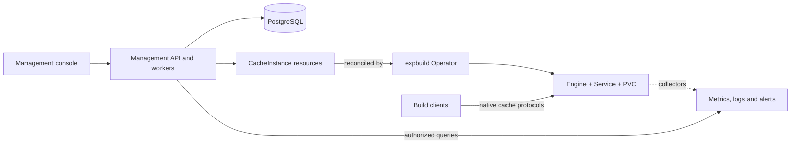

# expbuild

### Build caches, managed on your Kubernetes cluster

[English](README.md) · [简体中文](README.zh-CN.md)

**A self-hosted control plane for Bazel, Gradle, and WebDAV cache services.**
Create independent caches for your teams, control resources and access, and inspect usage and health from one console and API. Build clients connect directly to purpose-built cache engines using their native protocols.

[Deploy with Helm](deploy/charts/expbuild/README.md) · [Explore the architecture](docs/k8s-platform/README.md) · [Review validation results](docs/k8s-platform/open-source-benchmark.md) · [Develop locally](docs/development.md)

> **Active development.** The current baseline is one Kubernetes cluster, with a single replica and persistent volume per cache instance. Selected lifecycle, protocol, and HTTPS paths have passed isolated cluster tests. Production compatibility, scale, and recovery validation remain in progress. [Implementation status →](docs/k8s-platform/progress.md)

## Why expbuild?

For platform teams that want to operate shared build-cache infrastructure inside their own environment:

- **Give each project its own caches.** Manage users, project membership, roles, instance credentials, and audit records.
- **Control the lifecycle.** Create, configure, pause, resume, and delete instances; rotate credentials and follow asynchronous operations.
- **Keep resources accountable.** Set CPU, memory, storage, supported cache budgets, and project quotas; inspect resource discrepancies and retained volumes.
- **See what is happening.** Inspect capacity, supported cache metrics, Kubernetes events, logs, alerts, and platform health through configured monitoring backends.

## Supported cache services

These versioned templates are available for new instances when their engines are enabled:

| Template | Connect with | Storage and eviction |
| --- | --- | --- |
| `bazel-remote@0.1.0` | Bazel HTTP remote cache or REAPI Action Cache/CAS via [bazel-remote](https://github.com/buchgr/bazel-remote) | Independent PVC, cache budget, LRU |
| `gradle-http@0.2.0` | [Gradle HTTP build cache](https://docs.gradle.org/current/userguide/build_cache.html) | Independent PVC, cache budget, LRU |
| `webdav-apache@0.2.0` | Authenticated WebDAV via Apache HTTP Server | Independent PVC; no native cache budget or automatic eviction |

**REAPI is caching only; remote execution is not supported.** Historical Gradle/WebDAV `0.1.0` instances retain their original capabilities. Template upgrades are not yet automated and there is no template-version upgrade workflow.

Observations vary by engine: Bazel exposes capacity and AC/CAS lookup history; Gradle adds hits/misses, latency, traffic, and eviction metrics; WebDAV reports approximate size and file count from a bounded scan. Time series require Prometheus-compatible storage, logs require Loki with ingestion, and alerts require Alertmanager with rules. Missing data is shown as unavailable. [Full capability matrix →](docs/k8s-platform/observability.md)

**Experimental, opt-in:** [Turborepo HTTP artifact cache](docs/k8s-platform/turborepo-http.md) has its own engine and pinned connection profile; real-client acceptance is pending.

**Experimental, opt-in:** [Nx HTTP artifact cache](docs/k8s-platform/nx-http.md) has its own engine and pinned connection profile; real-client acceptance is pending.

The [experimental Maven Build Cache Extension profile](docs/k8s-platform/maven-build-cache.md) reuses WebDAV for build outputs; real-client acceptance is pending.

**Experimental client recipes:** sccache, Pants and [moonrepo 2.5.6](docs/k8s-platform/moonrepo.md) reuse existing engines. Real-client acceptance remains pending; recipes are not certified client support.

## How it works



The control plane manages ownership, permissions, operations, and audit history in PostgreSQL. The Go Operator reconciles Kubernetes `CacheInstance` resources into workloads, networking, and storage. **Cache traffic goes directly to each engine**, without passing through the management API.

Each instance has its own workload, volume, and credentials; projects map to managed namespaces. Network isolation also depends on a CNI that enforces NetworkPolicy. Optional [Gateway API integration](docs/k8s-platform/gateway.md) adds per-instance HTTPS and gRPC TLS domains.

## Get started

### Deploy on Kubernetes

The [Helm chart](deploy/charts/expbuild) installs the API and workers, console, Operator, migrations, and administrator bootstrap. Before running it, prepare:

1. Kubernetes with dynamic persistent storage and NetworkPolicy enforcement; the current integration baseline is Kubernetes 1.32.
2. External PostgreSQL, a labeled control-plane namespace, database and operation-encryption Secrets, and an optional bootstrap Secret.
3. Platform images built and pushed to your registry, plus approved cache-engine images pinned by SHA256 digest. [Container build instructions →](images/README.md)
4. HTTPS ingress, DNS, and a certificate, or an equivalent same-origin reverse proxy for the console and API.
5. A deployment values file based on [values.yaml](deploy/charts/expbuild/values.yaml), using your image references, Secret names, storage, and origin/ingress settings.

Follow the [installation guide](deploy/charts/expbuild/README.md) for exact Secret keys, namespace labels, cluster RBAC, and client network access. Then, from a checkout of this repository:

```sh
helm lint deploy/charts/expbuild -f /path/to/expbuild-values.yaml --strict
helm upgrade --install expbuild deploy/charts/expbuild \
  --namespace expbuild-system \
  -f /path/to/expbuild-values.yaml \
  --wait --timeout 10m
```

The namespace and Secrets must already exist. `ci-values.yaml` contains test placeholders and is not deployable. The current image workflow builds and tests but does not publish images. Cache endpoints are cluster-internal by default; monitoring backends are not installed by the chart.

### Build and contribute locally

With Node.js 22+ and npm, build the API and console from the repository root:

```sh
npm ci
npm run build
```

Running the application additionally needs PostgreSQL, API environment variables, and a dedicated Kubernetes development cluster with the CRD and Operator installed. The Operator requires Go 1.23+. See [development and testing](docs/development.md) for migrations, administrator bootstrap, local startup, and test commands.

## Evidence, with boundaries

Reproducible experiments check real cache behavior and output correctness, rather than assuming a cache hit proves a safe build:

| Workload | What was checked | Scope and limitations |
| --- | --- | --- |
| [Abseil / Bazel](docs/k8s-platform/open-source-benchmark.md) | Fresh-output remote reuse, executable hashes, forced tests, and a paired source edit | Three small-workload rounds on macOS/arm64; no general speedup or scale claim |
| [RxJava / Gradle](docs/k8s-platform/rxjava-module-output-diagnosis.md) | Complete JAR contents and uncached rebuilds after cache restore | Found a pinned plugin output-layout defect; explicit experimental adaptation passes the gates, with no stable speedup claim |
| [yq / BuildKit + Registry](docs/k8s-platform/buildkit-registry-yq-poc.md) | Fresh-builder reuse, source invalidation, OCI output checks, and offline GC recovery | Isolated native ARM64 proof of concept, **not an expbuild engine or template** |

[Cluster and protocol testing](docs/k8s-platform/testing.md) covers separate platform paths. These experiments do not establish production availability, multi-tenant scale, or recovery guarantees.

## Documentation

The English and Chinese homepages cover the same scope. Detailed engineering guides are available in English.

| Start here | Guides |
| --- | --- |
| Understand the platform | [Design](docs/k8s-platform/README.md) · [Implementation status](docs/k8s-platform/progress.md) |
| Install and operate | [Helm](deploy/charts/expbuild/README.md) · [Images](images/README.md) · [Instance domains](docs/k8s-platform/gateway.md) |
| Integrate clients and APIs | [API integration](docs/k8s-platform/api-integration.md) · [OpenAPI](docs/k8s-platform/openapi.json) |
| Manage resources | [Quotas](docs/k8s-platform/quotas.md) · [Inventory](docs/k8s-platform/inventory.md) · [Retained volumes](docs/k8s-platform/retained-volume-reclaim.md) |
| Observe and verify | [Observability](docs/k8s-platform/observability.md) · [Testing](docs/k8s-platform/testing.md) · [Experiments](docs/k8s-platform/open-source-benchmark.md) |
| Work on the code | [Development and testing](docs/development.md) · [API](apps/admin-api/README.md) · [Console](apps/admin-web/README.md) · [Operator](operator/README.md) |

Current implementation docs live in `docs/k8s-platform`. Earlier alternatives remain in `docs/design`, `docs/strategy`, and `docs/research`; the former Rust remote-execution implementation remains in Git history.

## What's next

- Qualify additional cache types, including OCI pull-through, BuildKit registry, package, compiler, and task caches.
- Add template upgrade/migration workflows and broaden recovery and production validation.
- Deepen observability and scale baselines; evaluate OIDC, object storage, GitOps, and multi-cluster support separately.

These are planned directions. Templates currently use a compiled adapter registry; a third-party extension SDK and shared cross-engine content index are not implemented. See the [cache expansion plan](docs/k8s-platform/cache-expansion-plan.md) for validation gates and the [active backlog](docs/k8s-platform/progress.md). The Apache WebDAV service remains unchanged while its replacement is evaluated.

## Contributing

Bug reports, documentation improvements, and engine proposals are welcome. For a new integration, describe its protocol, authentication, storage, eviction, metrics, and tested clients. Include validation and keep both homepages aligned when changing shared feature or setup information.

## License

[MIT](LICENSE)
