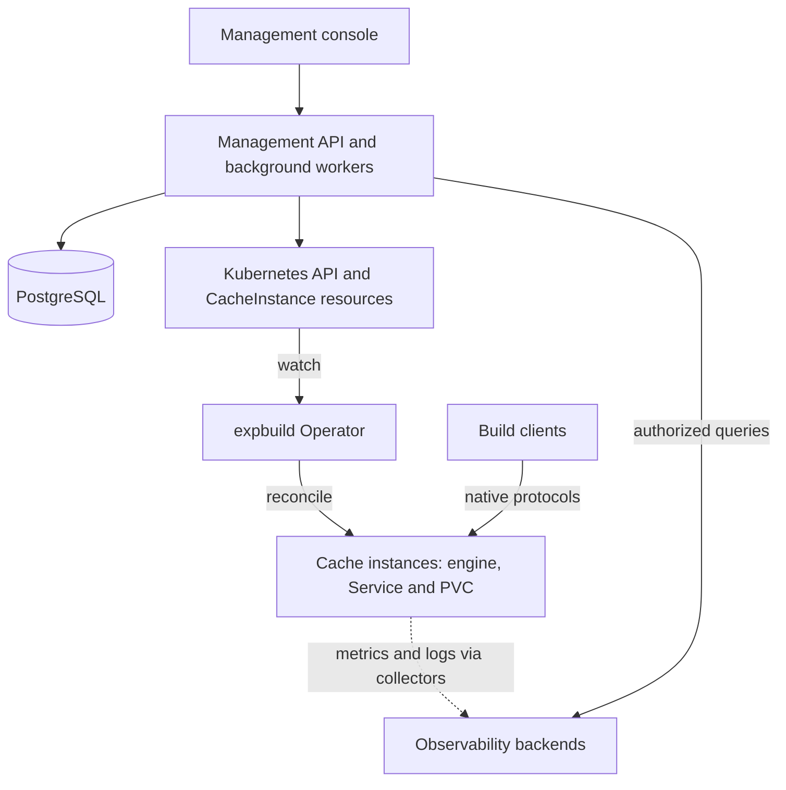

# expbuild

[English](README.md) | [简体中文](README.zh-CN.md)

**A self-hosted platform for managing build caches on Kubernetes.**

expbuild gives teams a management console and API for creating independent cache services, configuring resources and access, and understanding cache usage and health. It integrates purpose-built cache engines through versioned templates, starting with Bazel/REAPI, Gradle, and WebDAV.

Enterprise self-hosting is the primary deployment model.

**Project status:** active development. The current baseline is one Kubernetes cluster with a single replica and a persistent volume per cache instance. Selected lifecycle, protocol, and HTTPS access paths have passed isolated cluster tests; production compatibility, scale, and recovery validation remain in progress. See [implementation status](docs/k8s-platform/progress.md) for the recorded results and remaining work.

## What you can do

- **Manage cache instances:** create and configure services, pause and resume them, rotate credentials, and track asynchronous operations.
- **Organize teams and projects:** manage users, project membership, roles, and audit records through the console and API.
- **Control resources:** configure instance CPU, memory, storage, and supported cache budgets; manage project quotas and inspect resource discrepancies.
- **Manage retained storage:** retain or delete volumes with an instance, inspect retained volumes, and reclaim or clean them up through explicit workflows.
- **Connect build clients:** use native engine protocols over cluster services or optional per-instance domains through Gateway API.
- **Observe operations:** view capacity and supported cache metrics, resource trends, Kubernetes events, logs, alerts, and platform health using configured monitoring backends.

## Cache services

These are the template versions offered for new instances when their engines are enabled:

| Template              | Protocol and use                                                                                                                                                                                   | Storage and eviction                                                                                  | Available observations                                                  |
| --------------------- | -------------------------------------------------------------------------------------------------------------------------------------------------------------------------------------------------- | ----------------------------------------------------------------------------------------------------- | ----------------------------------------------------------------------- |
| `bazel-remote@0.1.0`  | [REAPI](https://github.com/bazelbuild/remote-apis) Action Cache/CAS and [Bazel HTTP remote caching](https://bazel.build/remote/caching) via [bazel-remote](https://github.com/buchgr/bazel-remote) | Independent [PVC](https://kubernetes.io/docs/concepts/storage/persistent-volumes/), cache budget, LRU | Capacity snapshots and AC/CAS lookup history                            |
| `gradle-http@0.2.0`   | [Gradle HTTP build cache](https://docs.gradle.org/current/userguide/build_cache.html)                                                                                                              | Independent PVC, cache budget, LRU                                                                    | Capacity, hits/misses, requests, latency, traffic, and eviction metrics |
| `webdav-apache@0.2.0` | Authenticated [WebDAV](https://httpd.apache.org/docs/2.4/mod/mod_dav.html) file access via [Apache HTTP Server](https://httpd.apache.org/)                                                         | Independent PVC; no native cache budget or automatic eviction                                         | Approximate content size and file count from a bounded scan             |

Historical `0.1.0` Gradle and WebDAV instances retain their original capabilities. Templates bind capabilities to exact versions; automatic upgrades and a template-version upgrade workflow are not yet available. The REAPI service provides caching only, with no remote execution.

Time-series views require [Prometheus](https://prometheus.io/docs/introduction/overview/)-compatible collection and storage. Logs require [Loki](https://grafana.com/docs/loki/latest/) and configured ingestion; alerts require [Alertmanager](https://prometheus.io/docs/alerting/latest/alertmanager/) and configured rules. Capabilities vary by template, and missing data is shown as unavailable rather than zero. See the [observability guide](docs/k8s-platform/observability.md) for the full matrix.

## Architecture



PostgreSQL stores users, project permissions, instance ownership, operations, and audit records. Kubernetes `CacheInstance` resources hold the desired instance configuration. The Go Operator reconciles that configuration into workloads, networking, and storage.

Cache traffic goes directly to each engine. Each instance has its own workload, volume, and credentials; projects map to managed namespaces. The management API authorizes access to operations and observations. Network isolation additionally depends on the cluster's NetworkPolicy implementation.

Templates currently use a compiled adapter registry. A third-party extension SDK, shared cross-engine content index, and multi-cluster management are not part of the current implementation.

## Deploy on Kubernetes

The repository includes a [Helm chart](deploy/charts/expbuild) for the API and its background workers, console, Operator, database migrations, and administrator bootstrap.

Prepare the following before installation:

1. A Kubernetes cluster with dynamic persistent storage and a CNI that enforces NetworkPolicy. The current integration baseline is Kubernetes 1.32.
2. An external PostgreSQL database, a control-plane namespace, and the required database, operation-encryption, and optional bootstrap Secrets.
3. Platform images built and pushed to your registry, plus approved cache-engine images pinned by SHA256 digest. See [container builds](images/README.md); the current build workflow does not publish images.
4. Console access through an HTTPS ingress with DNS and a certificate, or an equivalent same-origin reverse proxy.
5. A deployment values file based on [values.yaml](deploy/charts/expbuild/values.yaml), with real image references, Secret names, storage settings, and origin/ingress configuration. `ci-values.yaml` contains test placeholders and is not an installation configuration.

Follow the [installation guide](deploy/charts/expbuild/README.md) for namespace labels, Secret keys, cluster RBAC, and client network access. Once those prerequisites and your values file are ready, run from the repository root:

```sh
helm lint deploy/charts/expbuild -f /path/to/expbuild-values.yaml --strict
helm upgrade --install expbuild deploy/charts/expbuild \
  --namespace expbuild-system \
  -f /path/to/expbuild-values.yaml \
  --wait --timeout 10m
```

Cache endpoints are cluster-internal by default. Optional [Gateway API integration](docs/k8s-platform/gateway.md) provides per-instance HTTPS and gRPC TLS domains using an existing gateway, DNS, and certificates. The chart connects to existing observability infrastructure; it does not install Prometheus, Loki, or Alertmanager.

## Local development

Use Node.js 22+ and npm for the API and console, and Go 1.23+ for the Operator. CI currently uses Node.js 24, Go 1.27.1, and PostgreSQL 18; see the [workflows](.github/workflows) for exact test tooling.

From the repository root, install dependencies and build the API and console:

```sh
npm ci
npm run build
```

To run the application, prepare a development PostgreSQL database and a dedicated Kubernetes development cluster with the CRD, Operator, storage, and access configuration installed. The API uses the active kubeconfig or its in-cluster identity, and its workers execute instance operations against that cluster.

Set the API process environment using [.env.example](apps/admin-api/.env.example) as a reference. The service does not automatically load an `.env` file.

| Variable                        | Local configuration                                                                                          |
| ------------------------------- | ------------------------------------------------------------------------------------------------------------ |
| `DATABASE_URL`                  | Connection string for your development PostgreSQL database                                                   |
| `APP_ORIGIN`                    | `http://localhost:5173`                                                                                      |
| `STORAGE_CLASS`                 | An available StorageClass in the development cluster                                                         |
| `OPERATION_ENCRYPTION_KEY`      | A generated 32-byte key encoded as 64 hexadecimal characters; keep it stable across API restarts             |
| `ADMIN_EMAIL`, `ADMIN_PASSWORD` | Credentials for the initial administrator; required for bootstrap, with a password of at least 12 characters |

With those variables set, run migrations, bootstrap the administrator once, and start the API:

```sh
npm run migrate --workspace @expbuild/admin-api
npm run bootstrap --workspace @expbuild/admin-api
npm run dev --workspace @expbuild/admin-api
```

In a second terminal, start the console:

```sh
npm run dev --workspace @expbuild/admin-web
```

Open `http://localhost:5173`. Vite forwards `/v1` to the API at `127.0.0.1:3001`. See the [API guide](apps/admin-api/README.md), [console guide](apps/admin-web/README.md), and [Operator guide](operator/README.md) for component configuration. Building and running unit tests does not require a full cluster; creating usable cache instances does.

## Testing

Run the API and console tests from the repository root:

```sh
npm test
```

Database integration tests require `TEST_DATABASE_URL` pointing to a dedicated test server, with permission to create and drop temporary test databases. Without it, those tests explicitly skip.

Run the Go checks and build the Operator:

```sh
cd operator
go test ./...
go vet ./...
make build
```

Additional suites cover a real Kubernetes API server/etcd (`KUBEBUILDER_ASSETS`), chart rendering (`HELM_BIN`), actual cache engines, monitoring backends, Playwright browser flows, and disposable kind clusters. Browser tests run with `npm run test:browser` after building and installing Chromium, and also require `TEST_DATABASE_URL`.

See [testing and reproduction](docs/k8s-platform/testing.md) and [observability validation](docs/k8s-platform/observability.md). API-server tests do not run a complete cluster, browser tests use a Kubernetes test adapter, and isolated cluster results do not establish production storage or scale guarantees.

## Repository layout

| Path                     | Purpose                                                                                           |
| ------------------------ | ------------------------------------------------------------------------------------------------- |
| `apps/admin-api`         | TypeScript management API, PostgreSQL migrations, authorization, workers, and observation queries |
| `apps/admin-web`         | React/TypeScript console and English/Chinese translations                                         |
| `operator`               | Go Operator, CacheInstance API, engine adapters, and Gradle cache service                         |
| `deploy/charts/expbuild` | Helm chart, CRDs, RBAC, and deployment configuration                                              |
| `images`                 | Container build definitions                                                                       |
| `tests`                  | Browser acceptance tests and shared contracts                                                     |
| `tools`                  | Engine validation, container checks, and disposable cluster test tooling                          |
| `docs/k8s-platform`      | Current architecture, implementation, operations, and validation records                          |

## Documentation

The two READMEs cover the same scope. Detailed engineering guides are currently mostly in Chinese, with some component documentation in English.

| Topic                           | Guide                                                                                                                                                                   |
| ------------------------------- | ----------------------------------------------------------------------------------------------------------------------------------------------------------------------- |
| Architecture and implementation | [Platform design](docs/k8s-platform/README.md) · [Implementation plan](docs/k8s-platform/implementation-plan.md)                                                        |
| Installation and upgrades       | [Helm guide](deploy/charts/expbuild/README.md) · [Container images](images/README.md)                                                                                   |
| Client and API integration      | [API guide](docs/k8s-platform/api-integration.md) · [OpenAPI contract](docs/k8s-platform/openapi.json) · [Instance domains](docs/k8s-platform/gateway.md)               |
| Resources and storage           | [Project quotas](docs/k8s-platform/quotas.md) · [Resource inventory](docs/k8s-platform/inventory.md) · [Retained volumes](docs/k8s-platform/retained-volume-reclaim.md) |
| Observability                   | [Capabilities and setup](docs/k8s-platform/observability.md) · [Observability plan](docs/k8s-platform/observability-plan.md)                                            |
| Verification and progress       | [Testing](docs/k8s-platform/testing.md) · [Implementation status](docs/k8s-platform/progress.md)                                                                        |
| Cache expansion                 | [Research and roadmap](docs/k8s-platform/cache-expansion-plan.md) · [WebDAV engine proposal](docs/k8s-platform/webdav-cache-plan.md)                                    |

`docs/design`, `docs/strategy`, and `docs/research` preserve earlier research and alternatives. The current implementation follows `docs/k8s-platform`; the former Rust remote-execution implementation remains available in Git history.

## Roadmap

- Validate Docker/OCI pull-through caches, BuildKit registry caches, and artifact/CI cache use cases.
- Expand into package caches such as npm, Python, Go Modules, and Maven, followed by compiler and Monorepo task-cache integrations.
- Add template upgrade and migration workflows, broader recovery and reconciliation tools, and production deployment validation.
- Deepen observability with project-level thresholds, tracing, and scale baselines; evaluate OIDC, object storage, GitOps, and multi-cluster management as separate extensions.

These are planned directions, not currently supported features. The [cache expansion plan](docs/k8s-platform/cache-expansion-plan.md) records candidates and validation gates; [implementation status](docs/k8s-platform/progress.md) tracks the active backlog. The current Apache WebDAV service remains unchanged while its replacement is evaluated.

## Contributing

Bug reports, documentation improvements, and engine-integration proposals are welcome. For a new cache integration, describe its protocol, authentication, storage, eviction, metrics, and tested clients. Include relevant validation and update both READMEs when changing their shared feature or setup information.

## License

expbuild is distributed under the [MIT License](LICENSE).
