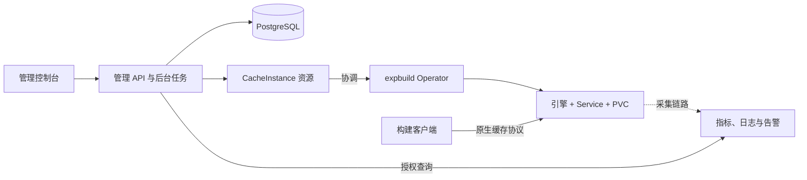

# expbuild

### 在自己的 Kubernetes 集群上，统一管理构建缓存

[English](README.md) · [简体中文](README.zh-CN.md)

**面向 Bazel、Gradle 和 WebDAV 缓存服务的自托管控制面。**
通过一个控制台和 API，为团队创建独立缓存、配置资源与访问权限、查看用量与健康状态。构建客户端使用原生协议直接访问专用缓存引擎。

[使用 Helm 部署](deploy/charts/expbuild/README.md) · [了解架构](docs/k8s-platform/README.md) · [查看验证结果](docs/k8s-platform/open-source-benchmark.md) · [本地开发](docs/development.md)

> **持续开发中。** 当前基线为单 Kubernetes 集群，每个缓存实例使用单副本和独立持久卷。指定的生命周期、协议和 HTTPS 链路已通过隔离集群测试；生产兼容性、规模与故障恢复仍在验证。[查看实施状态 →](docs/k8s-platform/progress.md)

## 为什么使用 expbuild？

面向希望在自有环境内运营共享构建缓存基础设施的平台团队：

- **按项目分配缓存。** 管理用户、项目成员、角色、实例凭据和审计记录。
- **管理完整生命周期。** 创建、配置、暂停、恢复和删除实例，轮换凭据，跟踪异步操作。
- **明确资源边界。** 配置 CPU、内存、存储、引擎支持的缓存预算和项目配额，检查资源差异与保留卷。
- **看清运行状态。** 接入监控后端，查看容量、引擎支持的缓存指标、Kubernetes 事件、日志、告警与平台健康。

## 已支持的缓存服务

启用对应引擎后，新建实例可选择以下版本化模板：

| 模板 | 接入方式 | 存储与淘汰 |
| --- | --- | --- |
| `bazel-remote@0.1.0` | 通过 [bazel-remote](https://github.com/buchgr/bazel-remote) 提供 Bazel HTTP 远程缓存与 REAPI Action Cache/CAS | 独立 PVC、缓存预算、LRU |
| `gradle-http@0.2.0` | [Gradle HTTP 构建缓存](https://docs.gradle.org/current/userguide/build_cache.html) | 独立 PVC、缓存预算、LRU |
| `webdav-apache@0.2.0` | 通过 Apache HTTP Server 提供带认证的 WebDAV | 独立 PVC；无原生缓存预算或自动淘汰 |

**REAPI 仅提供缓存，不支持远程执行。** 历史 Gradle/WebDAV `0.1.0` 实例保留原有能力，目前没有自动升级或模板版本升级流程。

观测能力因引擎而异：Bazel 提供容量与 AC/CAS 查询历史；Gradle 增加命中与缺失、延迟、流量和淘汰指标；WebDAV 通过有界扫描估算内容大小与文件数量。时序数据需要兼容 Prometheus 的存储，日志需要 Loki 与采集链路，告警需要 Alertmanager 与规则。缺失数据会显示为不可用。[完整能力矩阵 →](docs/k8s-platform/observability.md)

## 工作原理



控制面在 PostgreSQL 中管理归属、权限、操作与审计记录。Go Operator 将 Kubernetes `CacheInstance` 资源协调为工作负载、网络与存储。**缓存流量直达各引擎，不经过管理 API。**

每个实例拥有独立工作负载、持久卷和凭据；项目映射到受管理的命名空间。网络隔离还依赖 CNI 对 NetworkPolicy 的执行。可选的 [Gateway API 集成](docs/k8s-platform/gateway.md) 提供实例独立的 HTTPS 与 gRPC TLS 域名。

## 开始使用

### 部署到 Kubernetes

[Helm Chart](deploy/charts/expbuild) 安装 API 与后台任务、控制台、Operator、数据库迁移和管理员初始化任务。运行前需要准备：

1. 支持动态持久存储和 NetworkPolicy 的 Kubernetes 集群；当前集成测试基线为 Kubernetes 1.32。
2. 外部 PostgreSQL、已添加所需标签的控制面命名空间、数据库与操作加密 Secret，以及可选的管理员初始化 Secret。
3. 已构建并推送到自有仓库的平台镜像，以及经批准并使用 SHA256 digest 固定的缓存引擎镜像。[镜像构建说明 →](images/README.md)
4. HTTPS Ingress、DNS 和证书，或覆盖控制台与 API 的等效同源反向代理。
5. 基于 [values.yaml](deploy/charts/expbuild/values.yaml) 编写的部署配置，填入真实镜像、Secret 名称、存储和 origin/ingress 设置。

先按[安装指南](deploy/charts/expbuild/README.md) 配置 Secret 键名、命名空间标签、集群 RBAC 与客户端网络授权，再在仓库根目录执行：

```sh
helm lint deploy/charts/expbuild -f /path/to/expbuild-values.yaml --strict
helm upgrade --install expbuild deploy/charts/expbuild \
  --namespace expbuild-system \
  -f /path/to/expbuild-values.yaml \
  --wait --timeout 10m
```

命名空间与 Secret 必须提前存在。`ci-values.yaml` 是不可部署的测试占位配置。当前镜像工作流只构建与测试，不发布镜像。缓存端点默认仅供集群内访问；Chart 不安装监控后端。

### 本地构建与贡献

安装 Node.js 22+ 与 npm 后，在仓库根目录构建 API 和控制台：

```sh
npm ci
npm run build
```

实际运行应用还需要 PostgreSQL、API 环境变量，以及已安装 CRD 和 Operator 的专用 Kubernetes 开发集群。Operator 需要 Go 1.23+。迁移、管理员初始化、本地启动和测试命令见[开发与测试指南](docs/development.md)。

## 验证证据与边界

可复现实验检查真实缓存行为与产物正确性，不将一次缓存命中视为构建安全的充分证明：

| 工作负载 | 验证内容 | 范围与限制 |
| --- | --- | --- |
| [Abseil / Bazel](docs/k8s-platform/open-source-benchmark.md) | 全新输出目录下的远程复用、可执行文件哈希、强制测试与成对源码修改 | macOS/arm64 上三轮小规模工作负载；不作通用加速或规模承诺 |
| [RxJava / Gradle](docs/k8s-platform/rxjava-module-output-diagnosis.md) | 完整 JAR 内容，以及缓存恢复后的无缓存重建 | 发现固定版本插件的输出目录布局缺陷；显式实验适配通过验证门槛，未宣称稳定加速 |
| [yq / BuildKit + Registry](docs/k8s-platform/buildkit-registry-yq-poc.md) | 全新 builder 下的复用、源码失效、OCI 产物检查与离线 GC 恢复 | 独立的原生 ARM64 概念验证，**不是 expbuild 引擎或模板** |

[集群与协议测试](docs/k8s-platform/testing.md) 另行覆盖平台链路。这些实验不构成生产可用性、多租户规模或故障恢复保证。

## 文档导航

中英文首页覆盖相同范围，详细工程文档现已提供英文版本。

| 目标 | 指南 |
| --- | --- |
| 了解平台 | [架构设计](docs/k8s-platform/README.md) · [实施状态](docs/k8s-platform/progress.md) |
| 安装与运维 | [Helm](deploy/charts/expbuild/README.md) · [镜像](images/README.md) · [实例域名](docs/k8s-platform/gateway.md) |
| 客户端与 API 接入 | [API 集成](docs/k8s-platform/api-integration.md) · [OpenAPI](docs/k8s-platform/openapi.json) |
| 资源管理 | [项目配额](docs/k8s-platform/quotas.md) · [资源清单](docs/k8s-platform/inventory.md) · [保留卷](docs/k8s-platform/retained-volume-reclaim.md) |
| 观测与验证 | [可观测能力](docs/k8s-platform/observability.md) · [测试](docs/k8s-platform/testing.md) · [缓存实验](docs/k8s-platform/open-source-benchmark.md) |
| 参与开发 | [开发与测试](docs/development.md) · [API](apps/admin-api/README.md) · [控制台](apps/admin-web/README.md) · [Operator](operator/README.md) |

当前实现文档位于 `docs/k8s-platform`。`docs/design`、`docs/strategy` 与 `docs/research` 保留早期备选方案；旧 Rust 远程执行实现保留在 Git 历史中。

## 后续方向

- 验证更多缓存类型，包括 OCI 拉取代理、BuildKit Registry、包管理器、编译器与任务缓存。
- 增加模板升级与迁移流程，扩展恢复与生产部署验证。
- 深化可观测能力与规模基线，分别评估 OIDC、对象存储、GitOps 和多集群支持。

以上是规划方向。模板目前使用编译期适配器注册表，尚未实现第三方扩展 SDK 或跨引擎共享内容索引。验证门槛见[缓存扩展计划](docs/k8s-platform/cache-expansion-plan.md)，当前任务见[实施状态](docs/k8s-platform/progress.md)。评估替代方案期间，Apache WebDAV 服务保持不变。

## 参与贡献

欢迎问题反馈、文档改进和引擎集成提案。新增集成请说明协议、认证、存储、淘汰、指标和已测试客户端，附带验证结果；修改共有功能或安装信息时，请同步更新两份首页。

## 许可证

[MIT](LICENSE)

## 实验性客户端接入

[Nx HTTP 缓存](docs/k8s-platform/nx-http.md)使用独立适配器与固定版本配置，默认关闭；真实客户端验收尚未完成。
