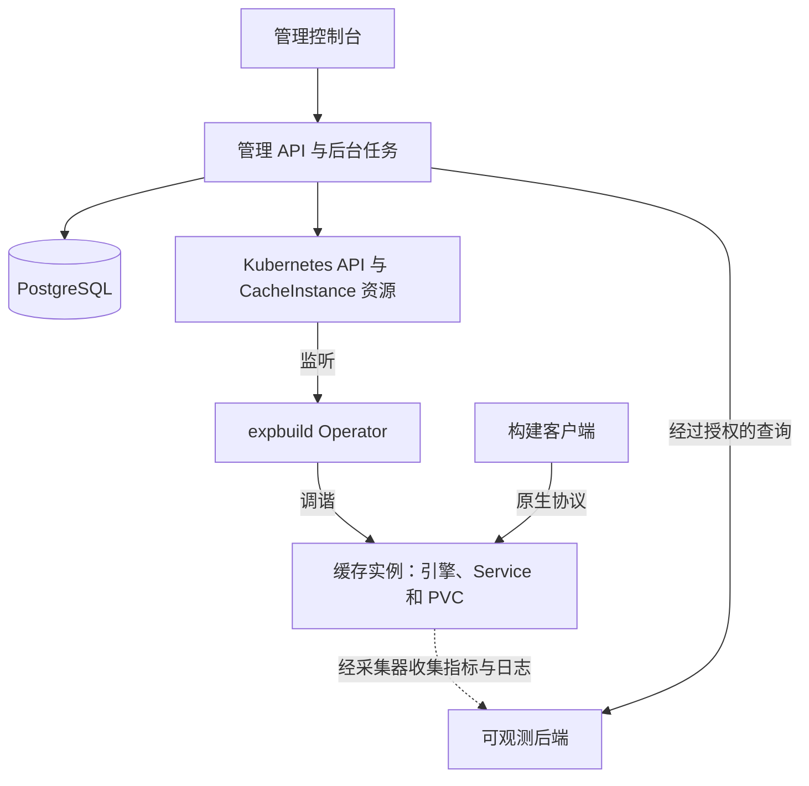

# expbuild

[English](README.md) | [简体中文](README.zh-CN.md)

**基于 Kubernetes 的自托管构建缓存管理平台。**

expbuild 为团队提供管理控制台和 API，用于创建独立缓存服务、配置资源与访问权限，并了解缓存用量和运行状态。平台通过版本化模板接入专用缓存引擎，目前覆盖 Bazel/REAPI、Gradle 和 WebDAV。

管理控制台支持 **English 和简体中文**，优先面向企业自托管部署。

**项目状态：** 持续开发中。当前基线为单 Kubernetes 集群，每个缓存实例使用单副本和独立持久卷。指定的生命周期、协议和 HTTPS 访问链路已通过隔离集群测试；生产环境兼容性、规模与故障恢复仍在验证。实际结果和剩余工作见[实施状态](docs/k8s-platform/progress.md)。

## 平台能力

- **实例管理：** 创建与配置服务、暂停与恢复、轮换凭据，并跟踪异步操作进度。
- **团队与项目：** 通过控制台和 API 管理用户、项目成员、角色和审计记录。
- **资源控制：** 配置实例 CPU、内存、存储和引擎支持的缓存预算，管理项目配额并检查资源差异。
- **保留卷管理：** 删除实例时选择保留或删除卷，查看保留卷，并通过明确的流程领回或清理。
- **客户端接入：** 通过集群内服务访问引擎原生协议，或使用 Gateway API 提供的实例独立域名。
- **可观测：** 接入监控后端，查看容量、引擎支持的缓存指标、资源趋势、Kubernetes 事件、日志、告警和平台健康。

## 缓存服务

启用对应引擎后，新建实例可选择以下模板版本：

| 模板                  | 协议与用途                                    | 存储与淘汰                         | 可用观测能力                                 |
| --------------------- | --------------------------------------------- | ---------------------------------- | -------------------------------------------- |
| `bazel-remote@0.1.0`  | REAPI Action Cache/CAS 与 Bazel HTTP 远程缓存 | 独立 PVC、缓存预算、LRU            | 容量快照和 AC/CAS 查询历史                   |
| `gradle-http@0.2.0`   | Gradle HTTP 构建缓存                          | 独立 PVC、缓存预算、LRU            | 容量、命中与缺失、请求、延迟、流量和淘汰指标 |
| `webdav-apache@0.2.0` | 需要认证的 WebDAV 文件访问                    | 独立 PVC；无原生缓存预算和自动淘汰 | 通过有界扫描提供近似内容大小与文件数         |

历史 Gradle 和 WebDAV `0.1.0` 实例保留原版本能力。模板能力绑定精确版本，目前没有自动升级和模板版本升级工作流。REAPI 服务只提供缓存，不提供远程执行。

历史趋势依赖兼容 Prometheus 的采集与存储；日志依赖 Loki 和已配置的采集链路；告警依赖 Alertmanager 和已配置的规则。不同模板的观测能力不同，缺失数据会显示为不可用，而非零值。完整能力矩阵见[可观测接入说明](docs/k8s-platform/observability.md)。

## 架构



PostgreSQL 保存用户、项目权限、实例归属、操作和审计记录。Kubernetes `CacheInstance` 资源保存实例的期望配置，Go Operator 将这些配置落实为工作负载、网络和存储资源。

缓存请求直接访问引擎。每个实例有独立工作负载、卷和凭据，项目对应受管理的 namespace。管理 API 对操作和观测数据进行授权；网络隔离还依赖集群实际执行 NetworkPolicy。

模板目前通过编译内适配器注册表接入。第三方扩展 SDK、跨引擎共享内容索引和多集群管理不属于当前实现。

## 部署到 Kubernetes

仓库提供 [Helm Chart](deploy/charts/expbuild)，用于安装管理 API 及其后台任务、控制台、Operator、数据库迁移和管理员初始化任务。

安装前需要准备：

1. 具备动态持久存储和 NetworkPolicy 执行能力的 Kubernetes 集群。当前集成验证基线为 Kubernetes 1.32。
2. 外部 PostgreSQL 数据库、控制面 namespace，以及数据库、操作加密密钥和可选管理员初始化所需的 Secret。
3. 构建并推送到自身仓库的平台镜像，以及使用 SHA256 digest 固定的受信缓存引擎镜像。参见[容器构建](images/README.md)；当前构建流程不会自动发布镜像。
4. 管理控制台的 HTTPS Ingress、DNS 和证书，或等效的同源反向代理。
5. 基于 [values.yaml](deploy/charts/expbuild/values.yaml) 的部署配置，填入真实镜像、Secret 名称、存储以及 Origin/Ingress 设置。`ci-values.yaml` 使用测试占位值，不能作为安装配置。

按照[安装指南](deploy/charts/expbuild/README.md)准备 namespace 标签、Secret 数据键、集群 RBAC 和客户端网络授权。前置条件及 values 文件就绪后，在仓库根目录执行：

```sh
helm lint deploy/charts/expbuild -f /path/to/expbuild-values.yaml --strict
helm upgrade --install expbuild deploy/charts/expbuild \
  --namespace expbuild-system \
  -f /path/to/expbuild-values.yaml \
  --wait --timeout 10m
```

缓存端点默认仅在集群内访问。可选的 [Gateway API 集成](docs/k8s-platform/gateway.md)利用已有 Gateway、DNS 和证书提供实例独立 HTTPS 与 gRPC TLS 域名。Chart 接入已有可观测设施，不负责安装 Prometheus、Loki 或 Alertmanager。

## 本地开发

API 和控制台需要 Node.js 22+ 与 npm，Operator 需要 Go 1.23+。CI 当前使用 Node.js 24、Go 1.27.1 和 PostgreSQL 18；具体测试工具版本见[工作流](.github/workflows)。

在仓库根目录安装依赖并构建 API 和控制台：

```sh
npm ci
npm run build
```

运行应用还需准备开发用 PostgreSQL 数据库和独立的 Kubernetes 开发集群，并安装 CRD、Operator、存储及访问配置。API 使用当前 kubeconfig 或集群内身份，其后台任务会在该集群执行实例操作。

参照 [.env.example](apps/admin-api/.env.example)设置 API 进程环境变量。服务不会自动加载 `.env` 文件。

| 变量                            | 本地配置                                                           |
| ------------------------------- | ------------------------------------------------------------------ |
| `DATABASE_URL`                  | 开发用 PostgreSQL 数据库连接字符串                                 |
| `APP_ORIGIN`                    | `http://localhost:5173`                                            |
| `STORAGE_CLASS`                 | 开发集群中可用的 StorageClass                                      |
| `OPERATION_ENCRYPTION_KEY`      | 生成的 32 字节密钥，以 64 位十六进制字符串表示；API 重启后保持不变 |
| `ADMIN_EMAIL`, `ADMIN_PASSWORD` | 首次初始化管理员的凭据，仅 bootstrap 需要，密码至少 12 个字符      |

设置好变量后，执行迁移、首次管理员初始化，并启动 API：

```sh
npm run migrate --workspace @expbuild/admin-api
npm run bootstrap --workspace @expbuild/admin-api
npm run dev --workspace @expbuild/admin-api
```

在第二个终端启动控制台：

```sh
npm run dev --workspace @expbuild/admin-web
```

打开 `http://localhost:5173`。Vite 会将 `/v1` 转发到 `127.0.0.1:3001` 的 API。组件配置见 [API 指南](apps/admin-api/README.md)、[控制台指南](apps/admin-web/README.md)和 [Operator 指南](operator/README.md)。构建及单元测试不需要完整集群，创建可用缓存实例则需要。

## 测试

在仓库根目录运行 API 和控制台测试：

```sh
npm test
```

数据库集成测试需要 `TEST_DATABASE_URL` 指向专用测试服务器，并允许创建和删除临时测试数据库。未配置时，这些测试会明确跳过。

执行 Go 检查并构建 Operator：

```sh
cd operator
go test ./...
go vet ./...
make build
```

其他测试覆盖真实 Kubernetes API Server/etcd（`KUBEBUILDER_ASSETS`）、Chart 渲染（`HELM_BIN`）、实际缓存引擎、监控后端、Playwright 浏览器流程和一次性 kind 集群。浏览器测试在完成构建及安装 Chromium 后使用 `npm run test:browser` 运行，同样需要 `TEST_DATABASE_URL`。

复现方法见[测试说明](docs/k8s-platform/testing.md)和[可观测验证](docs/k8s-platform/observability.md)。API Server 测试不运行完整集群，浏览器测试使用 Kubernetes 测试适配器，隔离集群结果也不代表生产存储或规模保证。

## 仓库结构

| 路径                     | 用途                                                           |
| ------------------------ | -------------------------------------------------------------- |
| `apps/admin-api`         | TypeScript 管理 API、PostgreSQL 迁移、权限、后台任务和观测查询 |
| `apps/admin-web`         | React/TypeScript 控制台及中英文翻译                            |
| `operator`               | Go Operator、CacheInstance API、引擎适配器和 Gradle 缓存服务   |
| `deploy/charts/expbuild` | Helm Chart、CRD、RBAC 和部署配置                               |
| `images`                 | 容器构建定义                                                   |
| `tests`                  | 浏览器验收测试和共享契约                                       |
| `tools`                  | 引擎验证、容器检查和一次性集群测试工具                         |
| `docs/k8s-platform`      | 当前架构、实现、运维和验证记录                                 |

## 文档

中英文 README 覆盖相同范围。详细工程文档目前以中文为主，部分组件文档为英文。

| 主题              | 入口                                                                                                                                              |
| ----------------- | ------------------------------------------------------------------------------------------------------------------------------------------------- |
| 架构与实现        | [平台设计](docs/k8s-platform/README.md) · [实现方案](docs/k8s-platform/implementation-plan.md)                                                    |
| 安装与升级        | [Helm 指南](deploy/charts/expbuild/README.md) · [容器镜像](images/README.md)                                                                      |
| 客户端与 API 接入 | [API 指南](docs/k8s-platform/api-integration.md) · [OpenAPI 契约](docs/k8s-platform/openapi.json) · [实例域名](docs/k8s-platform/gateway.md)      |
| 资源与存储        | [项目配额](docs/k8s-platform/quotas.md) · [资源对账](docs/k8s-platform/inventory.md) · [保留卷领回](docs/k8s-platform/retained-volume-reclaim.md) |
| 可观测            | [能力与接入](docs/k8s-platform/observability.md) · [可观测规划](docs/k8s-platform/observability-plan.md)                                          |
| 验证与进度        | [测试说明](docs/k8s-platform/testing.md) · [实施状态](docs/k8s-platform/progress.md)                                                              |
| 缓存扩展          | [调研与规划](docs/k8s-platform/cache-expansion-plan.md) · [WebDAV 引擎方案](docs/k8s-platform/webdav-cache-plan.md)                               |

`docs/design`、`docs/strategy` 和 `docs/research` 保留前期研究及备选方案。当前实现以 `docs/k8s-platform` 为准；旧 Rust 远程执行实现可通过 Git 历史查阅。

## 后续规划

- 验证 Docker/OCI 镜像拉取缓存、BuildKit Registry 缓存和制品/CI 缓存场景。
- 接入 npm、Python、Go Modules、Maven 等软件包缓存，随后扩展编译器与 Monorepo 任务缓存。
- 增加模板升级与迁移流程，完善恢复和资源对账工具，以及生产部署验证。
- 深化项目级告警阈值、调用链与规模基线；将 OIDC、对象存储、GitOps 和多集群管理作为独立扩展评估。

以上为规划方向，不属于当前已支持功能。[缓存扩展规划](docs/k8s-platform/cache-expansion-plan.md)记录候选方案与验收条件，[实施状态](docs/k8s-platform/progress.md)跟踪当前待办。评估替代方案期间，现有 Apache WebDAV 服务保持不变。

## 参与贡献

欢迎提交问题反馈、文档改进和引擎接入提案。新增缓存服务时，请说明协议、认证、存储、淘汰、指标和已验证客户端，并提供相关验证。修改两版 README 共有的功能或配置说明时，请同步更新中英文内容。

## 许可证

expbuild 使用 [MIT License](LICENSE)。
