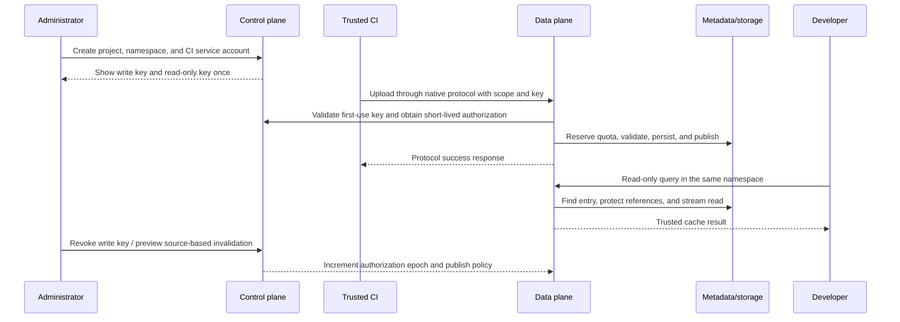

# ExpBuild P0 Technical Development Plan

Date: 2026-09-28. Version: design draft 0.1. The user confirmed that this round should continue refining the plan, so this directory provides inputs for subsequent development only. It does not modify the business implementation or indicate that functionality has been validated.

This plan builds on the [platform research plan](../strategy/README.md), narrowing the first release to: **enterprise self-hosting, REAPI cache-only + Gradle HTTP, a single data-plane instance, PostgreSQL, file storage and one validated S3-compatible backend, unified permissions, and an operationally complete management workflow.**

## 1. Contracts to Read Before Starting Development

| Document | Work that can begin from it |
|---|---|
| [Cache core](cache-core.md) | Rust domain types, protocol routing, streaming sessions, atomic publication, AC references, and GC transactions |
| [Metadata model](metadata-model.md) | Primary/foreign keys, read protection, quotas, lock ordering, recovery, invariants, and database roles |
| [PostgreSQL DDL draft](metadata-schema.sql) | Prototyping in a separate empty database; not a migration that can be applied directly to an existing production database |
| [Control-plane interfaces](control-plane.md) | TypeScript management APIs, sessions/service accounts, credential and policy synchronization, and source-based invalidation |
| [Protocol validation profile](protocol-profile.yaml) | Pinning first-release protocol intent, specification snapshots, and required test cases; future CI can reference it |
| [FindMissing performance study](findmissing-performance.md) | Batch metadata queries, fast and slow GC-retention paths, capacity definitions, and load-test gates |
| [Development breakdown and first iteration](development-plan.md) | Boundaries of the first 8 PRs, 12 work packages, dependency graph, two-week schedule, and release evidence |

When documents conflict, the explicit P0 decisions on this page define the scope baseline; the corresponding contracts govern domain and transaction details. Any conflict must be resolved in both documents; implementations must not independently choose different interpretations. Interfaces and DDL are drafts awaiting implementation, not a stable long-term SDK.

## 2. Core Decision Record

| ID | Current choice | Cost / conditions for reconsideration |
|---|---|---|
| ADR-001 | Two protocols in the first release; caching and remote execution are separate | Workers are not a core selling point for now; start an execution project only after cache correctness and pilot value meet their gates |
| ADR-002 | Rust data plane + existing TS/React control plane; internal modules first | Two languages require versioned contracts; any later language consolidation must demonstrate benefits |
| ADR-003 | A P0 namespace is the unit of physical isolation/deduplication and logical quotas | Identical bytes may be stored separately across projects; sharing requires dedicated authorization, metering, and migration design, not simply a prefix change |
| ADR-004 | Each namespace is bound to exactly one protocol and trust level, neither changeable in place | Changing protocol/trust level requires a new namespace and warm-up; prevents promoting old PR results to trusted status with one click |
| ADR-005 | Opaque tool keys, BlobIdentity, and physical generations are separate | Requires index/reference tables; prevents confusion between protocol keys and content digests and prevents GC from deleting new versions |
| ADR-006 | Publication makes content durable first, then commits visibility/entry/quota/outbox in one transaction | A crash may leave orphan objects, cleaned up by recovery and GC; success cannot be returned first |
| ADR-007 | P0 uses local durable staging; resumable uploads require the intact disk on the original node | Adds disk IO and temporary capacity; cross-node resumption in P1 requires separate checkpoint/routing design |
| ADR-008 | The control plane validates credentials on first use; the data plane uses signed authorization leases of ≤300 seconds | First-use requests depend on the control plane; avoids copying pepper/verifiers to nodes and prevents indefinite offline extension of old authorization |
| ADR-009 | Hard logical-storage quotas + upload reservations; initially a soft download budget | Metering and admission are separate; add strict total-download limits when customers require them, without presenting asynchronous statistics as hard limits |
| ADR-010 | Coarse-grained coordination of metadata writes within a namespace is acceptable in P0 | Throughput ceiling remains to be measured; ensure publication/GC/quota correctness first, with no network IO while holding locks |
| ADR-011 | Separate permissions for CAS content writes and result publication; retain publication provenance | Slightly more complex permissions; enables scoped isolation of results after a credential leak instead of blindly deleting all blobs |
| ADR-012 | Enterprise GA may retain the initial two ecosystems; defer the plugin SDK and cross-domain sharing | Slower growth in protocol count; avoids letting new adapters delay HA, recovery, and operational capabilities |

Long-term research still includes physical deduplication within a tenant, Edge, multiple data planes, open plugins, and execution backends. The above deliberately narrows the first-release scope. Later boundary changes require ADR updates and corresponding compatibility/migration validation.

## 3. Responsibilities and Data Ownership Across the Two Repositories

| Owner | Authoritative data / responsibilities | Boundary |
|---|---|---|
| expbuild-admin | Users, memberships, roles, credential verifiers, policy versions, management tasks, and console | Does not transfer large objects, return reusable historical secrets to the frontend, or rely on hidden UI elements for authorization |
| expbuild | Protocol handling, uploads, blob/entry/visibility, quota ledger, references/GC, and data-plane events | Does not accept client-asserted tenant authorization or depend directly on React/Prisma types |
| PostgreSQL | Shared transactional foundation with separate schemas and roles | Sharing a database does not grant every service write access to all tables; full IAM migrations are implemented separately by the control plane |
| BlobStore | Object bytes corresponding to immutable generations | Object existence alone does not establish visibility; metadata coordinates object lifecycles |

The database draft provides the minimal control-plane parent tables required by cross-schema foreign keys. It does not include all business tables such as User/Session/Team/Invitation/Operation. The next implementation round should add these tables according to the control-plane contract; applying this DDL cannot be claimed to provide complete enterprise IAM.

## 4. The First Genuinely Demonstrable Flow

The demo must also include negative cases: the same digest in another namespace cannot be probed or downloaded, and a read-only key cannot publish results. When a request fails, the console must show the actual error. The first round completes only a bounded CAS vertical slice and must not be called complete P0.

## 5. Concrete Outputs of the Pre-development Review

The review is not another discussion of “whether to support multiple protocols”; it must settle these actionable items:

1. Pin the initial Bazel/Gradle releases, wrapper/JDK, specification-source commits, and test artifacts. Unselected versions in `protocol-profile.yaml` remain uncertified.
2. Sample real build traffic and set blob/entry/ref/directory/staging/concurrency budgets; do not treat design-draft defaults as measured performance results.
3. In a disposable empty PostgreSQL database, validate DDL, negative foreign-key cases, entry-replacement transactions, repeated quota settlement, GC/read races, and immutable fields. Syntax checks do not replace transaction validation.
4. Review timing boundaries for credential/role changes, node disconnection, long-stream renewal, and upload commits; drive acceptance with controllable clocks and real state.
5. Determine whether existing users/caches need migration. Do not automatically trust legacy data with unknown ownership; if there is no live deployment, cold-start with the new structure.

Team and pilot-project rosters have not been provided, so the design does not invent personnel, customers, throughput scale, or validated versions. The earlier estimate of 4–6 people and a 3–4-month pilot remains a scenario assumption, not execution progress in this round.

## 6. Validation Completed in This Round

- The 91 local links in the 14 initial research and development-plan files were checked. The FindMissing performance study was added afterward, and document links continue to be checked separately. Markdown code fences are balanced.
- The protocol YAML parses; both repository HEADs, the SHA-256 hashes of the two in-repository proto files, and the specification's empty digest match. The 12 required fixture IDs are unique. This validates the profile only, not execution of the fixtures.
- The DDL's 47 SQL statements passed syntax parsing with pglast 8.4; the 34 foreign keys across 16 tables passed static checks of targets, unique keys, and types. PostgreSQL database creation, server-side PL/pgSQL compilation, and concurrent transaction tests have not been run.
- No business code in either repository was modified, no product tests were run, and no remote issues/PRs were created. This round delivers development contracts and a validation plan; the corresponding work packages will produce client-version certification, database integration, fault-recovery, and performance evidence.
