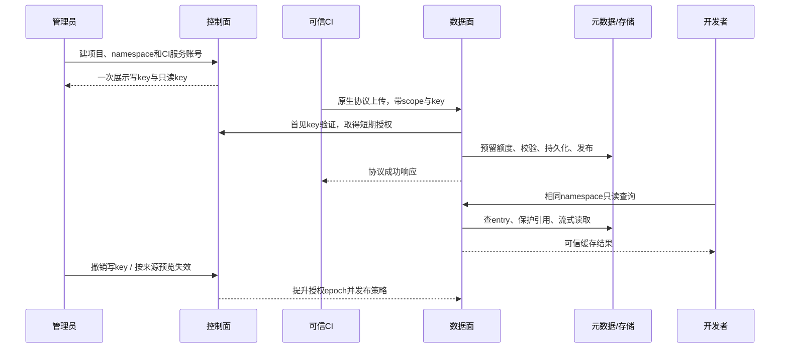

# ExpBuild P0 开发技术方案

日期：2026-09-28。版本：设计草案 0.1。用户确认本轮继续深化规划，因此本目录只提供后续开发输入，不修改业务实现，也不代表功能已通过验证。

本方案承接 [平台研究规划](../strategy/README.md)，将首版收敛为：**企业自托管、REAPI cache-only + Gradle HTTP、单数据面实例、PostgreSQL、文件存储与一个经过验证的 S3 兼容后端、统一权限和可运营的管理闭环。**

## 1. 直接开发需要读的契约

| 文档 | 可以据此开始的工作 |
|---|---|
| [缓存内核](cache-core.md) | Rust 领域类型、协议路由、流式会话、原子发布、AC引用与GC事务 |
| [元数据模型](metadata-model.md) | 主键/外键、读保护、额度、锁顺序、恢复、不变量与数据库角色 |
| [PostgreSQL DDL 草案](metadata-schema.sql) | 独立空库原型；不能直接作为现有生产库的迁移 |
| [控制面接口](control-plane.md) | TypeScript管理API、会话/服务账号、凭据与策略同步、来源失效 |
| [协议验证档案](protocol-profile.yaml) | 固定首版协议意图、规范快照和必测用例；后续CI可引用 |
| [FindMissing 性能专项](findmissing-performance.md) | 批量元数据查询、GC保留快慢路径、容量口径与压测门槛 |
| [开发拆分与首个迭代](development-plan.md) | 前8个PR边界、12个工作包、依赖图、两周安排及发布证据 |

文档发生冲突时以本页明确的 P0 决策为范围基线，领域及事务细节以对应契约为准；发现冲突必须修订双方，不允许实现各自选择一种含义。接口/DDL 是待实施草案，不是长期稳定 SDK。

## 2. 核心决策记录

| 编号 | 当前选择 | 代价 / 重新考虑条件 |
|---|---|---|
| ADR-001 | 首版两协议，缓存与远程执行独立 | 暂不利用worker作为核心卖点；待缓存正确性与试点价值过关再立执行项目 |
| ADR-002 | Rust数据面 + 现有TS/React控制面；先内部模块 | 两种语言需要版本化契约；团队后续合并语言须证明收益 |
| ADR-003 | P0 namespace 是物理隔离/去重与逻辑配额单位 | 不同项目相同字节可重复存；需要共享时专门设计授权、计量和迁移，不改前缀就开放 |
| ADR-004 | namespace唯一绑定协议和信任级别；不可原位改 | 改协议/可信等级须新建并预热；防止一键把旧PR结果提升为可信 |
| ADR-005 | 不透明工具key、BlobIdentity、物理generation分离 | 需要索引/引用表；保证协议键和内容摘要不混淆、GC不误删新版本 |
| ADR-006 | 发布先内容耐久，再同事务提交可见性/entry/额度/outbox | 崩溃可留下孤儿对象；靠恢复与GC清理，不能先返回成功 |
| ADR-007 | P0本地持久暂存，断点只在原节点完好磁盘续传 | 增加磁盘IO和临时容量；P1跨节点续传另做checkpoint/路由设计 |
| ADR-008 | 控制面首见凭据验证，数据面使用≤300秒签名授权lease | 首见请求依赖控制面；避免把pepper/verifier复制到节点，旧授权不能无限离线延长 |
| ADR-009 | 逻辑存储硬额度 + 上传预留；下载先软预算 | 计量与准入分离；严格下载总额按客户需求追加，不以异步统计冒充硬限 |
| ADR-010 | P0可接受namespace内粗粒度元数据写协调 | 吞吐上限待测；先确保发布/GC/配额正确，网络IO不得在锁内 |
| ADR-011 | CAS内容写与结果发布分权，保存发布来源 | 权限配置稍复杂；凭据泄漏后才能有范围地隔离结果，而非盲删所有blob |
| ADR-012 | 企业GA允许保持首版两生态；插件SDK与跨域共享后置 | 协议总数增长较慢；避免新适配器拖住HA、恢复和运营能力 |

长期研究中的 tenant 内物理去重、Edge、多数据面、开放插件和执行后端仍保留，以上是首版刻意缩小的范围。后续改变边界需要 ADR 更新和对应兼容/迁移验证。

## 3. 两仓库的职责与数据归属

| 所属 | 权威数据/职责 | 边界 |
|---|---|---|
| expbuild-admin | 用户、成员、角色、凭据verifier、策略版本、管理任务与控制台 | 不传大对象，不给前端返回可重用的历史secret，不靠页面隐藏做授权 |
| expbuild | 协议处理、上传、blob/entry/visibility、配额账本、引用/GC、数据面事件 | 不接受客户端自报tenant授权，不直接依赖React/Prisma类型 |
| PostgreSQL | 分schema与不同角色的共同事务基础 | 同库不等于所有服务有全部表的写权限；完整IAM迁移另由控制面实现 |
| BlobStore | 不可变generation对应的对象字节 | 不能仅凭对象存在决定可见性；对象生命周期由元数据协调 |

数据库草案提供跨schema外键所需的最小控制面父表，不包含完整 User/Session/Team/Invitation/Operation 等全部业务表。下一轮实现应依据控制面契约补齐这些表，不能宣称执行本DDL便有完整企业IAM。

## 4. 第一条真正可展示的路径

演示必须同时带负例：另一 namespace 相同 digest 不可探测/下载，只读 key 不能发布结果；请求失败时管理台显示真实错误。第一轮只完成有界 CAS 纵向路径，不能把它称作完整 P0。

## 5. 开发前评审的具体输出

不是再讨论“是否支持多协议”，而是确认以下可落地项目：

1. 固定首批 Bazel/Gradle release、wrapper/JDK、规范源commit与测试产物；`protocol-profile.yaml` 中未选版本保持未认证。
2. 对一段真实构建流量采样，定下 blob/entry/ref/目录/暂存/并发预算；不把设计草案默认值当性能实测结果。
3. 在一次性 PostgreSQL 空库验证DDL、负向外键、entry替换事务、配额重复结算、GC与读取竞争、不可变字段；语法通过不能代替事务验证。
4. 评审凭据/角色变更、节点断连、长流续租、上传提交的时间边界；用可控时钟和真实状态驱动验收。
5. 确定是否有旧用户/缓存需要迁移。默认不给无归属旧数据自动授信；若没有现网，采用新结构冷启动。

团队和试点项目名单尚未提供，因此不在设计中虚构人员、客户、吞吐规模或已通过的版本。此前4–6人、3–4个月试点估算仍是情景假设，不是本轮执行进度。

## 6. 本轮已完成的校验

- 初始研究与开发方案14个文件的91处本地链接已检查；随后新增FindMissing性能专项，文档链接继续单独校验。Markdown代码围栏闭合。
- 协议YAML可以解析；两仓库HEAD、两份仓库内proto的SHA-256、规范空摘要一致；12个必测fixture标识唯一。这只验证档案，不表示fixture已执行。
- DDL的47条SQL语句通过pglast 8.4语法解析；16张表的34个外键通过目标、唯一键及类型静态检查。尚未执行PostgreSQL建库、PL/pgSQL服务器端编译或并发事务测试。
- 没有修改两仓库业务代码、运行产品测试或创建远程issue/PR。本轮交付的是开发契约和验证计划；客户端版本认证、数据库集成、故障恢复及性能证据由对应工作包产出。
