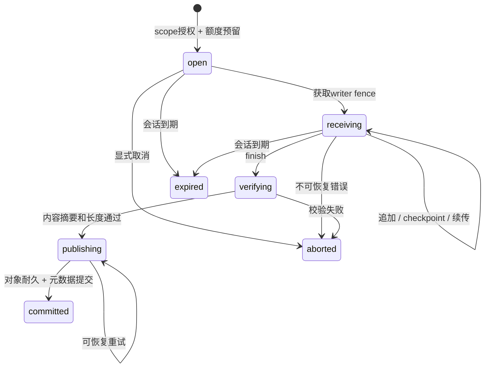

# P0 缓存内核与协议契约

状态：技术设计草案，尚未实现或通过客户端互操作验证。上层产品范围见 [研究总览](../strategy/README.md)，数据库实体和事务配套见 [元数据设计](metadata-model.md)。本文把长期架构收敛为首版可开发边界；不是新增协议承诺。

## 1. 固定的首版边界

- 一个 Rust 数据面部署实例、一个控制面、PostgreSQL；FS 或一个验证过的 S3 兼容后端。每个 namespace 绑定一个协议和一个信任级别，创建后不可原位改变。
- **P0 物理去重限定在 namespace 内。** tenant/project 是授权与归属层；namespace 是最小存储/配额隔离域。暂不实现跨 namespace 共享，未来另做显式授权与迁移。
- REAPI 只提供缓存服务；Gradle 提供原生 HTTP 缓存。执行服务、worker 注册与调度不在 P0 对外监听面中。
- REAPI 初版支持 SHA-256 + identity；压缩、其他 digest、Split/Splice 不宣告。缓存键与实际内容摘要是不同类型。
- P0 所有内容经过数据面，不给构建客户端对象存储凭据或预签名直传 URL。上传使用本地持久暂存，断点续传限定于原节点及其完好磁盘；跨节点续传后置。
- 先在 `crates/server` 内建立模块，边界稳定后再拆 crate，避免移动文件与重写协议同时进行。

这些取舍进一步约束了研究方案：长远的 tenant 内去重、分布式数据面、进程外插件与 Edge 不进入首个实现分支。

## 2. 外部路由与身份

所有路径中的 ID 为不可变 UUID；slug/name 可改但不参与存储寻址。tenant/project/namespace 三级关系由服务端核对，不能只验证 namespace ID 存在。

```text
REAPI instance_name:
  tenants/{tenant_id}/projects/{project_id}/namespaces/{namespace_id}

REAPI ByteStream identity read:
  {instance_name}/blobs/{sha256_hex}/{size_bytes}

REAPI ByteStream identity write:
  {instance_name}/uploads/{client_uuid}/blobs/{sha256_hex}/{size_bytes}

Gradle base URL:
  https://cache.example.com/cache/gradle/v1/{tenant_id}/{project_id}/{namespace_id}/
Gradle GET/PUT:
  {base_url}{tool_cache_key}
```

REAPI 使用 gRPC `authorization: Bearer <api-key>`；Gradle 使用 Basic，username 固定为 `expbuild`，password 为同一类平台 API key。Basic 只是一种传输包装，必须使用 HTTPS，不代表有第二套用户名密码。浏览器会话不允许当构建 key 使用，内部节点证书也不能替代用户权限。[控制面契约](control-plane.md) 定义验证与授权租约。

请求链固定为：解码凭据 → 取得授权租约 → 解析目标 scope → 核对成员/机器范围、协议和动作 → 构造 `AuthorizedContext` → 核心调用。适配器不能直接构造可任意 tenant 的已授权上下文。

原生协议的 HTTP URL/gRPC metadata 不进入访问日志原文；日志记录 request ID、已授权 scope、token 非秘密 ID 和错误类别。代理只信任部署中明确配置的上游身份/TLS 信息，禁止普通请求伪造认证 header。

| 原生操作 | 必需权限与额外边界 |
|---|---|
| GetCapabilities | 有效主体且获准进入目标namespace；只返回可用能力 |
| FindMissing/BatchRead/Read/GetTree/GetActionResult/Gradle GET | `cache.read`，且目标对象在当前namespace可见 |
| BatchUpdate/ByteStream Write | `blob.write`；会话绑定原principal_id与credential_id |
| QueryWriteStatus/续传/commit | `blob.write` + 与原session的principal/credential精确匹配；同namespace另一机器不可探测/接管 |
| UpdateActionResult | `result.publish`，引用对象必须在同namespace可引用；inline内容若需新发布CAS另需`blob.write` |
| Gradle PUT | `blob.write` + `result.publish` |

credential轮换不自动接管旧上传会话；旧凭据撤销后需新建上传资源，不能凭相同client UUID继承旧会话权限。

## 3. 核心类型与接口

以下为语言无关的接口签名草案；实现时可选 Rust trait/struct，但不可把 `ActionResult` 渗透到共享存储层。

```text
Scope = (tenant_id, project_id, namespace_id)
AuthorizedContext = (scope, principal_id, credential_id, actions,
                     authz_epoch, policy_version, lease_expires_at,
                     deadline, request_id, cancellation)
BlobIdentity = (namespace_id, digest_algorithm, digest_bytes, logical_size)
BlobGeneration = (blob_identity, generation_id, immutable_locator, state)
EntryKey = (namespace_id, protocol, key_schema_version, opaque_key)
EntryValue = (payload_kind, payload_bytes, resolved_blob_references,
              publisher_id, credential_id, invocation_id?, expires_at)
ReadHandle = (specific_generation, byte_range, read_lease, stream)
UploadHandle = (upload_id, owner_context, writer_fence, durable_offset)

CacheCore:
  FindVisibleBlobs(ctx, blob_ids) -> present/missing[]
  OpenBlob(ctx, blob_id, range) -> ReadHandle
  BeginUpload(ctx, upload_spec) -> UploadHandle
  Append(ctx, handle, offset, bytes) -> accepted_offset
  Checkpoint(ctx, handle) -> durable_offset
  CommitBlob(ctx, handle) -> published_generation
  AbortUpload(ctx, handle) -> idempotent outcome
  QueryUpload(ctx, external_resource_name) -> durable_offset/complete
  LookupEntry(ctx, key, read_protection) -> entry/miss
  PublishEntry(ctx, key, value, publish_mode) -> generation/outcome
  InvalidateEntries(ctx, selector, dry_run_token) -> operation_id

BlobStore (只接收核心生成的 locator/handle):
  BeginStage / OpenStage / AppendStage / FlushStage
  CommitImmutable / Stat / OpenRange / DeleteGeneration / AbortStage

MetadataStore:
  AuthorizeVisibility / ReserveQuota / CommitPublication
  AcquireReadProtection / FenceUpload / ClaimGC / FinalizeGC
```

`BlobStore` 不暴露 `get(digest)` 给协议适配器；这样不能绕开可见性、授权和读保护。`FindVisibleBlobs` 不是物理磁盘 exists。事务性元数据接口封装完整不变量，不能由每个 adapter 自己拼几次 SQL。

FindMissing 使用有界批量元数据查询；已获充分保留的命中走只读路径，临近到期或可恢复tombstone在返回前批量重验并续期。不得逐digest查后端，不得每个命中无条件更新访问时间；具体GC竞争规则和验收见 [FindMissing性能专项](findmissing-performance.md)。

`publish_mode` 支持 Replace、CreateIfAbsent、ExpectedGeneration 三种内部语义，但协议选择不同：P0 REAPI/Gradle 使用受权的原子替换；相同结果重复提交可返回幂等成功；不同内容同时写同一 key 时最后一个成功提交的版本可见，记录冲突指标与发布者。未来 Nx adapter 选择 CreateIfAbsent，并映射其原生冲突码，不能把此模式强加给所有协议。

`EntryValue.payload_bytes` 是有界协议元数据：REAPI保存ActionResult编码；Gradle保存归档描述/引用，其大归档字节在BlobStore，不能塞进数据库bytea列。具体metadata、key和引用集合的应用上限统一进入配置与兼容档案。

## 4. 可见性与缓存完整性

物理内容、逻辑可见性、结果发布权限各自独立：

1. `blob.write` 允许上传内容；`result.publish` 才允许发布工具可复用的结果。Gradle 单归档写入需要两者，不能绕过结果发布检查。
2. 物理存在、知道 hash、持有别的项目相同 hash，都不能创建本 namespace 的可见性。首次发布通过完整内容校验；P0 不提供“给一个 digest 就绑定到别处对象”的管理捷径。
3. 对没有本 namespace 可见性的 blob，FindMissing 报 missing，下载报 not found；不暴露其他 scope 是否持有它。无 namespace 权限则在查存储前拒绝。
4. **REAPI 的规范空 blob 是特例**：授权通过后，规范 SHA-256 空摘要且 size=0 必须始终可读，即使未上传。FindMissing 不列为缺失，不写物理对象、不占逻辑字节；任意 hash+0 不能冒充空 blob。[仓库内规范](../../crates/proto/proto/build/bazel/remote/execution/v2/remote_execution.proto:345)
5. 发布 entry 前，所有需要的 blob 已验证、同 namespace 可见且对应 generation 可引用。读取条目之前，确认引用仍有效并取得后续下载保护；不完整结果按 miss 处理并隔离。

不要把错误一律伪装成 miss：确定不存在/过期的结果是 miss；后端暂时不可用、权限拒绝和已发现的内容损坏分别返回相应错误并独立统计。

规范空摘要仍保留在原生ActionResult/Directory payload中，但引用提取时从需要持久保护的闭包排除，不创建BlobIdentity/Generation/Visibility/EntryReference/BlobLease或配额预留；OpenBlob返回虚拟零字节handle。空上传可即时返回`committed_size=0`且不持久化session；对未登记的空上传资源，QueryWriteStatus返回NOT_FOUND，客户端可重新发起空Write并再次成功。“空blob始终可读”和“特定upload session是否存在”分别处理。该规则只适用规范REAPI空blob；Gradle零长度归档是否有效由客户端fixture验证。

## 5. 上传状态机与耐久性



网络断开本身不等同 Abort：保留可恢复会话到 TTL。临时写入、完整但未发布对象、已发布对象都应能被恢复任务区分。Complete 会话保留一个明确的查询窗口，过期后 QueryWriteStatus 可返回 NOT_FOUND，不将旧会话重新变成 offset=0。

上图使用SQL枚举名，本文Complete/完成均指`committed`；Open句柄可处于`open/receiving`。`verifying/publishing`遇进程崩溃先由恢复器取得新fence并确认存储事实，再完成或中止；不能因普通上传TTL到期就盲删可能已发布的对象。

### ByteStream 精确规则

- 每次 Write 的首消息必须有资源名；后续资源名可空，否则必须与首消息一致。路由 metadata 如果存在也必须与消息一致。
- 资源名包含完整 scope、client UUID、digest/size；不能只按 UUID 建唯一键。规范允许同 UUID 上传不同 blob。可忽略允许的 optional metadata，但会话定位与请求内一致性规则必须固定。
- 第一个 write_offset 必须等于持久 checkpoint；随后必须等于本次流初始 offset + 本次已接收字节。负值、跳跃和不匹配都报协议错误，不能静默补零或重复追加。
- 同一会话只允许一个持有有效 writer fence 的流写入。新流竞争失败返回可重试冲突，不允许两个 Append 并行；超时接管需提升 fence，旧流不能提交。
- `accepted_offset` 可以领先 `durable_offset`；QueryWriteStatus 只报告后者，且同一个尚存在会话的结果不可倒退。
- 持久化顺序是暂存 flush/fsync → 提交 checkpoint。重启时把未确认尾部截断到 checkpoint，再从已持久前缀重算摘要；P0 不把具体 SHA 实现内部状态当稳定磁盘格式。
- 只有 finish_write、完整校验、持久对象、可见性/账本事务全部成功后才能 Complete。发送 finish 后的多余消息按规范处理；未 finish 关闭流可保留 checkpoint，但不能报告完整成功。
- 如果同 namespace 已有完整可见的相同 blob，可按 REAPI 提前返回完整 committed_size；不能利用其他 scope 的存在做这种提前成功。
- P0 identity 的 committed_size 是未压缩字节数。compressed-blobs 明确不支持；后续实现压缩必须重审 mixed-offset 特殊语义，不能直接沿用 identity 算法。

规则依据：[ByteStream](../../crates/proto/proto/google/bytestream/bytestream.proto:53)、[REAPI 上传资源与提前完成](../../crates/proto/proto/build/bazel/remote/execution/v2/remote_execution.proto:210)。

**文件IO也必须隔离fence。** P0每次writer接管使用新的stage locator，复制旧fence已确认的durable前缀并fsync，再以条件事务切换当前locator；旧fence文件不再接纳为新writer输入。旧流未取消完成的append只能影响旧文件，checkpoint/commit仍被fence拒绝。复制期间保护旧stage，切换前失败保持原checkpoint可恢复；各fence孤儿文件受独立暂存空间预算和清理管理。仅在DB增加fence字段、却让两个流继续写同一文件不合格。

### FS 与 S3 的发布路径

FS：唯一暂存文件 → 校验 → flush/fsync → 不可变 generation 路径发布 → 同步父目录（按耐久性等级）→ 元数据事务。路径只由 UUID、算法和已验证 digest 生成，不能让 opaque tool key 直接成为文件路径。

S3：P0 同样暂存至本地持久卷 → 完整校验 → SDK 流式上传到唯一 generation key → 确认上传完成 → 元数据事务。后端 multipart/重试交给固定版本驱动并测试。此方式会增加本地磁盘写与临时容量，但使初版断点语义一致；原生 S3 multipart 的分段恢复与跨节点续传另立后续设计。

若节点/暂存盘永久丢失，会话显式进入不可恢复状态，由客户端新建上传；不能返回旧 offset 后却找不到对应字节。元数据事务失败时保留已完成对象，幂等恢复发布或按孤儿宽限期回收；不提前给客户端成功。

## 6. Entry 发布与引用提取

Gradle 请求流为一个 opaque payload：上传完成后平台计算内容 BlobIdentity，再把工具 key 绑定到 blob generation；可见性、entry、额度与 session 完成在同一元数据事务提交，成功响应必须在事务之后。它的工具 key 不用于验证 body 的内容摘要。服务端不解压、不改包、不计算任务 key。已 committed 的内部 session 重试只返回原完成事实，不能重新发布并覆盖该 key 后来的版本；新的原生 PUT 是独立上传操作。

REAPI ActionResult 的引用提取由 adapter 实现：

- 验证 action digest、ActionResult 结构、输出路径和大小；Action 与 Command 按 UpdateActionResult 的规范前提检查，Action.do_not_cache 禁止结果缓存。无需为了 cache-only 强制保留全部源输入树。[ActionCache 规范](../../crates/proto/proto/build/bazel/remote/execution/v2/remote_execution.proto:177)
- 抽取文件、stdout/stderr、输出目录及所选协议 profile 的其他必要引用，解码并验证引用对象；用访问预算限制深度、节点、总字节和工作时长。
- `Tree` 内嵌的 Directory 消息不等同独立上传的 CAS Directory blob。通过 Tree 引用验证内嵌目录完整性和文件 digest，不能无条件要求每个内嵌目录也单独存在 CAS；若采用 root_directory_digest 的独立 Directory 链，则验证对应链，并核对同时出现时的根摘要一致性。
- 元数据 inline 内容保持等价；首次实现可以不满足 inline hint，但不能突破消息大小限制，也不能声称 hint 是必需语义。输出符号链接遵循规范；文件路径与 symlink target 使用不同校验规则，不能把合法相对 target 中的 `..` 一律当文件路径攻击。
- 引用提取完成后在同一元数据事务中确认引用状态、更新 entry generation 和引用集合、写发布来源/账本/outbox。锁按稳定 ID 顺序取得。数据上传成功不等于结果发布成功。

P0 CacheEntry 保留当前可见版本，覆盖增加 generation。历史发布行为进入审计，不要求保存所有历史 payload。通过 entry generation 做内部乐观并发，管理失效任务带期望版本，避免清理计划删除预览后刚更新的结果。

## 7. 读取、覆盖与 GC 协同

`LookupEntry` 先在事务中取得当前 entry 与已解析引用，锁定具体 blob generations，延长读保护后才返回。保护独立于 entry：条目被覆盖或失效后，已经成功读取结果的客户端仍有短期窗口下载旧产物。

P0 可使用有界引用集合的 O(n) 元数据更新，不在每次命中重新遍历整棵目录树。默认窗口可从 10 分钟开始试验，按大产物/慢网络 PoC 校准；引用数量与事务时长设上限，超限显式拒绝/提示，不截断为不完整结果。长流另持有具体 generation 的可续读 lease，不能只保护一个会被重新指向的 BlobIdentity。

存储保护窗口不是访问授权：即使blob还因10分钟grace存在，主体仍受≤300秒授权lease、epoch撤销和namespace状态约束。授权失效后不能继续读，尚存的物理内容等正常GC。

GC 与发布共享状态机：

```text
Live --无有效引用/保留/读写租约--> Tombstoned --复核+fence--> Deleting --> Deleted
Tombstoned --在进入Deleting之前原子恢复--> Live
Deleting --不接受新引用；新上传使用新的generation/locator
```

GC 删除只针对 claim 时记录的 generation locator，永不按“当前这个 digest 的路径”删除。新增引用、续租、更新 visibility 与 GC 状态切换在同一事务锁协议下互斥；单纯“删前再查一次”不够。后台执行失败可按 fencing/幂等重试，但失去 GC lease 的任务不能更新成功状态。

P0 可选择以 namespace 为写事务的粗粒度协调域，把 GC/发布/配额的正确性先做清楚；锁内不进行网络 IO或大对象哈希。细粒度并行必须保持相同不变量，依据实测争用再优化。数据库 DDL 不能替代完整事务协议。

## 8. 配额、资源预算与错误映射

P0 硬存储额度按 namespace 逻辑字节和可见blob数量计：同一 BlobIdentity 在同 namespace 只计一次；结果条目数量另有上限。上传前按声明大小及一个新blob保守预留，未知长度按分段预算申请；发布时扣除实际新增量并释放保留，取消/到期幂等释放。REAPI规范空blob例外不预留；同namespace已可见内容可直接成功。内容已进入 CAS但 entry 发布失败时，CAS 用量仍计入，直至可见性过期清理，不能凭 entry 失败把已占资源忽略。

管理员可把额度降到当前使用+预留以下：此时拒绝新的正增量预留，保持读取和已获预留的结算；已预留上传若不增加总占用可完成。不能用`used+reserved<=limit`永久CHECK禁止降额，也不能忽略降额后新请求的原子准入。对象数限制防止海量极小blob绕过字节限额。

物理存储含压缩、重复 generation、暂存和待删除对象，另设节点磁盘水位及暂存预算，不能把逻辑配额当磁盘足够的证明。下载 P0 为软流量预算+速率/并发限制；不承诺跨节点零超发的硬流量限额。

| 内核结果 | REAPI / ByteStream | Gradle HTTP | 管理 API |
|---|---|---|---|
| 无有效凭据 | UNAUTHENTICATED | 401 + Basic challenge | 401 |
| 无操作权限 | PERMISSION_DENIED | 403 | 403；未获资源可见性时可统一404 |
| 已授权目标中未命中 | NOT_FOUND；FindMissing 列出 digest | 404 | 404 |
| 摘要/参数/偏移不合法 | INVALID_ARGUMENT；偏移按固定profile选择规范码 | 400 | 400 |
| 请求 batch 超界 | INVALID_ARGUMENT，具体规范规定 | 不适用 | 不适用 |
| 单对象超过允许大小 | RESOURCE_EXHAUSTED | 413 | 413 |
| 额度/并发限制 | RESOURCE_EXHAUSTED | 429，是否重试由客户端行为验证 | 429 |
| 缺失必需输出/Action/Command | UpdateActionResult: FAILED_PRECONDITION | 不适用 | 409，带受限详情 |
| 后端暂时不可用 | UNAVAILABLE | 503 | 503 |
| 已确认数据损坏 | DATA_LOSS；缓存条目隔离 | 502/503，客户端行为PoC后固定 | 500 + request_id |

协议没有相同语义时不强求相同状态码。batch 整体合法但单个对象失败，返回 per-item status；不能因一个错误丢弃其他对象的结果。错误不泄漏对象存储位置、数据库语句或另一个租户的信息。

请求预算独立包含：RPC/message bytes、单 blob、HTTP body、batch logical bytes、临时磁盘、同时流数、每流缓冲、目录节点/深度、引用数、数据库事务时长和总 deadline。先沿用 REAPI 4MiB batch 宣告并真正执行，其他默认值由 M0 工作负载校准；所有上限都体现在配置、错误和兼容档案中。

## 9. REAPI / Gradle 首版验收接口清单

| 协议面 | P0 行为 |
|---|---|
| GetCapabilities | SHA256、identity、实际 batch/blob 限制、execution禁用；版本区间须由冻结的客户端测试证据确定，不能仅复制现有2.0–2.3常量 |
| FindMissing | scope强制、空blob特例、摘要数/消息预算、使用窗口保护；响应只有missing集合，错误使用整RPC状态 |
| BatchRead / BatchUpdate | scope强制、空blob特例、batch内容限额、每项错误、独立byte统计 |
| ByteStream Read/Write/Query | 资源解析、offset、checkpoint、resume、finish、取消、授权与机器故障语义 |
| GetActionResult / UpdateActionResult | 引用图、可信发布、读保护、规范缓存策略；不依赖执行服务 |
| GetTree | 使用有界遍历/流式分页；page_size/token约束；root缺失NOT_FOUND，子树缺失按规范返回可用部分，不误改为全树失败 |
| Execution / WorkerScheduler | cache-only listener不注册；调用不可执行任务或注册worker |
| Gradle GET | 命中200原始内容；未命中404；错误与miss分开 |
| Gradle PUT | 可信写入权限；完整提交后2xx；过大413；支持实际客户端Expect-Continue行为；不自动重定向丢凭据 |

GetTree 的游标绑定 scope、root、遍历状态和有效期，不能只接受客户端传入的任意 offset。可用服务器暂存游标，失效后明确返回错误由客户端重试；内存/数据库状态有上限，重复/循环目录引用去重。[GetTree 规范](../../crates/proto/proto/build/bazel/remote/execution/v2/remote_execution.proto:420)

契约测试不仅验证返回码，还验证没有部分发布、没有额度泄漏、没有跨 scope 存在性泄漏、清理后旧 locator 不会误删新对象，以及失效 entry 不会因后台重试重新可见。
