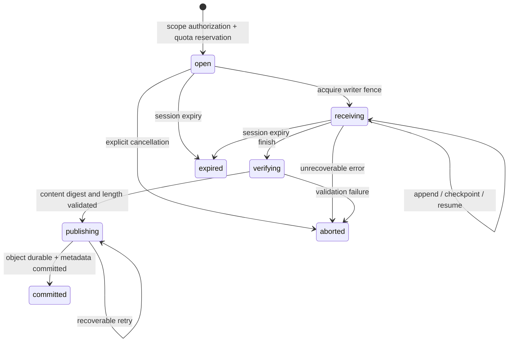

# P0 Cache Core and Protocol Contract

Status: technical design draft; not yet implemented or validated for client interoperability. For the higher-level product scope, see the [research overview](../strategy/README.md); for database entities and supporting transactions, see the [metadata design](metadata-model.md). This document narrows the long-term architecture to an implementable first-release boundary; it makes no new protocol commitments.

## 1. Fixed First-Release Boundaries

- One Rust data-plane deployment instance, one control plane, and PostgreSQL; FS or one validated S3-compatible backend. Each namespace is bound to one protocol and one trust level, which cannot be changed in place after creation.
- **P0 physical deduplication is limited to a namespace.** tenant/project are the authorization and ownership layers; namespace is the smallest storage/quota isolation domain. Cross-namespace sharing is not implemented yet; explicit authorization and migration will be designed separately later.
- REAPI provides cache services only; Gradle provides native HTTP caching. Execution services, worker registration, and scheduling are outside P0's externally exposed listeners.
- The first REAPI release supports SHA-256 + identity; compression, other digests, and Split/Splice are not advertised. Cache keys and actual content digests are distinct types.
- All P0 content passes through the data plane. Build clients receive neither object-storage credentials nor presigned direct-upload URLs. Uploads use local durable staging; resumption is limited to the original node with its disk intact. Cross-node resumption is deferred.
- Establish modules within `crates/server` first, then split crates once the boundaries stabilize, avoiding simultaneous file moves and protocol rewrites.

These choices further constrain the research proposal: longer-term tenant-wide deduplication, a distributed data plane, out-of-process plugins, and Edge are excluded from the first implementation branch.

## 2. External Routing and Identity

All IDs in paths are immutable UUIDs; slug/name may change but do not participate in storage addressing. The server verifies the three-level tenant/project/namespace relationship; checking only that a namespace ID exists is insufficient.

```text
REAPI instance_name:
  tenants/{tenant_id}/projects/{project_id}/namespaces/{namespace_id}

REAPI ByteStream identity read:
  {instance_name}/blobs/{sha256_hex}/{size_bytes}

REAPI ByteStream identity write:
  {instance_name}/uploads/{client_uuid}/blobs/{sha256_hex}/{size_bytes}

Gradle base URL:
  https://cache.example.com/cache/gradle/v1/{tenant_id}/{project_id}/{namespace_id}/
Gradle GET/PUT:
  {base_url}{tool_cache_key}
```

REAPI uses gRPC `authorization: Bearer <api-key>`; Gradle uses Basic, with username fixed to `expbuild` and the same kind of platform API key as the password. Basic is only a transport wrapper and requires HTTPS; it does not imply a second username/password system. Browser sessions cannot serve as build keys, and internal node certificates cannot substitute for user permissions. The [control-plane contract](control-plane.md) defines authentication and authorization leases.

The request chain is fixed: decode credentials → obtain an authorization lease → resolve the target scope → verify member/machine scope, protocol, and action → construct `AuthorizedContext` → call the core. Adapters cannot directly construct authorized contexts for arbitrary tenants.

Raw native-protocol HTTP URLs/gRPC metadata are not written to access logs; logs record the request ID, authorized scope, non-secret token ID, and error category. Proxies trust only upstream identity/TLS information explicitly configured in the deployment; ordinary requests must not be able to forge authentication headers.

| Native operation | Required permissions and additional boundaries |
|---|---|
| GetCapabilities | Valid principal authorized to enter the target namespace; return only available capabilities |
| FindMissing/BatchRead/Read/GetTree/GetActionResult/Gradle GET | `cache.read`, with the target object visible in the current namespace |
| BatchUpdate/ByteStream Write | `blob.write`; session bound to the original principal_id and credential_id |
| QueryWriteStatus/resume/commit | `blob.write` + an exact match to the original session's principal/credential; another machine in the same namespace cannot probe or take over the session |
| UpdateActionResult | `result.publish`; referenced objects must be referenceable in the same namespace; inline content that requires new CAS publication also requires `blob.write` |
| Gradle PUT | `blob.write` + `result.publish` |

Credential rotation does not automatically take over old upload sessions. After old credentials are revoked, a new upload resource is required; the same client UUID cannot inherit the old session's permissions.

## 3. Core Types and Interfaces

The following is a language-independent draft of interface signatures. The implementation may use Rust traits/structs, but `ActionResult` must not leak into the shared storage layer.

```text
Scope = (tenant_id, project_id, namespace_id)
AuthorizedContext = (scope, principal_id, credential_id, actions,
                     authz_epoch, policy_version, lease_expires_at,
                     deadline, request_id, cancellation)
BlobIdentity = (namespace_id, digest_algorithm, digest_bytes, logical_size)
BlobGeneration = (blob_identity, generation_id, immutable_locator, state)
EntryKey = (namespace_id, protocol, key_schema_version, opaque_key)
EntryValue = (payload_kind, payload_bytes, resolved_blob_references,
              publisher_id, credential_id, invocation_id?, expires_at)
ReadHandle = (specific_generation, byte_range, read_lease, stream)
UploadHandle = (upload_id, owner_context, writer_fence, durable_offset)

CacheCore:
  FindVisibleBlobs(ctx, blob_ids) -> present/missing[]
  OpenBlob(ctx, blob_id, range) -> ReadHandle
  BeginUpload(ctx, upload_spec) -> UploadHandle
  Append(ctx, handle, offset, bytes) -> accepted_offset
  Checkpoint(ctx, handle) -> durable_offset
  CommitBlob(ctx, handle) -> published_generation
  AbortUpload(ctx, handle) -> idempotent outcome
  QueryUpload(ctx, external_resource_name) -> durable_offset/complete
  LookupEntry(ctx, key, read_protection) -> entry/miss
  PublishEntry(ctx, key, value, publish_mode) -> generation/outcome
  InvalidateEntries(ctx, selector, dry_run_token) -> operation_id

BlobStore (accepts only core-generated locators/handles):
  BeginStage / OpenStage / AppendStage / FlushStage
  CommitImmutable / Stat / OpenRange / DeleteGeneration / AbortStage

MetadataStore:
  AuthorizeVisibility / ReserveQuota / CommitPublication
  AcquireReadProtection / FenceUpload / ClaimGC / FinalizeGC
```

`BlobStore` does not expose `get(digest)` to protocol adapters, preventing them from bypassing visibility, authorization, and read protection. `FindVisibleBlobs` is not a physical-disk existence check. Transactional metadata interfaces encapsulate complete invariants; individual adapters must not assemble them from a few SQL calls themselves.

FindMissing uses bounded batch metadata queries. Hits with sufficient retention take a read-only path; near-expiry objects or recoverable tombstones are revalidated and renewed in batches before returning. There must be no per-digest backend queries or unconditional access-time updates on every hit. See the [FindMissing performance design](findmissing-performance.md) for specific GC race rules and acceptance criteria.

`publish_mode` supports three internal semantics: Replace, CreateIfAbsent, and ExpectedGeneration, with different protocols choosing differently. P0 REAPI/Gradle use authorized atomic replacement; resubmitting the same result may return idempotent success. When different content is written concurrently to the same key, the last successfully committed version is visible, and conflict metrics and publishers are recorded. A future Nx adapter will choose CreateIfAbsent and map its native conflict code; this mode must not be imposed on all protocols.

`EntryValue.payload_bytes` contains bounded protocol metadata: REAPI stores the ActionResult encoding; Gradle stores archive descriptions/references, while its large archive bytes live in BlobStore and must not be stuffed into database bytea columns. Application limits for metadata, keys, and reference sets are recorded consistently in configuration and compatibility profiles.

## 4. Visibility and Cache Integrity

Physical content, logical visibility, and permission to publish results are independent:

1. `blob.write` permits content uploads; only `result.publish` permits publishing results that tools can reuse. A Gradle single-archive write requires both and cannot bypass result-publication checks.
2. Physical existence, knowledge of a hash, or possession of the same hash in another project cannot create visibility in this namespace. Initial publication requires full content validation; P0 provides no administrative shortcut that binds an object from elsewhere merely by supplying a digest.
3. For a blob without visibility in this namespace, FindMissing reports missing and downloads report not found; they do not disclose whether another scope holds it. Requests without namespace permission are rejected before querying storage.
4. **The canonical REAPI empty blob is an exception**: after authorization, the canonical SHA-256 empty digest with size=0 must always be readable, even if never uploaded. FindMissing does not list it as missing; no physical object is written and no logical bytes are charged. An arbitrary hash+0 cannot impersonate the empty blob. [In-repository specification](https://github.com/expbuild/expbuild/blob/a0458e723818f943107c96cbc7a0895237bd06ca/crates/proto/proto/build/bazel/remote/execution/v2/remote_execution.proto#L345)
5. Before an entry is published, all required blobs must be validated, visible in the same namespace, and have referenceable generations. Before an entry is read, verify that its references remain valid and obtain protection for subsequent downloads; treat incomplete results as misses and quarantine them.

Do not disguise every error as a miss: confirmed absent/expired results are misses; temporary backend unavailability, permission denial, and detected content corruption each return the appropriate error and are counted separately.

The canonical empty digest remains in native ActionResult/Directory payloads, but reference extraction excludes it from the closure requiring durable protection. No BlobIdentity/Generation/Visibility/EntryReference/BlobLease or quota reservation is created; OpenBlob returns a virtual zero-byte handle. An empty upload may immediately return `committed_size=0` without persisting a session. QueryWriteStatus returns NOT_FOUND for an unregistered empty-upload resource; the client can issue another empty Write and succeed again. “The empty blob is always readable” and “a particular upload session exists” are handled separately. This rule applies only to the canonical REAPI empty blob; whether a zero-length Gradle archive is valid must be verified with client fixtures.

## 5. Upload State Machine and Durability



A network disconnection alone is not an Abort: retain recoverable sessions until their TTL. Recovery tasks must distinguish temporary writes, complete but unpublished objects, and published objects. Complete sessions retain an explicit query window; after expiry, QueryWriteStatus may return NOT_FOUND rather than resetting an old session to offset=0.

The diagram uses SQL enum names; “Complete/completed” in this document means `committed`, and an Open handle may be in `open/receiving`. After a process crash in `verifying/publishing`, the recovery worker first obtains a new fence and verifies the storage facts before completing or aborting. Ordinary upload TTL expiry must not blindly delete an object that may already have been published.

### Exact ByteStream Rules

- The first message in each Write must contain a resource name; subsequent resource names may be empty, otherwise they must match the first. Routing metadata, if present, must also match the messages.
- The resource name contains the full scope, client UUID, and digest/size; the unique key cannot consist of the UUID alone. The specification permits uploading different blobs under the same UUID. Allowed optional metadata may be ignored, but session lookup and consistency rules within a request must be fixed.
- The first write_offset must equal the durable checkpoint; subsequent offsets must equal the stream's initial offset + bytes received in this stream. Negative values, gaps, and mismatches produce protocol errors; silently padding with zeros or appending duplicates is forbidden.
- Only one stream holding a valid writer fence may write to a session. A new stream that loses contention receives a retryable conflict; two Append operations cannot run in parallel. Takeover after timeout must advance the fence, preventing the old stream from committing.
- `accepted_offset` may lead `durable_offset`; QueryWriteStatus reports only the latter, and results for the same still-existing session must never move backward.
- Persistence order is staging flush/fsync → checkpoint commit. On restart, truncate the unacknowledged tail to the checkpoint, then recompute the digest from the durable prefix. P0 does not treat a particular SHA implementation's internal state as a stable disk format.
- Completion requires finish_write, full validation, a durable object, and a successful visibility/ledger transaction. Extra messages after finish are handled according to the specification; closing a stream without finish may preserve its checkpoint but cannot report full success.
- If the same namespace already has a complete, visible copy of the same blob, REAPI permits returning the full committed_size early; existence in another scope cannot justify early success.
- For P0 identity, committed_size is the uncompressed byte count. compressed-blobs are explicitly unsupported; a later compression implementation must revisit the special mixed-offset semantics rather than directly reusing the identity algorithm.

Rules are based on [ByteStream](https://github.com/expbuild/expbuild/blob/a0458e723818f943107c96cbc7a0895237bd06ca/crates/proto/proto/google/bytestream/bytestream.proto#L53) and [REAPI upload resources and early completion](https://github.com/expbuild/expbuild/blob/a0458e723818f943107c96cbc7a0895237bd06ca/crates/proto/proto/build/bazel/remote/execution/v2/remote_execution.proto#L210).

**File I/O must also isolate fences.** In P0, each writer takeover uses a new stage locator, copies and fsyncs the durable prefix acknowledged under the old fence, then switches the current locator through a conditional transaction. Files from the old fence are no longer accepted as input for the new writer. An uncancelled append from the old stream can affect only the old file; its checkpoint/commit is still rejected by the fence. Protect the old stage during copying; failure before the switch leaves the original checkpoint recoverable. Orphan files from individual fences are governed by separate staging-space budgets and cleanup. Adding only a database fence field while allowing both streams to keep writing the same file is insufficient.

### FS and S3 Publication Paths

FS: unique staging file → validation → flush/fsync → publish at an immutable generation path → sync parent directory (according to the durability tier) → metadata transaction. Paths are generated only from UUIDs, algorithms, and validated digests; opaque tool keys cannot become file paths directly.

S3: P0 likewise stages to a local durable volume → fully validates → streams through the SDK to a unique generation key → confirms upload completion → performs the metadata transaction. Backend multipart/retry handling is delegated to a pinned driver version and tested. This adds local disk writes and temporary capacity requirements, but keeps the first release's resumption semantics consistent; native S3 multipart part recovery and cross-node resumption require a separate later design.

If a node/staging disk is permanently lost, the session explicitly becomes unrecoverable and the client must create a new upload; the server cannot return an old offset and then fail to find the corresponding bytes. If the metadata transaction fails, retain the completed object and recover publication idempotently or reclaim it after the orphan grace period; do not report success to the client early.

## 6. Entry Publication and Reference Extraction

A Gradle request stream is an opaque payload: after upload, the platform computes its content BlobIdentity and binds the tool key to the blob generation. Visibility, entry, quota, and session completion commit in one metadata transaction, and the success response must follow that transaction. The tool key is not used to validate the body's content digest. The server does not decompress, repackage, or compute task keys. Retrying an already committed internal session returns only the original completion fact; it cannot republish and overwrite a later version of that key. A new native PUT is an independent upload operation.

The adapter extracts references from REAPI ActionResult:

- Validate the action digest, ActionResult structure, output paths, and sizes. Check Action and Command according to UpdateActionResult's specified prerequisites; Action.do_not_cache prohibits result caching. Cache-only operation need not force retention of the entire source input tree. [ActionCache specification](https://github.com/expbuild/expbuild/blob/a0458e723818f943107c96cbc7a0895237bd06ca/crates/proto/proto/build/bazel/remote/execution/v2/remote_execution.proto#L177)
- Extract files, stdout/stderr, output directories, and other required references for the selected protocol profile; decode and validate referenced objects. Traversal budgets limit depth, nodes, total bytes, and work duration.
- Directory messages embedded in `Tree` are not equivalent to independently uploaded CAS Directory blobs. Validate embedded-directory integrity and file digests through the Tree reference; do not unconditionally require every embedded directory to exist separately in CAS. If an independent Directory chain through root_directory_digest is used, validate that chain and verify matching root digests when both forms are present.
- Preserve the equivalence of inline metadata content. The first implementation may decline inline hints, but cannot exceed message-size limits or claim that hints are mandatory semantics. Output symlinks follow the specification; file paths and symlink targets use different validation rules, so `..` in a valid relative target must not always be treated as a file-path attack.
- After reference extraction, one metadata transaction confirms reference states, updates the entry generation and reference set, and writes publication provenance/ledger/outbox. Acquire locks in stable ID order. Successful data upload does not mean successful result publication.

P0 CacheEntry retains the currently visible version; replacement increments generation. Historical publication activity is audited, without requiring all historical payloads to be retained. Entry generations provide internal optimistic concurrency. Administrative invalidation tasks carry an expected version so a cleanup plan cannot delete results updated after its preview.

## 7. Coordinating Reads, Replacement, and GC

`LookupEntry` first obtains the current entry and resolved references in a transaction, locks specific blob generations, and extends read protection before returning. Protection is independent of the entry: after replacement or invalidation, a client that has successfully read the result still has a short window to download the old artifacts.

P0 may use O(n) metadata updates over bounded reference sets, without traversing the entire directory tree again on each hit. Experiments can start with a 10-minute default window, calibrated through large-artifact/slow-network PoCs. Cap reference counts and transaction duration; reject/report excess explicitly rather than truncating results into an incomplete form. Long streams additionally hold renewable read leases on specific generations; protecting only a BlobIdentity that can be repointed is insufficient.

A storage-protection window is not access authorization: even if a blob still exists because of a 10-minute grace period, the principal remains subject to an authorization lease of ≤300 seconds, epoch-based revocation, and namespace state. Reads cannot continue after authorization expires; remaining physical content awaits normal GC.

GC and publication share a state machine:

```text
Live --no valid references/retention/read-write leases--> Tombstoned --recheck+fence--> Deleting --> Deleted
Tombstoned --atomic restoration before entering Deleting--> Live
Deleting --no new references accepted; new uploads use a new generation/locator
```

GC deletes only the generation locator recorded at claim time, never “the current path for this digest.” Adding references, renewing leases, updating visibility, and switching GC state are mutually exclusive under the same transactional locking protocol; merely checking again before deletion is insufficient. Background failures may be retried with fencing/idempotence, but a task that has lost its GC lease cannot mark success.

P0 may choose the namespace as a coarse coordination domain for write transactions to establish GC/publication/quota correctness first; no network I/O or large-object hashing occurs while holding locks. Finer-grained parallelism must preserve the same invariants and be optimized based on measured contention. Database DDL cannot replace the complete transaction protocol.

## 8. Quotas, Resource Budgets, and Error Mapping

P0 hard storage quotas count logical bytes and visible blobs per namespace: the same BlobIdentity is counted once within a namespace; result-entry count has a separate limit. Before upload, conservatively reserve the declared size and one new blob; for unknown lengths, request budget in segments. On publication, charge the actual increase and release the reservation; cancellation/expiry releases it idempotently. The canonical REAPI empty blob is exempt from reservation; content already visible in the same namespace can succeed immediately. If content has entered CAS but entry publication fails, CAS usage remains charged until expired visibility is cleaned up; entry failure cannot erase resources already consumed.

Administrators may lower quotas below current usage + reservations. Reject new positive-increment reservations in that case, while preserving reads and settlement of existing reservations; reserved uploads may complete if they do not increase total occupancy. A permanent `used+reserved<=limit` CHECK must not prohibit quota reductions, nor may atomic admission checks for new requests be omitted after a reduction. Object-count limits prevent huge numbers of tiny blobs from bypassing byte limits.

Physical storage includes compression, duplicate generations, staging, and objects awaiting deletion. Separate node disk-watermark and staging budgets are required; logical quotas do not prove sufficient disk capacity. P0 downloads use soft traffic budgets plus rate/concurrency limits; they do not promise hard cross-node traffic limits with zero overshoot.

| Core outcome | REAPI / ByteStream | Gradle HTTP | Management API |
|---|---|---|---|
| No valid credentials | UNAUTHENTICATED | 401 + Basic challenge | 401 |
| No permission for the operation | PERMISSION_DENIED | 403 | 403; may consistently use 404 without resource visibility |
| Miss within an authorized target | NOT_FOUND; FindMissing lists the digest | 404 | 404 |
| Invalid digest/argument/offset | INVALID_ARGUMENT; choose the specified offset code according to a fixed profile | 400 | 400 |
| Request batch exceeds limits | INVALID_ARGUMENT, as specified by the particular protocol | Not applicable | Not applicable |
| Single object exceeds allowed size | RESOURCE_EXHAUSTED | 413 | 413 |
| Quota/concurrency limit | RESOURCE_EXHAUSTED | 429; retry behavior verified with clients | 429 |
| Missing required output/Action/Command | UpdateActionResult: FAILED_PRECONDITION | Not applicable | 409, with restricted details |
| Backend temporarily unavailable | UNAVAILABLE | 503 | 503 |
| Confirmed data corruption | DATA_LOSS; cache entry quarantined | 502/503, fixed after client-behavior PoC | 500 + request_id |

Do not force identical status codes where protocols lack identical semantics. If a batch is valid overall but individual objects fail, return per-item status; one error must not discard results for other objects. Errors must not disclose object-storage locations, database statements, or another tenant's information.

Request budgets independently cover RPC/message bytes, single blobs, HTTP bodies, batch logical bytes, temporary disk, concurrent streams, per-stream buffers, directory nodes/depth, reference counts, database transaction duration, and total deadlines. Initially retain and actually enforce the advertised REAPI 4MiB batch limit; calibrate other defaults against M0 workloads. All limits appear in configuration, errors, and compatibility profiles.

## 9. First-Release REAPI / Gradle Acceptance Interface Checklist

| Protocol surface | P0 behavior |
|---|---|
| GetCapabilities | SHA256, identity, actual batch/blob limits, execution disabled; version ranges require frozen client-test evidence, rather than merely copying existing 2.0–2.3 constants |
| FindMissing | Mandatory scope, empty-blob exception, digest-count/message budgets, usage-window protection; response contains only the missing set, with whole-RPC status for errors |
| BatchRead / BatchUpdate | Mandatory scope, empty-blob exception, batch-content limits, per-item errors, separate byte accounting |
| ByteStream Read/Write/Query | Resource parsing, offset, checkpoint, resume, finish, cancellation, authorization, and machine-failure semantics |
| GetActionResult / UpdateActionResult | Reference graph, trusted publication, read protection, specified caching policy; no execution-service dependency |
| GetTree | Bounded traversal/streaming pagination; page_size/token constraints; NOT_FOUND for a missing root, but available portions returned as specified for missing subtrees, without incorrectly failing the entire tree |
| Execution / WorkerScheduler | Not registered on cache-only listeners; calls cannot execute tasks or register workers |
| Gradle GET | 200 with original content on hit; 404 on miss; errors distinguished from misses |
| Gradle PUT | Trusted write permissions; 2xx only after full commit; 413 if too large; support actual client Expect-Continue behavior; no automatic redirects that lose credentials |

GetTree cursors bind scope, root, traversal state, and expiry; they cannot simply accept an arbitrary client-provided offset. Server-stored cursors may be used, with explicit errors after expiry so clients can retry. Memory/database state is bounded, and duplicate/cyclic directory references are deduplicated. [GetTree specification](https://github.com/expbuild/expbuild/blob/a0458e723818f943107c96cbc7a0895237bd06ca/crates/proto/proto/build/bazel/remote/execution/v2/remote_execution.proto#L420)

Contract tests verify more than status codes: no partial publication, quota leaks, or cross-scope existence leaks; old locators cannot delete new objects after cleanup; and invalidated entries cannot become visible again because of background retries.
