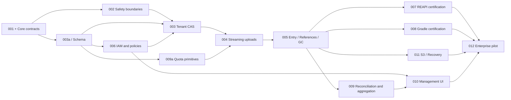

# P0 Development Breakdown, Delivery Gates, and Validation Plan

Date: 2026-09-28. Status: development design draft. Scope is fixed at **REAPI cache-only + Gradle HTTP, enterprise self-hosting, file backend + one validated S3 backend**. This document has not created issues/PRs, changed product code, or executed the tests below.

This document breaks the [EXP-001–012 roadmap](../strategy/06-roadmap-and-validation.md) into reviewable changes; the [cache core](cache-core.md), [metadata model](metadata-model.md), and [control plane](control-plane.md) define the contracts. Rust path abbreviations `server/` and `server-bin/` below mean `expbuild/crates/server/` and `expbuild/crates/server-bin/`, respectively; all admin paths are relative to `expbuild-admin/`. Paths not marked “new” are files or modules inspected in this round; new filenames are suggested locations, not claims that the files already exist.

## 1. Starting Order: Settle Interfaces, Then Implement in Parallel

Do not begin by adding `tenant_id` to every parameter and then improvise uploads, references, and GC. They share commit boundaries. First complete a contract review across Rust, the control plane, and testing, producing these versionable outputs:

| Item to freeze | Required detail | Work it blocks |
|---|---|---|
| Context and authorization | Namespace route → server-resolved scope; principal/token; reads, blob writes, result publication; expiration and revocation | All tenant data access and native-client integration |
| Blob/Entry/Visibility | Separation of tool keys and digests; isolation domain; physical generation; native payload; publication provenance; visibility uniqueness constraints | Storage interfaces, Prisma/SQL, adapters |
| Uploads and quotas | begin/append/status/commit/abort; durable offset; idempotency; ownership and reclamation of quota reservations | ByteStream, Gradle PUT, S3 |
| References and deletion | Shared lock ordering and fencing for commit/protection leases/GC; deletion bound to old generations; safe misses when results lack references | AC publication, concurrent GC, recovery |
| Internal control API | Policy versions, response/error structures, node identity, event idempotency keys; control-plane and data-plane DB write privileges | Integration between repositories, revocation tests, real UI |

Freezing permits later explicit version evolution; it is not a promise of a stable plugin SDK. Every interface change must update contract examples, error mappings, and test fixtures together; neither side may add “temporary fields” and leave the other repository guessing.

**Migration location:** first establish modules such as `core/`, `auth/`, `metadata/`, `upload/`, and `http/` within the existing `crates/server/src/`, retaining `grpc/` as the REAPI adapter layer. Domain interfaces must not depend on `ActionResult`; it stays in the adapter payload. Split crates after boundaries stabilize. Do not change directories, protocols, databases, and UI simultaneously in the first round.

The existing `storage/traits.rs` binds interfaces to REAPI `Digest/ActionResult`; `server-bin/src/main.rs` unconditionally registers execution/worker, and `tests/common/server_harness.rs` also starts execution services. These are migration seams; wrapping old implementations in new names does not complete tenant isolation.

## 2. First PRs: Each Independently Reviewable and Revertible

The PR numbers below are planning identifiers, not remote PRs that have been created. Each item normally has one implementer and a reviewer in the corresponding role; split further if too broad rather than rewriting the service in one PR.

| PR / original task | Change scope | Completion evidence | Rollback boundary |
|---|---|---|---|
| **01 Baseline and test entry points** / 001, 012 | `crates/proto/build.rs`, vendored-proto source registry; `tests/Cargo.toml`, `tests/common/server_harness.rs`; new compatibility lock, cache-only harness, fixture inventory | Pin current commit, Rust/protoc, client versions, and binary hashes; identify existing tests as passing/failing/not run; new harness has no worker dependency | Tests/docs only; no change to live protocols |
| **02 Input and runtime modes** / 002 | `server/src/util/digest.rs`, `storage/filesystem*.rs`, `grpc/*`, `config/mod.rs`, `server-bin/src/main.rs`, `configs/server/*.toml` | Unified validation of digest length/hex/nonnegative size; invalid input cannot panic or escape directories; cache-only does not register execution/worker; advertise only actually supported capabilities such as SHA256/identity | Retain old binary for isolated development; enterprise endpoints must not roll back to anonymous execution mode |
| **03 Domain types and empty-database migration** / 003, 005 | New `server/src/core/`, `metadata/`; `server/src/lib.rs`, `Cargo.toml`; separate PostgreSQL migration chain for the management database | Type/error contracts compile; empty-database apply, rerun validation, schema-permission tests; physical isolation keys and namespace visibility cannot be conflated | Additive table creation only; no production traffic, so delete the empty experimental database; do not present old SQLite migrations as PostgreSQL migrations |
| **04 Minimal end-to-end identity and policy flow** / 006 | Admin `server/prisma/schema.prisma`, `server/src/middleware/auth.ts`, `utils/auth.ts`, `routes/projects.ts`; new scoped query layer, service-account/token/policy routes; new Rust `auth/` | Create tenant/project/namespace → issue read-only and write tokens → data-plane validation; intersect authorization filters; reject startup without production secrets; test revocation through the real policy path | Versioned new APIs; disable new endpoints while retaining data; do not restore old plaintext keys to new endpoints |
| **05 Tenant-aware CAS vertical slice** / 003, 007 | Connect `grpc/cas_service.rs`, `cas/manager.rs` to new context/core; new namespace metadata repository and file driver; extend harness | Initially support size-limited batch CAS: A can read a digest, B cannot read/probe it; FindMissing really calls the RPC; incomplete uploads invisible; reject or disable unmigrated RPCs | Separate switch and storage prefix for new endpoints; stop new writes after failure and retain committed data; do not fall back to old anonymous storage |
| **06 Streaming uploads and durable sessions** / 004 | `grpc/bytestream_service.rs`, `storage/filesystem.rs`; new `upload/`, session repository, quota-reservation interface implementation | Read/Write/QueryWriteStatus; offsets, retransmission, unique temporary files, incremental digests, recovery and cancellation; repeated commit does not settle twice; buffer budgets constrain large objects | Stop accepting new uploads, wait for/terminate existing sessions; isolate old/new staging prefixes; retain recovery/cleanup programs |
| **07 Entry publication and references** / 005, 007 | Migrate `grpc/action_cache_service.rs`, `cache/manager.rs` to CacheIndex; new entry/ref transactions and REAPI reference parsing | Blob existence does not imply namespace reference permission; AC/opaque entries publish atomically; missing CAS produces safe misses; publication requires result.publish; retain writer/token provenance | Disabling result writes still allows reads of valid old generations; do not let the old AC store read new-format entries |
| **08 Production Gradle adapter** / 008 | New `server/src/http/gradle.rs`, HTTP listener configuration; reuse core from 04/06/07; new Gradle fixture | Native wrapper cold write/warm read in a separate workspace/input change; Basic → same principal; 404/413/read-only/interruption; bytes are not unpacked or rewritten | Disable Gradle by namespace; REAPI unaffected; reclaim archives through normal lifecycle |

PR-02 may be accompanied by independent small admin fixes: intersect the query scope in `routes/pipeline.ts`, authenticate heartbeats in `routes/agents.ts` or disable them by default, and remove production mock fallback from `services/dataService.ts`. These fixes need not wait for the new UI, but do not establish that the existing admin meets multitenancy requirements.

PR-05 is a restricted internal validation service. Do not present it as an enterprise pilot release before the durability, integrity, and quota gates in PR-06, PR-07, and EXP-009 pass. Unfinished adapters must explicitly report unimplemented functionality, not silently forward to old managers.

## 3. Complete EXP-001–012 Work Packages and Dependencies

“a/b/c” denotes subitems that may each become an issue. Release dependencies in the table refer to the enterprise pilot; after interface review, tests, UI, and adapters may start development against the contracts in advance.

| Work package | Detailed deliverables and primary owner | Release dependencies |
|---|---|---|
| 001 | a proto sources/differences; b Bazel/Gradle lock; c capability and error inventory. Protocol lead | None; scope changes require reassessment |
| 002 | a validated digest/path; b cache-only registration; c batch/tree/object-size budgets. Rust | 001 |
| 003 | a RequestContext/identities; b NamespaceResolver; c BlobVisibility and mandatory query scope; d cross-tenant negative cases. Rust + control plane | 001, 002, authorization portion of 006 |
| 004 | a FS generations and unique staging; b upload sessions; c ByteStream offset/resume; d crash cleanup. Storage | 003, quota primitives from 009a |
| 005 | a entry/reference transactions; b REAPI reference extraction; c read/upload protection; d tombstone → deleting fencing; e reconcile. Storage | 003, 004 |
| 006 | a PostgreSQL identity model; b scoped repository; c token issuance/rotation/revocation; d policy synchronization; e audit outbox. Control plane | Shared contract from 001 and 003a, not all of 003 |
| 007 | a CAS/AC/ByteStream native errors; b native Bazel three-stage build; c inline/Tree/missing references; d isolation and revocation. Protocol + testing | 003–006, 009 |
| 008 | a HTTP/Basic/routing; b opaque PUT/GET; c native Gradle three-stage build; d limits/interruption/proxy semantics. Protocol | 003–006, 009 |
| 009 | a reserve/settle/release atomic transactions, delivered with 004; b logical-byte/object metering; c deduplicated events and aggregation; d ledger reconciliation. Rust + control plane | 003, 006; full reconciliation depends on 005 |
| 010 | a onboarding/projects/credentials; b quotas/storage/audits; c source-based invalidation; d empty/error/expired/unknown states. Frontend | 006, 009; invalidation depends on 005 |
| 011 | a S3 driver contract; b designated-backend validation; c Compose/systemd/TLS/readiness; d backup/restore and upgrade/rollback. Platform + storage | 004, 005, 006; deployment skeleton may start early |
| 012 | a conformance harness; b fault matrix; c customer samples and performance baseline; d pilot release report. Testing + platform | All gates in 007–011 |

This deliberately breaks potential cycles in the original coarse-grained tasks: **009a is a prerequisite for uploads, not a statistics feature to add after uploads ship; 003a and 006a share a frozen contract and do not wait for each other's entire work package to finish.**

May proceed in parallel: control plane 006 and file/upload implementation; frontend status pages and API implementation; native-client fixtures and adapters; S3 driver and Gradle; GC fault harness and business implementation. Cannot proceed independently in parallel: entry/ref/GC schema and commit lock ordering, streaming reservations and quota settlement, token revocation and long-stream authorization. Each of these three groups requires review by a shared owner.

## 4. First Two-week Engineering Iteration

This schedule uses the earlier **4–6 full-time people** scenario; two weeks is not a commitment to complete P0. With fewer people, prioritize contracts, security fixes, and the REAPI tenant slice, and defer the Gradle PoC.

| Time | Rust/storage | Control plane/frontend | Testing/platform | Demonstrable output |
|---|---|---|---|---|
| D1–2 | Review core interfaces, errors, and state machines; pin protocols | Review model/policy APIs; scope existing permission fixes | Pin repository/tool baseline; test-status report; customer-sample template | Reviewed contracts, PR-01, initial ADRs |
| D3–5 | PR-02; PR-03 types and repository; FS storage-isolation design | Empty PostgreSQL database, minimal namespace/token APIs; remove error masking | Cache-only harness; malformed-digest/cross-scope cases | Trustworthy capability declarations; repeatable empty-database creation |
| D6–8 | PR-05 restricted batch CAS; draft upload-recovery implementation | Connect real policy path; read-only/write tokens; frontend onboarding form | Real FindMissing and cross-project negative cases; Gradle fixture and thin HTTP PoC | A writes and reads back; B cannot read/probe |
| D9–10 | Verify unmigrated RPCs default to disabled; fix slice issues | Validate new-request revocation; explicitly note long streams still await PR-06 | Restart/failure logs, artifact hashes, failed-check inventory; next-iteration priorities | Reproducible narrow-slice demo and gap report |

A thin Gradle PoC may initially use an in-memory fake core to validate routing, Basic, GET/PUT, and fixtures, but must run only in test builds and be labeled “not persistent, not certified”; final 008 must reuse the real core. D10 does not require completed streaming recovery, full GC, S3, or the entire management console. If contract review slips, do not rush ahead with temporary unscoped interfaces.

## 5. Protocol Conformance Fixtures and Evidence Format

Suggested new directories: `tests/conformance/` (RPC/HTTP black box), `tests/fixtures/bazel-cache/`, `tests/fixtures/gradle-cache/`, `tests/faults/`. The current `tests/Cargo.toml` explicitly registers two test targets; new Rust tests must also be registered. Adding a file does not mean CI has executed it.

Each fixture has a `manifest.json`: `fixture_id`, `spec_commit`, client release + binary SHA256, toolchain/OS, source-file hashes, server commit, server config hash, authentication mode, command list, expected output files + SHA256, expected tool and server events, and known limitations. Authentication values are injected from the test environment; reports retain only token_id. Unstable content such as generation timestamps must be eliminated at the fixture source, not silently normalized in incorrect artifacts.

| Fixture | Inputs/actions | Pass criteria |
|---|---|---|
| `bazel-cache-v1` | Small deterministic genrule/compilation targets, empty files, directory outputs, stdout/stderr; pinned external dependencies | No-remote baseline → runner A cold write → runner B warm read after clearing local state → modify one input; artifacts equal, tool records correspond to server AC/CAS events; no requests to execution endpoints |
| `gradle-cache-v1` | Pinned wrapper + JDK; cacheable task with fully declared inputs/outputs; local cache disabled | Same three stages; B displays `FROM-CACHE` and performs remote GET; input change causes misses only for relevant tasks; PUT/GET content identical |
| `protocol-wire-v1` | Direct native RPC/HTTP; ranges, offsets, batch mixed statuses, inline/Tree, GET/PUT size boundaries | Native error codes and response fields conform to the frozen compatibility table; testing only expbuild's own client is insufficient |
| `tenant-trust-v1` | Two tenants, two projects within one tenant; same digest/key; trusted/isolated namespaces; read/write/publish roles | No leaks through direct reads, FindMissing, AC references, resumption, or metric queries; tokens with only blob.write cannot publish results |

Hits cannot be inferred solely from shorter wall-clock times; runs with residual local cache are invalid. RPC tests establish wire semantics, while native fixtures establish tool usability; both are required. Each case outputs `PASS/FAIL/SKIP`, command, duration, failure stage, trace/request ID, sanitized logs, and artifact verification. SKIP does not count as passing; reports list uncovered backends and versions.

## 6. Fault and Concurrency Test Matrix

Fault-injection points belong in test wrappers around drivers/repositories. Durability cases must kill and restart real processes, not merely throw exceptions. Prefer controllable clocks, transaction barriers, and explicit breakpoints to random sleeps that guess at races.

| Scenario / injection point | Invariant to verify | Gate |
|---|---|---|
| Invalid digest, oversized key, negative size, malformed instance | No panic, no IO outside the root directory, no fallback for unknown namespace | PR-02/05 |
| Concurrent uploads of the same digest; digest/size mismatch; empty file | Unique staging; only complete blobs visible; failures create no entry/permanent reservation | PR-06 |
| Kill before/after writing durable offset; kill before/after backend complete | QueryWriteStatus never exceeds durable data; retransmission idempotent; recoverable or deterministically expired after restart | PR-06 |
| DB commit fails after blob succeeds; retry commit after lost response | At most an orphan blob; no dangling successful entries; quota settles only once | PR-06/07/09 |
| New references/read protection collide with tombstone/delete | Deleting accepts no new references; old deletion tasks cannot delete new generations; valid reads protected | PR-07, 005d |
| DB disconnection, disk full, S3 timeout/partial upload | Bounded retries; no “empty-data success”; new writes fail closed; reservation release/reclamation can be reconciled | 004/009/011 |
| Token revocation, disconnected/expired policy, replayed old snapshot | New requests, resumption, long streams, and commit converge as specified; no anonymous fallback or old-version acceptance | 006/007/008 |
| Concurrent over-quota requests, administrator quota reduction, unknown length, duplicate/out-of-order events | Positive-increment admission cannot increase the overage; quota reduction blocks new reservations, existing reservations may settle without an increment; consistent reservation ownership, no double charging in aggregation | 009 |
| Index restored to an earlier point, missing blobs, replayed GC tasks | Disable writes/GC first, then reconcile; missing references produce safe misses; tasks do not delete current objects | 011 |
| Proxy retries, interrupted connections, 413, read-only errors | Record actual Bazel/Gradle exit/fallback behavior; do not broadly claim cache failures never affect builds | 007/008 |

Every merge runs corresponding unit tests, real PostgreSQL transaction tests, and narrow integration tests; the main branch runs smoke tests with both native clients. Before release, run the full fault matrix, designated S3 backend, and recovery drills. Existing Rust baselines can begin with `cargo test -p re_server` and `cargo test -p expbuild-integration-tests --test test_cas_operations`. The current `test` in admin's `server/package.json` is a failing placeholder command, so a real test entry point must be established first. Frontend `npm run build` proves buildability only, not authorization or data correctness.

## 7. Rollout, Rollback, and Critical Path

P0 must complete an executable runbook: new PostgreSQL schema/separate storage prefix → create tenant/namespace/token → switch only one pilot project → observe protocol errors/output validation/quotas → expand. Import old SQLite data according to established ownership; metrics without ownership remain in a clearly labeled historical-installation view. Old anonymous CAS/AC defaults to a cold start and is not automatically imported into trusted namespaces.

Prefer rolling the application back to the previous new-version release compatible with the current schema; expand/contract retains old columns until the rollback window ends. Switching back to old endpoints is limited to the original pilot environment where its permission and trust model has been confirmed acceptable; rollback does not mean reopening anonymous caches to users. Before rollback, stop new writes, drain/terminate uploads, and preserve the ledger and audits; do not dual-write across trust models. Database restoration and blob restoration are separate operations; reopen traffic only after meeting 011's reconciliation gates.

The critical path is **contracts → tenancy/authorization → uploads and quotas → entries/references/GC → native-client + recovery certification**. More UI pages or protocols cannot shorten it. Validate three risks first: whether reference graphs can commit within the transaction budget; whether GC fencing remains correct across deletion retries; whether short authorization leases can support long streams of large files. Failure of any one blocks the pilot; first adjust mechanisms or limit scale, without hiding problems behind broader compatibility claims.

On completing P0, submit a release evidence package: compatibility lock, schema/API versions, test and fault results, reproducible measurement report, recovery records, known limitations, dependency/license inventory, and administrator deployment/rotation/invalidation/recovery operation records. Performance figures come from repeated runs in a fixed environment; do not display “build time saved” before client events are integrated.
