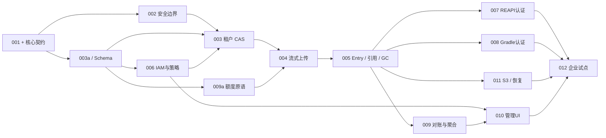

# P0 开发拆分、交付门槛与验证方案

日期：2026-09-28。状态：开发设计草案。范围固定为 **REAPI cache-only + Gradle HTTP、企业自托管、文件后端 + 一个经过验证的 S3 后端**。本文没有创建 issue/PR，没有改产品代码，也没有执行下述测试。

本文把 [EXP-001—012 路线图](../strategy/06-roadmap-and-validation.md) 拆为可评审改动；契约以 [缓存内核](cache-core.md)、[元数据模型](metadata-model.md)、[控制面](control-plane.md) 为准。下文 Rust 文件简写 `server/`、`server-bin/` 分别指 `expbuild/crates/server/`、`expbuild/crates/server-bin/`；admin 文件均相对 `expbuild-admin/`。未标“新增”的路径是本轮检查过的文件或模块；新增文件名是建议落点，不表示已经存在。

## 1. 开工顺序：先决定接口，再平行实现

不能先把 `tenant_id` 加到每个参数，再临时补上传、引用与 GC。它们共享提交边界，先完成一次跨 Rust、控制面、测试的契约评审，产生以下可版本化成果：

| 冻结项 | 必须写清的内容 | 阻塞的工作 |
|---|---|---|
| 上下文与授权 | namespace 路由→服务端解析的 scope；principal/token；读、blob 写、结果发布；过期与撤销 | 所有租户数据访问、原生客户端接入 |
| Blob/Entry/Visibility | 工具 key 与摘要分离；隔离域；物理 generation；原生 payload；发布来源；可见性唯一约束 | 存储接口、Prisma/SQL、适配器 |
| 上传与额度 | begin/append/status/commit/abort；durable offset；幂等；额度预留归属与回收 | ByteStream、Gradle PUT、S3 |
| 引用与删除 | 提交/保护租约/GC 共用锁顺序与 fencing；删除绑定旧 generation；结果缺引用时安全 miss | AC 发布、并发 GC、恢复 |
| 内部控制 API | 策略版本、响应/错误结构、节点身份、事件幂等键；控制面与数据面的 DB 写权限 | 两仓库联调、撤销测试、真实 UI |

冻结是允许后续显式版本演进，不是承诺插件 SDK 稳定。任何接口改动必须同时更新契约示例、错误映射和测试 fixture；不能由单方新增“临时字段”后让另一仓库猜测。

**迁移落点：**先在现有 `crates/server/src/` 内建立 `core/`、`auth/`、`metadata/`、`upload/`、`http/` 等模块，保留 `grpc/` 作为 REAPI 适配层。领域接口不得依赖 `ActionResult`；它留在适配层 payload 中。边界稳定后再拆 crate。不要在第一轮同时改目录、协议、数据库和 UI。

现有 `storage/traits.rs` 把接口绑定到 REAPI `Digest/ActionResult`，`server-bin/src/main.rs` 无条件注册 execution/worker，`tests/common/server_harness.rs` 也启动执行服务。迁移时这些是接缝，不能把旧实现包一层新名字便视为完成租户隔离。

## 2. 首批 PR：每个都能独立评审和撤回

以下 PR 编号为计划编号，不是已创建的远程 PR。每项通常由单人负责实现、另一位对应角色评审；跨度过大时继续拆，不用一个 PR 重写服务。

| PR / 原任务 | 改动范围 | 完成证据 | 回滚边界 |
|---|---|---|---|
| **01 基线与测试入口** / 001、012 | `crates/proto/build.rs`、vendored proto 来源登记；`tests/Cargo.toml`、`tests/common/server_harness.rs`；新增兼容 lock、cache-only harness、fixture 清单 | 固定当前 commit、Rust/protoc、客户端版本和二进制摘要；明确现有测试通过/失败/未执行；新 harness 无 worker 依赖 | 仅测试/文档；不改变线上协议 |
| **02 输入与运行模式** / 002 | `server/src/util/digest.rs`、`storage/filesystem*.rs`、`grpc/*`、`config/mod.rs`、`server-bin/src/main.rs`、`configs/server/*.toml` | 摘要长度/hex/非负大小统一校验；非法输入不能 panic/逃逸目录；cache-only 不注册执行/worker；只宣告实际支持的 SHA256/identity 等能力 | 保留旧二进制用于隔离开发；企业端点不得回滚到匿名执行模式 |
| **03 领域类型与空库迁移** / 003、005 | 新增 `server/src/core/`、`metadata/`；`server/src/lib.rs`、`Cargo.toml`；管理库另起 PostgreSQL 迁移链 | 类型/错误契约可编译；空库 apply、重复运行校验、schema 权限测试；物理隔离键和 namespace 可见性不可混用 | 只做增量建表；无生产流量，删除空试验库即可；不用旧 SQLite migration 冒充 PostgreSQL 迁移 |
| **04 身份与策略最小闭环** / 006 | admin `server/prisma/schema.prisma`、`server/src/middleware/auth.ts`、`utils/auth.ts`、`routes/projects.ts`；新增 scope 查询层、服务账号/令牌/策略路由；Rust 新增 `auth/` | 创建租户/项目/namespace→签发只读与写入 token→数据面校验；越权过滤取交集；缺生产密钥拒绝启动；撤销用真实策略链路测试 | 版本化新增 API；关闭新端点保留数据；旧明文 key 不恢复到新端点 |
| **05 CAS 租户垂直切片** / 003、007 | `grpc/cas_service.rs`、`cas/manager.rs` 接新 context/core；新增 namespace metadata repository、文件 driver；扩展 harness | 先支持受限大小的 batch CAS：同摘要 A 可读、B 不可读/探测；FindMissing 真正调用 RPC；未完成上传不可见；未迁移 RPC 拒绝或关闭 | 新端点独立开关和存储前缀；失败后停新写，保留已提交数据；不回落旧匿名存储 |
| **06 流式上传与持久会话** / 004 | `grpc/bytestream_service.rs`、`storage/filesystem.rs`；新增 `upload/`、session repository、额度预留接口实现 | Read/Write/QueryWriteStatus；offset、重传、唯一临时文件、增量摘要、恢复与取消；重复 commit 不重复结算；大对象受缓冲预算限制 | 停接新上传，等待/终止现有 session；新旧 staging 前缀隔离；保留恢复/清理程序 |
| **07 条目发布与引用** / 005、007 | `grpc/action_cache_service.rs`、`cache/manager.rs` 迁移到 CacheIndex；新增 entry/ref 事务与 REAPI 引用解析 | blob 存在不等于 namespace 可引用；AC/opaque 条目可原子发布；缺 CAS 安全 miss；发布需 result.publish；保存 writer/token 来源 | 关闭结果写入仍可读有效旧 generation；新格式 entry 不交给旧 AC store 读取 |
| **08 Gradle 正式适配器** / 008 | 新增 `server/src/http/gradle.rs`、HTTP listener 配置；复用 04/06/07 内核；新增 Gradle fixture | 原生 wrapper 的冷写/异地工作区热读/输入改变；Basic→同一 principal；404/413/只读/中断；字节不解包重写 | 按 namespace 关闭 Gradle；REAPI 不受影响；归档按正常生命周期回收 |

PR-02 可同时安排独立的 admin 小修：`routes/pipeline.ts` 查询范围取交集，`routes/agents.ts` 心跳认证或默认禁用，`services/dataService.ts` 去掉生产 mock 回退。这些修复无需等待新 UI，但不能据此宣称现有 admin 已满足多租户要求。

PR-05 是受限制的内部验证服务；在 PR-06、PR-07 和 EXP-009 的持久化、完整性与额度门槛通过前，不把它作为企业试点版。适配器未完成时明确报未实现，不能暗中转发到旧 manager。

## 3. EXP-001—012 完整工作包与依赖

“a/b/c”是可以分别建 issue 的子项。表中的发布依赖指企业试点；接口评审后，测试、UI 和适配器可提前基于契约开发。

| 工作包 | 更细的交付与主负责人 | 发布依赖 |
|---|---|---|
| 001 | a proto 来源/差异；b Bazel/Gradle lock；c capability 与错误清单。协议负责人 | 无；范围变更须重评 |
| 002 | a validated digest/path；b cache-only 注册；c batch/树/对象大小预算。Rust | 001 |
| 003 | a RequestContext/标识；b NamespaceResolver；c BlobVisibility 与查询强制 scope；d 跨租户负例。Rust+控制面 | 001、002、006 的鉴权部分 |
| 004 | a FS generation 与唯一 staging；b upload session；c ByteStream offset/resume；d 崩溃清理。存储 | 003、009a 的额度原语 |
| 005 | a 条目/引用事务；b REAPI 引用提取；c 读/上传保护；d tombstone→deleting fencing；e reconcile。存储 | 003、004 |
| 006 | a PostgreSQL 身份模型；b scope repository；c token 签发/轮换/撤销；d 策略同步；e 审计 outbox。控制面 | 001、003a 的共同契约，不等完整 003 |
| 007 | a CAS/AC/ByteStream 原生错误；b 原生 Bazel 三阶段构建；c inline/Tree/缺引用；d 隔离和撤销。协议+测试 | 003—006、009 |
| 008 | a HTTP/Basic/路由；b opaque PUT/GET；c 原生 Gradle 三阶段构建；d 限额/中断/代理语义。协议 | 003—006、009 |
| 009 | a reserve/settle/release 原子事务，随 004 落地；b 逻辑字节/对象计量；c 去重事件与聚合；d 账本对账。Rust+控制面 | 003、006；完整对账依赖 005 |
| 010 | a 接入/项目/凭据；b 配额/存储/审计；c 来源失效；d 空/错/过期/未知状态。前端 | 006、009；失效依赖 005 |
| 011 | a S3 driver 契约；b 指定后端验证；c Compose/systemd/TLS/readiness；d 备份恢复/升级回滚。平台+存储 | 004、005、006；部署骨架可提前 |
| 012 | a conformance harness；b 故障矩阵；c 客户样本与性能基线；d 试点发布报告。测试+平台 | 007—011 全部门槛 |

这里主动打破原粗粒度任务可能出现的循环：**009a 是上传的前置基础，不是等上传上线后才补的统计功能；003a 与 006a 共用冻结契约，不互相等待整个大任务结束。**

可并行：控制面 006 与文件/上传实现；前端状态页与 API 实现；原生客户端 fixture 与适配器；S3 driver 与 Gradle；GC fault harness 与业务实现。不能独立平行：entry/ref/GC 表结构与提交锁顺序、流式预留与配额结算、令牌撤销与长流授权，这三组必须有共同负责人评审。

## 4. 第一个两周工程迭代

按此前 **4–6 人专职**情景安排，不把两周当作完整 P0 承诺。若人员不足，先保留契约、安全修复、REAPI 租户切片，将 Gradle PoC 顺延。

| 时间 | Rust/存储 | 控制面/前端 | 测试/平台 | 可展示成果 |
|---|---|---|---|---|
| D1–2 | 核心接口、错误与状态机评审；协议锁定 | 模型/策略 API 评审；现有权限修补范围 | 固定仓库/工具基线；测试现状报告；客户样本模板 | 经评审契约、PR-01、首批 ADR |
| D3–5 | PR-02；PR-03 类型和 repository；FS 存储隔离设计 | PostgreSQL 空库、namespace/token 最小 API；移除错误掩盖 | cache-only harness；畸形 digest/跨 scope 案例 | 能力宣告可信；空库可重复创建 |
| D6–8 | PR-05 受限 batch CAS；起草上传恢复实现 | 接真实策略链路；只读/写入 token；前端接入表单 | 真 FindMissing 与跨项目负例；Gradle fixture 与薄 HTTP PoC | A 写入并读回、B 无权读/探测 |
| D9–10 | 审查未迁移 RPC 默认关闭；修复切片问题 | 验证新请求撤销；明确长流尚待 PR-06 | 重启/失败日志、产物哈希、未通过清单；下轮排序 | 可复现窄切片演示与缺口报告 |

Gradle 薄 PoC 可先用内存 fake core 验证路由、Basic、GET/PUT 和 fixture，但必须仅在测试构建运行并标记“未持久化、未认证”；最终 008 必须复用真实内核。D10 不要求流式恢复、完整 GC、S3 或全管理台完成。若契约评审拖延，不用无 scope 的临时接口抢进度。

## 5. 协议 conformance fixture 与证据格式

新增建议目录：`tests/conformance/`（RPC/HTTP 黑盒）、`tests/fixtures/bazel-cache/`、`tests/fixtures/gradle-cache/`、`tests/faults/`。当前 `tests/Cargo.toml` 显式注册两个 test target，新增 Rust 测试必须同步注册；不能仅放文件后假定 CI 已执行。

每份 fixture 具有 `manifest.json`：`fixture_id`、`spec_commit`、客户端 release+binary SHA256、工具链/OS、源文件摘要、server commit、server config hash、认证模式、命令列表、预期输出文件+SHA256、预期工具事件与服务器事件、已知限制。认证值从测试环境注入，报告仅保留 token_id；生成时间等不稳定内容必须在 fixture 源头消除，不能偷偷归一化错误产物。

| Fixture | 输入/动作 | 判定条件 |
|---|---|---|
| `bazel-cache-v1` | 小型确定性 genrule/编译目标，空文件、目录输出、stdout/stderr；固定外部依赖 | 无远端基线→runner A 冷写→清空本地状态的 B 热读→修改一个输入；产物相等，工具记录与服务端 AC/CAS 事件对应；执行端点没有请求 |
| `gradle-cache-v1` | wrapper+JDK 锁定；声明完整输入/输出的 cacheable task；本地缓存禁用 | 相同三阶段；B 显示 `FROM-CACHE` 且有远端 GET；改输入只使相关任务 miss；PUT/GET 内容相同 |
| `protocol-wire-v1` | 直接原生 RPC/HTTP；范围、offset、batch mixed status、inline/Tree、GET/PUT 大小边界 | 原生错误码和响应字段符合冻结兼容表；不能只测试 expbuild 自有客户端 |
| `tenant-trust-v1` | 两 tenant、同 tenant 两 project；相同 digest/key；可信/隔离 namespace；读/写/发布角色 | 直读、FindMissing、AC 引用、续传、指标查询都不泄漏；只可 blob.write 的 token 不能发布结果 |

命中不能只凭墙钟缩短判断；有本地缓存残留的运行作废。RPC 测试证明 wire 语义，原生 fixture 证明工具可用，两者缺一不可。每个 case 输出 `PASS/FAIL/SKIP`、命令、时长、失败阶段、trace/request ID、脱敏日志和产物校验；SKIP 不计通过，报告列明未覆盖的后端与版本。

## 6. 故障与并发测试矩阵

故障注入点做在 driver/repository 的测试包装层；涉及耐久性的案例必须杀真实进程重启，不能只抛异常。优先使用可控时钟、事务 barrier 和明确断点，不靠随机 sleep 猜测竞态。

| 场景 / 注入点 | 必须验证的不变量 | 门槛 |
|---|---|---|
| 非法 digest、超长 key、负 size、畸形 instance | 无 panic、无根目录外 IO、无未知 namespace 回退 | PR-02/05 |
| 同摘要并发上传；digest/size 不符；空文件 | 唯一 staging；仅完整 blob 可见；失败不形成 entry/永久预留 | PR-06 |
| 写入 durable offset 前/后 kill；后端 complete 前/后 kill | QueryWriteStatus 不超过持久数据；重传幂等；重启后可恢复或确定过期 | PR-06 |
| blob 成功后 DB 提交失败；响应丢失后重试 commit | 最多孤儿 blob；无悬空成功条目；额度只结算一次 | PR-06/07/09 |
| 新引用/读保护与 tombstone/delete 同步碰撞 | Deleting 不接新引用；旧删除任务不能删新 generation；有效读受到保护 | PR-07、005d |
| DB断连、磁盘满、S3超时/部分上传 | 有限重试；无“空数据成功”；新写 fail closed；释放/回收预留可对账 | 004/009/011 |
| token 撤销、策略断联/过期、旧 snapshot 重放 | 新请求、续传、长流、commit 均按约定收敛；不能匿名降级或接受旧版本 | 006/007/008 |
| 超额度并发、管理员降额、未知长度、重复/乱序事件 | 正增量准入不能增加超额；降额后禁止新预留，既有预留可无增量结算；预留归属一致，聚合不重复计费 | 009 |
| 索引恢复到旧点、blob 缺失、GC 任务重放 | 先禁写/GC，reconcile；缺引用安全 miss；任务不删当前对象 | 011 |
| 代理重试、连接中断、413、只读错误 | Bazel/Gradle 实际退出/降级行为有记录；不泛称缓存故障必不影响构建 | 007/008 |

每次合并跑对应单元、真实 PostgreSQL 事务测试与窄集成；主分支跑两个原生客户端 smoke；发布前跑全故障矩阵、指定 S3 与恢复演练。现有 Rust 可从 `cargo test -p re_server` 和 `cargo test -p expbuild-integration-tests --test test_cas_operations` 建基线。admin 的 `server/package.json` 当前 `test` 是失败占位命令，须先建立真实测试入口；前端 `npm run build` 仅证明可构建，不证明授权与数据正确。

## 7. 上线、回滚与关键路径

P0 必须完成一份可执行 runbook：新 PostgreSQL schema/独立存储前缀→创建 tenant/namespace/token→只切一个试点项目→观察协议错误/输出校验/配额→扩大。旧 SQLite 数据按确定归属导入；无归属指标留在标识明确的历史安装视图；旧匿名 CAS/AC 默认冷启动，不自动导入可信 namespace。

回滚应用优先使用与当前 schema 兼容的上一新版本；expand/contract 不删除旧列直到回滚窗口结束。切回旧端点仅限已确认其权限和信任模型可接受的原试点环境，不把回滚等同于向用户重新开放匿名缓存。回滚前停新写、排空/终止上传，保存账本与审计；不跨信任模型双写。恢复数据库与恢复 blob 是不同操作，按 011 的 reconcile 门槛再开放流量。

关键路径是 **契约→租户/授权→上传与额度→entry/引用/GC→原生客户端+恢复认证**，UI 页面数和协议数无法缩短它。最先验证三项风险：引用图能否在事务预算内提交；GC fencing 能否在删除重试中保持正确；短授权租约能否覆盖大文件长流。任一失败都阻断试点，先调整机制或限制规模，不通过扩大兼容宣告掩盖。

完成 P0 时提交一份发布证据包：兼容 lock、schema/API 版本、测试与故障结果、可复现实测报告、恢复记录、已知限制、依赖与许可清单、管理员部署/轮换/失效/恢复操作记录。性能数值来自固定环境重复运行；未接入客户端事件前不展示“节省构建时间”。
