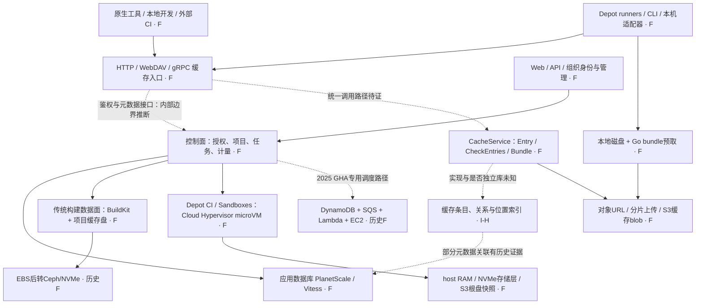

# Depot 深度调研与技术架构推断

调研日期：2026-09-28。方法：官方文档、工程文章、事故复盘、固定 commit 的公开代码交叉核对；没有登录客户账户、调用受保护接口或运行性能测试。**本报告重建公开可见的结构，不把它包装成 Depot 内部设计说明。**

证据分级：**F**＝官方明确披露的事实或所审代码行为；**I-H / I-M**＝高/中置信度的架构推断；**U**＝当前无法确认。F 仍受来源日期、产品范围和代码是否部署的限制；厂商报告的性能并非独立复测。

| 阅读入口 | 内容 |
|---|---|
| 本文 | 架构重建、关键机制、FindMissing推断与expbuild决策 |
| [Cache证据](cache-evidence.md) | 原生协议、权限、隔离、保留、管理与未公开项 |
| [计算与存储证据](compute-evidence.md) | BuildKit、runner、microVM、Metal、区域故障依赖 |
| [公开代码证据](public-code-evidence.md) | 固定commit、CLI/agent/API契约、真实调用与边界 |

## 1. 最重要的判断

Depot 的产品优势来自同时控制**接入客户端、计算位置、缓存传输、存储层次和运营控制面**。它把多种加速机制组合成用户接入成本很低的平台：传统原生工具直接连缓存；自有 runner 自动注入配置；小对象由专用客户端打包；Docker 构建复用持久块盘；新计算平台进一步控制 VM 和根盘。这是综合推断，不能归结为某个特别快的数据库或一个通用CAS服务器。

对 expbuild 最有价值的四个发现：

1. 多协议入口后面存在类型化缓存契约，公开代码直接暴露了批量查键、分段包和分阶段上传；这些已不只是猜测。
2. 小对象请求数、访问局部性和计算/存储距离，是与服务端查询同样重要的性能变量。
3. 管理查询与认证/调度共用基础资源曾放大故障。完善管理功能必须带查询预算和故障隔离。
4. Depot 已有客户 AWS 账户内的数据面部署；expbuild 的“自托管”要明确到控制面也可自主运行、离线可用和存储可替换。不能把 BYOC 当作对方没有的能力。

## 2. 产品与部署边界

| 面 | 已公开能力 | 分析时必须保留的边界 |
|---|---|---|
| Depot Cache | 多工具原生远程缓存；本地开发和外部CI也可接入 | 不是每种协议都要求安装Depot CLI，也不等于统一构建语义 |
| Container Builds | BuildKit远程构建、原生CPU架构、项目缓存盘 | BuildKit不是REAPI远程执行服务 |
| GitHub Actions runners | 执行GitHub工作流，自动接缓存 | 生命周期、权限与Depot CI不是同一个实现 |
| Depot CI / Sandboxes | 自有任务与microVM执行环境 | 2026 Metal已迁移范围与其他产品分开核对 |
| Registry | OCI制品与pull-through等能力 | Registry存储后端与Cache blob后端不能互相类推 |
| Depot Managed | 数据面部署客户AWS账户，继续使用Depot服务控制面 | 未由该文档证明能完整离线自托管控制面 |

产品范围依据：[官方文档入口](https://depot.dev/docs)、[Container Builds](https://depot.dev/docs/container-builds/overview)、[Managed](https://depot.dev/docs/managed/overview)、[Registry](https://depot.dev/docs/registry/overview)。本轮不做价格排名，也不把厂商速度倍数作为expbuild容量目标。

## 3. 时间轴：避免把不同代际拼成一个现状

| 时点 | 公开披露 | 能证明什么 |
|---|---|---|
| 2023-07-17 | Docker缓存盘由EBS转Ceph/NVMe | 当时的块存储演进；文章“Cache v2”不是后来多协议Cache的v2 |
| 2024 GitHub缓存工程文章 | runner本机代理兼容GitHub Cache API，S3传输并发优化 | 自有runner能在客户端/协议边缘优化数据路径 |
| 2025-03-11 | 应用数据库使用PlanetScale/Vitess，迁NVMe的PlanetScale Metal | 数据库供应商和架构公开；不要和2026 Depot Metal混名 |
| 2025-05-08事件 / 05-12复盘 | Cache Explorer大查询触发主库过载并波及认证/调度 | 历史故障依赖，不证明当前仍完全共库 |
| 2025-05-30 | Go cache v2 bundle与整包预取 | 小对象合并已有生产产品说明；不证明所有协议已使用 |
| 2025-10-20事件 / 10-29复盘 | GHA调度依赖DynamoDB/SQS/Lambda；Registry曾用ECR+Tigris/CDN | 平台有多个状态与存储系统，并非全部走一个SQL库 |
| 2025-11-21 | 索引、查询分批和事务缩短应对惊群 | SQL批处理也要校验执行计划，批次越大未必越快 |
| 2026-05-06 | Cloud Hypervisor/KVM、JIT microVM调度及启动优化 | VMM有明确证据，无需猜Firecracker |
| 2026-07-07 | Depot Metal：计算/存储分离、NVMe-oF/TCP、S3 | 当时已用于Depot CI/Sandboxes，其他产品迁移仍在计划中 |

来源：[Ceph演进](https://depot.dev/blog/cache-v2-faster-builds)、[GitHub Cache](https://depot.dev/blog/github-actions-cache)、[数据库](https://depot.dev/blog/faster-database-with-planetscale-metal)、[5月事故](https://depot.dev/blog/may-8-outage)、[Go v2](https://depot.dev/blog/now-available-gocache-v2-faster-improved-golang-build-performance)、[10月事故](https://depot.dev/blog/october-20-us-east-1-outage)、[SQL优化](https://depot.dev/blog/planetscale-to-reduce-the-thundering-herd)、[microVM](https://depot.dev/blog/optimizing-microvm-boot-times)、[Metal](https://depot.dev/blog/announcing-depot-metal)。查阅日没有取得“其他产品已全部完成Metal迁移”的新证据。

## 4. 我推断的整体架构

图中节点标F表示对应能力或组件有公开证据；虚线表示跨来源拼接的推断，不代表确认的内部调用。历史组件标日期，图不是同一时刻的完整部署拓扑。

**I-H：对外统一的是接入和管理，内部是多种数据路径。** 依据为各工具接入文档、公开CacheService、Go bundle、BuildKit块盘和Metal分别采用不同机制。替代解释是多个独立服务在入口层聚合；现有证据不能证明一个单进程共享内核，也不能证明所有产品共享物理去重池。

**I-M：Cache数据面把小型控制请求与大对象传输分开。** 至少CLI generic缓存已直接执行“申请→URL上传→提交”。但原生gRPC/Gradle等适配器可能代理字节，不能把这个机制推广成所有构建客户端直连S3。

**U：**统一服务端语言、Kubernetes、Redis/RocksDB、Bloom filter、具体分片数、跨租户去重、所有协议的GC事务，均无充分公开证据。本轮不填充这些空白。

## 5. 缓存内核：公开契约比产品页更有信息

已固定CLI commit：`788a3d5373bc5f4bc19f40f8d6148899b763706c`。以下以[cache.proto](https://github.com/depot/cli/blob/788a3d5373bc5f4bc19f40f8d6148899b763706c/proto/depot/cache/v1/cache.proto)为证据，属于公开契约，不是完整服务端源码。

| 接口/字段 | 直接观察 | 可支持的推断 |
|---|---|---|
| `entry_type + key`，部分接口有`scope` | 工具类型、键和隔离提示分别存在 | 通用条目模型承载不同工具；不能据此还原数据库唯一键 |
| `CreateEntry / FetchMorePresignedURLs / FinalizeEntry` | entry ID、上传URL、part ETag、最终size分开 | 上传分配与完成发布是不同阶段；原子性/持久性仍未知 |
| `CheckEntries(keys[]) → key/found[]` | 原生批量存在性契约 | 内部具备批量接口；不是REAPI FindMissing实现证据 |
| `GetBundle / Segment` | subkey、offset、size及包URL | 逻辑小条目可以位于较大的物理对象中 |
| `FinalizeEntry.children` | 条目可携带子项，注释提及Bazel目录 | 有关系元数据；完整REAPI引用闭包与GC规则仍未公开 |
| `GetDownloadURLByPrefix / ListEntries` | 前缀匹配、scope及游标分页 | 保留工具特有查找能力；不能强行统一为纯CAS |

实际[CLI上传实现](https://github.com/depot/cli/blob/788a3d5373bc5f4bc19f40f8d6148899b763706c/pkg/api/cache.go)调用CreateEntry、向返回URL发PUT、收集ETag再Finalize。这证明该客户端的一条真实路径；没有证明所有适配器如何校验摘要、何时对其他客户端可见。

我的逻辑模型推断是：`组织/凭据上下文 + entry_type + key/scope → 条目位置与状态 → 独立对象或bundle segment`。其中组织来自鉴权，不一定作为业务请求字段；这个模型不能等同于expbuild已经提出的namespace物理隔离模型。

## 6. 性能机制：它实际减少了哪些成本

### 6.1 小对象合包与局部性

Go v2文章明确把多个PUT累积为bundle，以offset/length标记segment，GET时取目标及整包索引以预取相邻产物。公开proto提供相符的Segment模型。这解释了它如何减少小对象远程往返，而不是仅提高GET服务端QPS。[Go v2工程说明](https://depot.dev/blog/now-available-gocache-v2-faster-improved-golang-build-performance)

**我们的推断/代价：**收益取决于构建访问相关性；冷随机访问可能放大下载量。包还会带来flush时机、崩溃丢失未提交数据、segment过期后的物理回收和重打包成本。不能从文章推出这些问题已按哪种机制解决，也不能把旧CLI的v1实现当作公开的v2源代码。

### 6.2 同区域与并行传输

GitHub缓存工程文章描述runner本机Go代理、S3存储及针对其样本调整上传/下载并发。它证明Depot掌握了原生工具之外的传输优化位置；该路径的吞吐宣称不能证明外部网络、随机小对象或REAPI批量查询同样快。[GitHub缓存工程说明](https://depot.dev/blog/github-actions-cache)

**我们的推断：**自有runner使它能把网络、身份、自动配置和缓存一起优化，这是单独一个远程缓存服务不容易复制的优势。expbuild可通过企业CI节点/Edge接近这一点，不必第一期自建云计算平台。

### 6.3 元数据也在关键路径

2025数据库文章明确PlanetScale/Vitess和NVMe迁移，给出混合查询P95由40ms降至5ms的厂商统计。该数字没有FindMissing的批量大小、QPS或调用分解，不能据此称Depot FindMissing为5ms。[数据库工程说明](https://depot.dev/blog/faster-database-with-planetscale-metal)

2025-11文章发现过大的IN列表使部分查询放弃有效主键访问，拆批后改善；还缩短了事务内工作并优化实例筛选索引。**直接启示：批量查询要测执行计划与负载，不能把无限增大batch当优化。** 这不是公开FindMissing处理函数。[惊群与查询优化](https://depot.dev/blog/planetscale-to-reduce-the-thundering-herd)

### 6.4 计算平台的新存储层

2026公开路径为Cloud Hypervisor/KVM microVM，以及host内存、专用NVMe存储服务器、S3持久根盘/快照的分层，Metal说明了NVMe-oF/TCP。它主要解释VM启动与任务文件IO；不能替代对缓存键查询、引用、权限和GC的说明。[microVM](https://depot.dev/blog/optimizing-microvm-boot-times)、[Metal](https://depot.dev/blog/announcing-depot-metal)

## 7. 专门回答：Depot 的 FindMissing 可能怎么做

**可观察事实：**Bazel官方示例使用HTTP cache；Pants和moonrepo示例使用`grpcs://cache.depot.dev`，后者支持REAPI型缓存。再加上公开CheckEntries批量契约，可以确认存在HTTP与gRPC接入以及批量查询设计。不能仅凭Bazel示例把它说成HTTP-only，也不能将CheckEntries等同于FindMissing。[Bazel](https://depot.dev/docs/cache/integrations/bazel)、[Pants](https://depot.dev/docs/cache/integrations/pants)、[moonrepo](https://depot.dev/docs/cache/integrations/moonrepo)

| 候选内部路径 | 判断 | 证据与反证空间 |
|---|---|---|
| 解析组织/类型后批量查询存在性索引 | **I-H：最值得验证的猜测** | CheckEntries和缓存元数据证据吻合；查询索引可能是SQL，也可能是独立KV |
| gRPC adapter复用CheckEntries背后的领域方法 | **I-M** | 减少重复实现合理；也可能是独立存储服务，无公开调用链 |
| 热点命中先在内存/边缘查询，miss再访问权威索引 | **I-M/偏低** | 全球边缘宣告及缓存局部性使其合理，但没有存在性缓存算法证据 |
| 每个digest都同步HEAD S3 | **U，优先级较低的假说** | 高请求成本与其合包优化方向不符，但没有服务端源码足以排除 |
| 用Bloom或RocksDB实现FindMissing | **U** | 当前没有足够证据点名具体结构 |

我更倾向的请求流程：`一次鉴权 → 标准化/去重 → 有界批量存在性接口 → 查询逻辑条目与可用位置 → 返回缺失集合`。**其中内部SQL、缓存层及TTL续期机制均是推断，不能当事实引用。**

没有找到可用的FindMissing专属QPS、P95/P99、冷/热索引对照、续期写放大或GC并发测试。Depot的性能宣传不能证明expbuild的方案满足需求；可借鉴的是批量查询接口和减少远程往返的原则。[expbuild专项](../../design/findmissing-performance.md)

## 8. 故障暴露的控制面结构

2025-05事故复盘说明：Cache Explorer查询涉及超过1.4亿条缓存记录及元数据，主库CPU/事务池耗尽，认证重试和任务启动形成连锁压力；迁部分认证读到副本又遇复制延迟。它证明当时存在跨功能资源耦合，不证明今天仍完全未隔离，也不证明那1.4亿条属于一个租户或当前总量。[事故复盘](https://depot.dev/blog/may-8-outage)

2025-10复盘揭示另一维度：GHA调度和Container Build调度依赖不同；Registry的全球layer分发仍可能受区域manifest源阻断。这说明“全球缓存”与“故障时可跨区完整运行”不同。现行架构细节须结合后续迁移证据，不能永远固化为这次历史事故的拓扑。[区域故障复盘](https://depot.dev/blog/october-20-us-east-1-outage)

**对expbuild的建议：**浏览/搜索/统计有独立连接池、并发与语句预算；认证/发布/额度有保底资源。高频统计异步聚合，管理页不扫描完整blob集合。只读副本适合允许滞后的视图；权限撤销、刚创建的凭据与写后即读不能盲目迁副本。故障矩阵应包含管理查询、认证突发和GC同时施压。

## 9. 权限、管理与部署：差异化要更具体

Cache认证支持user/org及job临时凭据，文档明确不接受container project token；原生工具保留各自接入格式。GitHub缓存repository边界、Docker项目缓存盘和通用Cache组织范围要分别理解。公开代码的可选scope提示未来/特定路径可以更细，不能从某页没有按钮就断言企业版绝无细粒度能力。[Cache认证](https://depot.dev/docs/cache/authentication)、[安全边界](https://depot.dev/docs/security)、[详细核对](cache-evidence.md)

Depot Managed已经覆盖客户AWS账户的数据面，CLI仍连接客户计算/缓存，而Web/API控制面继续由Depot提供，并可配置PrivateLink。**因此expbuild值得验证的空间是完整自主管理、多云/本地存储、可离线部署、跨协议一致的namespace授权及扩展接口。** 这属于我们的产品假设，仍需试点验证。[Managed说明](https://depot.dev/docs/managed/overview)

## 10. 对expbuild规划的具体影响

| 决策 | 建议 | 理由 |
|---|---|---|
| 多协议核心 | 保留entry key与blob identity分离；协议保留原生前缀/引用/签名 | Depot公开契约同样需要类型、scope、children、bundle等能力 |
| FindMissing | 提前做批量索引与GC混合压测 | 有批量接口证据，无可借用的性能承诺 |
| 小对象 | 增加bundle/packfile研究项，先原型验证Go/Bazel样本 | 关注请求次数与物理对象粒度；暂不把它塞进P0持久性关键路径 |
| 接入体验 | 规划CI初始化/可选agent自动配置，记录首个真实命中 | Depot runner的自动接入会形成实际体验差距 |
| 管理面 | 首版就限制列表、统计、搜索资源 | 避免“管理完善”反而拖垮构建路径 |
| S3直传 | 后续独立ADR，不自动替换P0代理传输 | URL能力、原生协议及活跃流撤销窗口需重新定义 |
| 私有部署 | 明确完整自托管 vs BYOC托管数据面 | Depot已有后者，不是空白市场 |
| 执行平台 | 仍后置；先集成成熟执行引擎 | Metal涉及VMM/镜像/块存储/调度运维，复制成本远超缓存服务 |

本轮不因竞品使用Vitess就把expbuild从PostgreSQL改成MySQL，也不因Metal使用分层块存储就引入Ceph或自研NVMe服务。技术选择应由我们确认的部署限制和工作负载决定。

后续最有价值的证据是：在允许的试用环境中锁定客户端版本，观察不同协议的请求批次、region RTT、对象大小/合包行为、过期重查和权限负例，并向Depot询问数据驻留、GC窗口与只读权限契约。本轮没有执行这些在线实验，所有未知项保留为未知。
