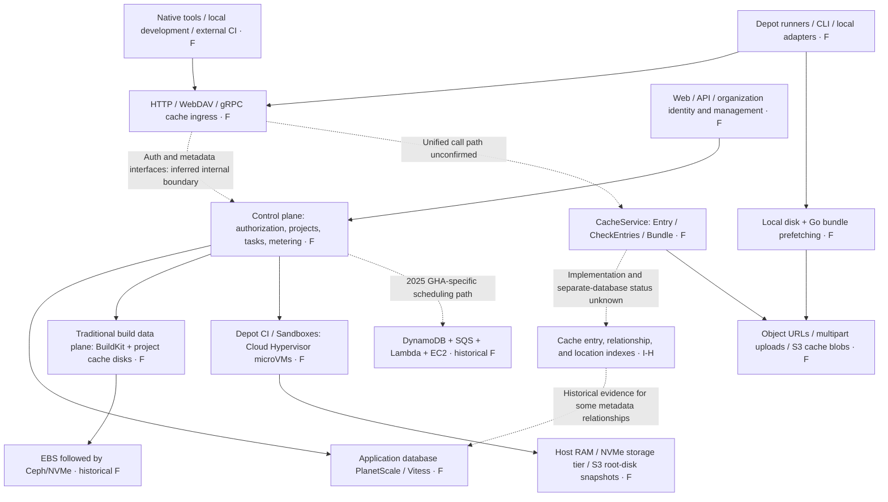

# In-Depth Depot Research and Architectural Inferences

Research date: 2026-09-28. Method: cross-checking official documentation, engineering articles, incident retrospectives, and public code pinned to specific commits; no customer accounts were accessed, protected APIs called, or performance tests run. **This report reconstructs publicly visible structures; it does not present itself as Depot's internal design documentation.**

Evidence grades: **F** = explicitly disclosed official facts or behavior in the reviewed code; **I-H / I-M** = high-/medium-confidence architectural inferences; **U** = currently unconfirmed. F remains subject to source dates, product scope, and whether the code is deployed; vendor-reported performance has not been independently reproduced.

| Reading guide | Contents |
|---|---|
| This document | Architectural reconstruction, key mechanisms, FindMissing inferences, and expbuild decisions |
| [Cache evidence](cache-evidence.md) | Native protocols, permissions, isolation, retention, management, and undisclosed details |
| [Compute and storage evidence](compute-evidence.md) | BuildKit, runners, microVMs, Metal, and dependencies exposed by regional outages |
| [Public code evidence](public-code-evidence.md) | Pinned commits, CLI/agent/API contracts, actual calls, and boundaries |

## 1. Key Assessment

Depot's product advantage comes from controlling **integration clients, compute placement, cache transfer, storage tiers, and the operational control plane** together. It combines several acceleration mechanisms into a platform with low adoption costs: conventional native tools connect directly to the cache; its own runners inject configuration automatically; specialized clients pack small objects; Docker builds reuse persistent block disks; and the new compute platform extends control to VMs and root disks. This is a synthesis of evidence, not something reducible to one particularly fast database or a general-purpose CAS server.

The four most valuable findings for expbuild are:

1. Typed cache contracts exist behind the multiprotocol endpoints. Public code directly exposes batched key checks, segmented bundles, and staged uploads; these are more than hypotheses.
2. Small-object request counts, access locality, and compute/storage distance are performance variables as important as server-side queries.
3. Shared underlying resources for management queries and authentication/scheduling have amplified failures. Comprehensive management functionality must include query budgets and failure isolation.
4. Depot already deploys data planes into customer AWS accounts. expbuild's “self-hosting” must explicitly include an independently operable control plane, offline availability, and replaceable storage. BYOC cannot be treated as a capability Depot lacks.

## 2. Product and Deployment Boundaries

| Area | Publicly documented capabilities | Boundaries the analysis must retain |
|---|---|---|
| Depot Cache | Native remote caching for multiple tools; also accessible from local development and external CI | Not every protocol requires the Depot CLI; this does not imply unified build semantics |
| Container Builds | Remote BuildKit builds, native CPU architectures, project cache disks | BuildKit is not a REAPI remote execution service |
| GitHub Actions runners | Execute GitHub workflows and connect to caches automatically | Their lifecycle and permissions are not the same implementation as Depot CI |
| Depot CI / Sandboxes | Proprietary task and microVM execution environments | Check the scope migrated to Metal in 2026 separately from other products |
| Registry | OCI artifacts, pull-through capabilities, and more | Registry storage backends and Cache blob backends cannot be inferred from each other |
| Depot Managed | Data plane deployed in the customer's AWS account while retaining Depot's service control plane | This documentation does not establish fully offline self-hosting of the control plane |

Product-scope sources: [official documentation](https://depot.dev/docs), [Container Builds](https://depot.dev/docs/container-builds/overview), [Managed](https://depot.dev/docs/managed/overview), [Registry](https://depot.dev/docs/registry/overview). This review does not rank pricing or use vendor speedup ratios as expbuild capacity targets.

## 3. Timeline: Do Not Combine Different Generations into One Current State

| Date | Public disclosure | What it establishes |
|---|---|---|
| 2023-07-17 | Docker cache disks moved from EBS to Ceph/NVMe | Block-storage evolution at that time; the article's “Cache v2” is not v2 of the later multiprotocol Cache |
| 2024 GitHub cache engineering article | A runner-local proxy compatible with the GitHub Cache API; S3 transfer-concurrency optimization | Proprietary runners enable data-path optimization at the client/protocol edge |
| 2025-03-11 | Application database uses PlanetScale/Vitess and migrates to NVMe-backed PlanetScale Metal | Database vendor and architecture are public; do not confuse this with 2026 Depot Metal |
| 2025-05-08 incident / 05-12 retrospective | A large Cache Explorer query overloaded the primary database and affected authentication/scheduling | Historical failure dependencies; does not establish that everything still shares a database |
| 2025-05-30 | Go cache v2 bundles and whole-bundle prefetching | Small-object aggregation is documented as a production product feature; not proof that all protocols use it |
| 2025-10-20 incident / 10-29 retrospective | GHA scheduling depends on DynamoDB/SQS/Lambda; Registry used ECR+Tigris/CDN | The platform has multiple state and storage systems rather than routing everything through one SQL database |
| 2025-11-21 | Indexes, query batching, and shorter transactions address a thundering herd | SQL batching also requires execution-plan validation; larger batches are not necessarily faster |
| 2026-05-06 | Cloud Hypervisor/KVM, JIT microVM scheduling, and boot optimization | Explicit evidence identifies the VMM; no need to guess Firecracker |
| 2026-07-07 | Depot Metal: compute/storage separation, NVMe-oF/TCP, S3 | Already used by Depot CI/Sandboxes at that time; migration of other products remained planned |

Sources: [Ceph evolution](https://depot.dev/blog/cache-v2-faster-builds), [GitHub Cache](https://depot.dev/blog/github-actions-cache), [database](https://depot.dev/blog/faster-database-with-planetscale-metal), [May incident](https://depot.dev/blog/may-8-outage), [Go v2](https://depot.dev/blog/now-available-gocache-v2-faster-improved-golang-build-performance), [October incident](https://depot.dev/blog/october-20-us-east-1-outage), [SQL optimization](https://depot.dev/blog/planetscale-to-reduce-the-thundering-herd), [microVM](https://depot.dev/blog/optimizing-microvm-boot-times), [Metal](https://depot.dev/blog/announcing-depot-metal). As of the access date, no new evidence established that all other products had completed migration to Metal.

## 4. My Inferred Overall Architecture

Nodes labeled F have public evidence for the corresponding capability or component. Dashed lines are inferences assembled across sources, not confirmed internal calls. Historical components are dated; the diagram is not a complete deployment topology at a single point in time.

**I-H: Integration and management are unified externally; internally, there are multiple data paths.** This follows from the different mechanisms in tool-integration documentation, the public CacheService, Go bundles, BuildKit block disks, and Metal. An alternative explanation is aggregation of several independent services at ingress. Existing evidence cannot establish a shared core in a single process or a physical deduplication pool shared by all products.

**I-M: The Cache data plane separates small control requests from large-object transfers.** At least the generic CLI cache directly performs “allocate → upload via URL → finalize.” Native gRPC/Gradle and other adapters may proxy bytes, however, so this must not be generalized into all build clients connecting directly to S3.

**U:** There is insufficient public evidence for a uniform server-side language, Kubernetes, Redis/RocksDB, Bloom filters, exact shard counts, cross-tenant deduplication, or GC transactions across all protocols. This review leaves these gaps unfilled.

## 5. Cache Core: Public Contracts Reveal More Than Product Pages

Pinned CLI commit: `788a3d5373bc5f4bc19f40f8d6148899b763706c`. The evidence below comes from [cache.proto](https://github.com/depot/cli/blob/788a3d5373bc5f4bc19f40f8d6148899b763706c/proto/depot/cache/v1/cache.proto), a public contract rather than complete server source code.

| Interface / field | Direct observation | Supported inference |
|---|---|---|
| `entry_type + key`, with `scope` in some interfaces | Tool type, key, and isolation hints are separate | A generic entry model supports different tools; this cannot reconstruct the database's unique key |
| `CreateEntry / FetchMorePresignedURLs / FinalizeEntry` | Entry ID, upload URLs, part ETags, and final size are separate | Upload allocation and completed publication are distinct phases; atomicity/durability remain unknown |
| `CheckEntries(keys[]) → key/found[]` | Native batched existence contract | An internal batch interface exists; this is not evidence of the REAPI FindMissing implementation |
| `GetBundle / Segment` | Subkey, offset, size, and bundle URL | Small logical entries can reside in larger physical objects |
| `FinalizeEntry.children` | Entries can carry children; comments mention Bazel directories | Relationship metadata exists; complete REAPI reference closure and GC rules remain undisclosed |
| `GetDownloadURLByPrefix / ListEntries` | Prefix matching, scope, and cursor pagination | Tool-specific lookup capabilities are retained; these cannot be forced into pure CAS semantics |

The actual [CLI upload implementation](https://github.com/depot/cli/blob/788a3d5373bc5f4bc19f40f8d6148899b763706c/pkg/api/cache.go) calls CreateEntry, PUTs to the returned URL, collects the ETag, and then finalizes. This proves one real path for that client, not how every adapter validates digests or when entries become visible to other clients.

My inferred logical model is: `organization/credential context + entry_type + key/scope → entry location and state → standalone object or bundle segment`. Organization comes from authentication and need not appear as a business-request field. This model is not equivalent to expbuild's proposed physical namespace-isolation model.

## 6. Performance Mechanisms: Which Costs Are Actually Reduced

### 6.1 Small-Object Bundling and Locality

The Go v2 article explicitly describes accumulating multiple PUTs into bundles, marking segments with offset/length, and retrieving the target and whole-bundle index on GET to prefetch neighboring artifacts. The public proto provides a matching Segment model. This explains how it reduces remote round trips for small objects rather than merely increasing server GET QPS. [Go v2 engineering explanation](https://depot.dev/blog/now-available-gocache-v2-faster-improved-golang-build-performance)

**Our inference / costs:** Benefits depend on correlation in build access patterns; cold random access may amplify downloads. Bundles also introduce flush-timing decisions, loss of uncommitted data on crashes, physical reclamation after segment expiration, and repacking costs. The article cannot establish how these issues were solved, and the older CLI's v1 implementation cannot be treated as public v2 source code.

### 6.2 Same-Region Placement and Parallel Transfers

The GitHub cache engineering article describes a runner-local Go proxy, S3 storage, and upload/download concurrency tuned for its samples. It proves that Depot controls a transfer-optimization point beyond native tools; throughput claims for that path do not establish equally fast external networking, random small-object access, or REAPI batch queries. [GitHub cache engineering explanation](https://depot.dev/blog/github-actions-cache)

**Our inference:** Its own runners let Depot optimize networking, identity, automatic configuration, and caching together, an advantage difficult for a standalone remote cache service to reproduce. expbuild can approach this through enterprise CI nodes/Edge without building its own cloud compute platform in the first phase.

### 6.3 Metadata Is Also on the Critical Path

The 2025 database article explicitly identifies PlanetScale/Vitess and migration to NVMe, reporting vendor statistics showing mixed-query P95 falling from 40ms to 5ms. That figure includes no FindMissing batch size, QPS, or call breakdown, so it cannot establish 5ms Depot FindMissing latency. [Database engineering explanation](https://depot.dev/blog/faster-database-with-planetscale-metal)

The 2025-11 article found that excessively large IN lists caused some queries to stop using efficient primary-key access; splitting them into batches improved performance. It also shortened work within transactions and optimized indexes for instance filtering. **Direct lesson: measure execution plans and load for batch queries; indefinitely increasing batch size is not an optimization.** This is not a published FindMissing handler. [Thundering herd and query optimization](https://depot.dev/blog/planetscale-to-reduce-the-thundering-herd)

### 6.4 The Compute Platform's New Storage Layer

The 2026 public design uses Cloud Hypervisor/KVM microVMs and tiers of host memory, dedicated NVMe storage servers, and S3 durable root disks/snapshots; Metal specifies NVMe-oF/TCP. This primarily explains VM startup and task file I/O. It cannot substitute for explanations of cache-key lookups, references, permissions, and GC. [microVM](https://depot.dev/blog/optimizing-microvm-boot-times), [Metal](https://depot.dev/blog/announcing-depot-metal)

## 7. Specific Question: How Might Depot Implement FindMissing?

**Observable facts:** The official Bazel example uses HTTP cache; Pants and moonrepo examples use `grpcs://cache.depot.dev`, with moonrepo supporting REAPI-style caching. Together with the public CheckEntries batch contract, this confirms HTTP and gRPC access and a batched-query design. The Bazel example alone does not make Depot HTTP-only, nor can CheckEntries be equated with FindMissing. [Bazel](https://depot.dev/docs/cache/integrations/bazel), [Pants](https://depot.dev/docs/cache/integrations/pants), [moonrepo](https://depot.dev/docs/cache/integrations/moonrepo)

| Candidate internal path | Assessment | Evidence and room for alternatives |
|---|---|---|
| Resolve organization/type, then batch-query an existence index | **I-H: the hypothesis most worth validating** | Consistent with CheckEntries and cache-metadata evidence; the index could be SQL or a separate KV store |
| A gRPC adapter reuses the domain method behind CheckEntries | **I-M** | Avoiding duplicate implementations is reasonable; a separate storage service is also possible, with no public call chain |
| Check hot entries in memory/at the edge first, then consult the authoritative index on misses | **I-M / toward the low end** | Global-edge claims and cache locality make this plausible, but there is no evidence of an existence-cache algorithm |
| Synchronously HEAD S3 for each digest | **U, lower-priority hypothesis** | High request costs conflict with its bundling optimization direction, but no server source is available to rule it out |
| Implement FindMissing using Bloom or RocksDB | **U** | Current evidence is insufficient to identify a specific structure |

The request flow I consider more likely is: `authenticate once → normalize/deduplicate → bounded batched existence interface → query logical entries and available locations → return the missing set`. **The internal SQL, cache layers, and TTL renewal mechanisms here are all inferences and must not be cited as facts.**

No usable FindMissing-specific QPS, P95/P99, cold/warm index comparison, renewal write-amplification measurement, or concurrent-GC test was found. Depot's performance marketing cannot prove that expbuild's design meets requirements; the reusable lessons are batched-query interfaces and reducing remote round trips. [expbuild focused study](../../design/findmissing-performance.md)

## 8. Control-Plane Structure Exposed by Failures

The 2025-05 retrospective explains that a Cache Explorer query involved more than 140 million cache records and their metadata, exhausting primary-database CPU/transaction-pool resources. Authentication retries and task startup created cascading pressure; moving some authentication reads to replicas then exposed replication lag. This proves cross-feature resource coupling at the time, not that everything remains unisolated today, or that the 140 million records belonged to one tenant or represent the current total. [Incident retrospective](https://depot.dev/blog/may-8-outage)

The 2025-10 retrospective reveals another dimension: GHA scheduling and Container Build scheduling have different dependencies, and Registry's global layer distribution can still be blocked by a regional manifest origin. “Global cache” therefore differs from “fully operational across regions during failure.” Current architectural details must incorporate subsequent migration evidence rather than permanently adopting this historical incident's topology. [Regional outage retrospective](https://depot.dev/blog/october-20-us-east-1-outage)

**Recommendations for expbuild:** Browsing/search/statistics should have separate connection pools, concurrency limits, and statement budgets; authentication/publication/quota operations need guaranteed resources. Aggregate high-frequency statistics asynchronously, and do not let management pages scan the full blob set. Read replicas suit views that tolerate lag; permission revocation, newly created credentials, and read-after-write operations cannot blindly move to replicas. The failure matrix should include simultaneous pressure from management queries, authentication bursts, and GC.

## 9. Permissions, Management, and Deployment: Make Differentiation More Specific

Cache authentication supports user/org and temporary job credentials; documentation explicitly rejects container project tokens. Native tools retain their respective integration formats. GitHub cache repository boundaries, Docker project cache disks, and general Cache organization scope must be understood separately. Optional scope in public code suggests finer granularity in future/specific paths; the absence of a button on one page does not establish that the enterprise offering has no fine-grained capabilities. [Cache authentication](https://depot.dev/docs/cache/authentication), [security boundaries](https://depot.dev/docs/security), [detailed review](cache-evidence.md)

Depot Managed already covers the data plane in customer AWS accounts. The CLI still connects to customer compute/cache, while Depot continues to provide the Web/API control plane, with PrivateLink configurable. **The opportunity worth validating for expbuild is therefore fully independent operation, multicloud/on-premises storage, offline deployment, consistent cross-protocol namespace authorization, and extension interfaces.** This is our product hypothesis and still requires pilot validation. [Managed explanation](https://depot.dev/docs/managed/overview)

## 10. Specific Implications for expbuild Planning

| Decision | Recommendation | Rationale |
|---|---|---|
| Multiprotocol core | Keep entry keys separate from blob identities; retain native protocol prefixes/references/signatures | Depot's public contract likewise needs types, scope, children, bundles, and related capabilities |
| FindMissing | Run mixed batch-index and GC load tests early | Batch-interface evidence exists, but no performance promise can be borrowed |
| Small objects | Add bundle/packfile research; first prototype against Go/Bazel samples | Focus on request counts and physical object granularity; keep it out of P0's durability-critical path for now |
| Integration experience | Plan CI initialization/optional agent auto-configuration and record the first real hit | Depot runners' automatic integration creates a practical user-experience gap |
| Management plane | Limit listing, statistics, and search resources from the first release | Avoid comprehensive management features overwhelming the build path |
| Direct S3 transfer | Use a separate future ADR; do not automatically replace P0's proxied transfer | URL capabilities, native protocols, and revocation windows for active streams need to be redefined |
| Private deployment | Distinguish complete self-hosting from a BYOC managed data plane | Depot already offers the latter; this is not an unserved market |
| Execution platform | Keep it deferred; integrate mature execution engines first | Metal involves VMM/image/block-storage/scheduling operations, with replication costs far beyond those of a cache service |

This review does not justify switching expbuild from PostgreSQL to MySQL simply because a competitor uses Vitess, or introducing Ceph or a custom NVMe service because Metal uses tiered block storage. Technology choices should follow our validated deployment constraints and workloads.

The most valuable next evidence would come from pinning client versions in an authorized trial environment, observing request batches, region RTT, object sizes/bundling behavior, rechecks after expiration, and negative authorization cases across protocols, and asking Depot about data residency, GC windows, and read-only permission contracts. This review did not perform those online experiments; all unknowns remain unknown.
