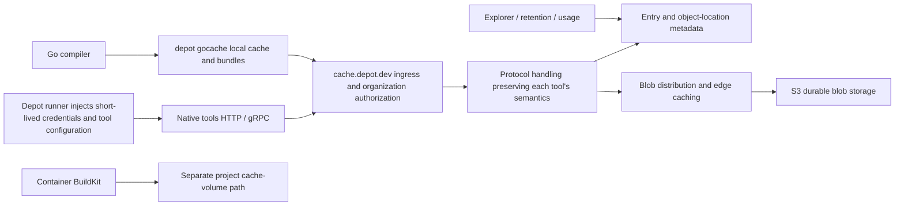

# Depot Cache: Public Evidence and Architectural Inferences

Research date: 2026-09-28. Scope: Depot's multiprotocol remote cache, client integration, isolation, retention policies, management, and performance evidence. This document did not involve using a Depot account, reading customer data, or load-testing the service.

Labels: **Public fact** means something explicitly described in official documentation or engineering articles; **Product claim** means a product statement, such as performance or global availability, that has not been independently verified; **Inference** means a design inferred from interfaces and public implementations, which must not be treated as a fact about internal code. For undated documentation, dates refer to this review's access date.

## 1. Conclusions

Depot Cache's observable product model is: **unified organization identity and management, native protocols preserved for each tool, and connections to multiple cache data paths**. Public information supports coexistence of HTTP and gRPC access, S3 storage for build-cache blobs, and active small-object aggregation by the Go client. It does not support describing the entire product as “one Ceph cluster” or “one unified REAPI service.” The evidence and limits of inference follow.

The three most useful lessons for expbuild are low tool-integration costs, fewer small-object network requests through client-side optimization, and cache management presented in a form users can understand. Areas requiring additional design are fine-grained authorization and trusted-write boundaries, isolation of query and management workloads, and precise GC concurrency semantics. These last three are our design requirements, not assertions that Depot has not implemented them.

## 2. Protocol and Integration Matrix

All entries below are current official configurations; they do not mean that all server RPCs have passed conformance testing.

| Tool | Official endpoint and method | Organization selection / restrictions | Evidence |
| --- | --- | --- | --- |
| Bazel | `--remote_cache=https://cache.depot.dev`; `authorization` header | Add `x-depot-org` if the user belongs to multiple organizations | [Bazel documentation](https://depot.dev/docs/cache/integrations/bazel), accessed 2026-09-28 |
| Gradle | `HttpBuildCache`, `https://cache.depot.dev`, Depot token as HTTP Basic password | Use the organization ID as username for multiple organizations; the example enables push | [Gradle documentation](https://depot.dev/docs/cache/integrations/gradle), accessed 2026-09-28 |
| sccache | `SCCACHE_WEBDAV_ENDPOINT=https://cache.depot.dev`, token or username/password | Use the organization ID as username for multiple organizations | [sccache documentation](https://depot.dev/docs/cache/integrations/sccache), accessed 2026-09-28 |
| Turborepo | `TURBO_API=https://cache.depot.dev`, `TURBO_TOKEN` | `TURBO_TEAM` is the Depot organization ID | [Turborepo documentation](https://depot.dev/docs/cache/integrations/turbo), accessed 2026-09-28 |
| Nx | Implements the Nx self-hosted remote cache protocol; server is `https://cache.depot.dev` | Custom headers for organization selection are unsupported; users in multiple organizations must use an organization token | [Nx documentation](https://depot.dev/docs/cache/integrations/nx), accessed 2026-09-28 |
| Pants | `remote_store_address=grpcs://cache.depot.dev`; enable remote reads and writes | Authorization and `x-depot-org` headers | [Pants documentation](https://depot.dev/docs/cache/integrations/pants), accessed 2026-09-28 |
| moonrepo | Depot documentation uses `unstable_remote.host=grpcs://cache.depot.dev` | `DEPOT_TOKEN`; `X-Depot-Org` for multiple organizations | [Depot moonrepo documentation](https://depot.dev/docs/cache/integrations/moonrepo), accessed 2026-09-28 |
| Go | Go 1.24+; `GOCACHEPROG="depot gocache"` | CLI authorization; `--organization` can select the organization | [Go documentation](https://depot.dev/docs/cache/integrations/gocache), accessed 2026-09-28 |
| Maven | Maven Build Cache extension; HTTP remote URL is `https://cache.depot.dev` | Organization tokens only; the example configures SHA-256 and a Bearer header | [Maven documentation](https://depot.dev/docs/cache/integrations/maven), accessed 2026-09-28 |
| GitHub Actions | Depot runners automatically replace the GitHub Actions cache API backend for `actions/cache` and setup actions using that API | This integration supports only Depot GitHub Actions runners | [Actions Cache documentation](https://depot.dev/docs/cache/integrations/github-actions), accessed 2026-09-28 |

Maven here refers to a **build-result caching extension**; it does not establish that Depot is a Maven dependency artifact repository. Likewise, sccache's WebDAV configuration does not prove that the server provides a complete general-purpose WebDAV filesystem.

### REAPI and FindMissing: What Can Be Confirmed

- **Strong evidence:** Pants and moonrepo use TLS gRPC. moonrepo's own official documentation explicitly requires REAPI v2 AC, CAS, SHA-256, and gRPC from remote services and provides Depot configuration. Thus, “Depot supports a REAPI cache path” is corroborated by both service-integration and client-protocol documentation. [moonrepo remote cache](https://moonrepo.dev/docs/guides/remote-cache), accessed 2026-09-28.
- **Version differences:** Depot's moonrepo example still uses `unstable_remote`, while moonrepo's current v2 documentation uses `remote`. This illustrates why integration examples must be checked against the client version; webpage snippets should not be copied directly into expbuild's compatibility acceptance criteria. [Depot documentation](https://depot.dev/docs/cache/integrations/moonrepo), [moonrepo v2](https://moonrepo.dev/docs/guides/remote-cache), accessed 2026-09-28.
- **Boundary:** The official Bazel example uses HTTP, not gRPC. That one example cannot establish that Depot lacks REAPI support, and Pants/moonrepo support cannot establish support for every Bazel REAPI extension, compression, ByteStream resumption, or Execute.
- **Unconfirmed:** The material reviewed does not disclose `FindMissingBlobs` batch sizes, QPS, digest/s, P95/P99, index structures, Bloom filters, data consistency, or GC renewal mechanisms. Nor is there evidence that every FindMissing call accesses the primary database or executes S3 HEAD for every digest.

## 3. Identity and Sharing Scope Must Be Distinguished

**Public fact:** Depot Cache accepts user tokens, organization tokens, and `DEPOT_CACHE_TOKEN`, injected by a Depot runner and valid only for a single job's lifetime. Cache explicitly rejects project tokens because projects here belong to the container build product. [Cache Authentication](https://depot.dev/docs/cache/authentication), accessed 2026-09-28.

**Public fact:** In the general CLI permission matrix, Cache supports user/org tokens but not project/pull tokens; read-only pull tokens are specific to Registry. Registry's read-only credentials must not be assumed to apply to general build caching. [CLI Authentication](https://depot.dev/docs/cli/authentication), accessed 2026-09-28.

**Public fact:** GitHub Actions cache is scoped by repository. The documentation explicitly states that branch isolation is not enforced: branches share a namespace, and users can differentiate them through key formats. [Actions Cache behavior](https://depot.dev/docs/cache/integrations/github-actions), accessed 2026-09-28.

**Documentation/source discrepancy requiring validation:** `CreateEntryRequest` in the public CLI repository has an optional `scope`, with a comment giving GHA branch/platform/version combinations as an example; prefix-matched downloads also accept a scope. This proves that the cache contract has an additional isolation field, but a proto comment alone cannot establish that the production Actions integration enables branch isolation or that the user documentation above is obsolete. Both pieces of evidence should be retained side by side. [Public cache.proto](https://github.com/depot/cli/blob/788a3d5373bc5f4bc19f40f8d6148899b763706c/proto/depot/cache/v1/cache.proto), source snapshot accessed 2026-09-28.

**Public fact:** Another product form, Depot CI durable cache disks, is shared by name within an organization and can span repositories. Public fork PRs do not mount cache disks. Parallel mounts allow concurrent reads and writes, but overlapping application-level writes do not automatically become atomic. [Cache disks](https://depot.dev/docs/ci/how-to-guides/cache-disks), accessed 2026-09-28.

**High-confidence inference:** Depot unifies management, but cache namespaces must retain a product dimension. At minimum, organization-level tool caches, repository-level Actions archives, project-level container volumes, and organization-named cache disks must be distinguished. Whether internal keys contain these fields, or whether databases or buckets are separate, is not public.

**Implication for expbuild:** Copying “organization token + global endpoint” does not constitute a complete enterprise permission model. expbuild still needs projects/namespaces, trust domains, and separation of `blob.write` from `result.publish`; in particular, key prefixes for untrusted PRs cannot replace server-side authorization isolation. This is a choice for our project, not an assertion about Depot's security.

## 4. Storage and Global Distribution: Established Facts

| Date / scope | Official disclosure | What it establishes / does not establish |
| --- | --- | --- |
| 2023-07-17, Docker layer cache v2 | Migration from EBS to a Ceph cluster on NVMe, thin-provisioned volumes, builders mounting cache volumes | Establishes historical block-disk storage for Docker caches; cannot be treated as the backend for the multiprotocol Cache product launched in 2025. Source: [Cache storage v2](https://depot.dev/blog/cache-v2-faster-builds) |
| 2025-01-14, Depot Cache launch | Claims caches are retrieved from the cache edge nearest to the local developer / CI | Supports a product design for global distribution; no edge list, routing algorithm, replication model, or cross-region consistency is disclosed. Source: [Introducing Depot Cache](https://depot.dev/blog/introducing-depot-cache) |
| 2025-05-30, Go cache v2 | Each operation in the first version generated a separate S3 request; small and empty objects had substantial overhead, leading to bundles | Explicitly establishes S3 in the Go data path and request count as a bottleneck in addition to bandwidth. Source: [Gocache v2](https://depot.dev/blog/now-available-gocache-v2-faster-improved-golang-build-performance) |
| 2026-07-07, Depot Metal's review of existing systems | Lists S3 for cache blobs from CI jobs, Bazel, Gradle, and Go, and Ceph for Docker build block disks | Confirms historical use of S3 as a multiprotocol blob backend; does not establish that every protocol currently shares one physical CAS or bucket. Source: [Depot Metal / Storage](https://depot.dev/blog/announcing-depot-metal) |
| Current Security documentation | GitHub Actions cache backed by S3 | Further supports the Actions blob backend; does not imply that all data follows its repository scope rules. Source: [Security / caching and storage](https://depot.dev/docs/security), accessed 2026-09-28 |

**Medium-confidence inference:** A plausible service layering is “protocol and organization routing → metadata/object location → blob distribution → S3 persistence,” with edges absorbing remote downloads. An alternative could use regional proxies plus a CDN, or clients could connect directly to distribution after obtaining download locations. A unified endpoint and global product claims alone cannot identify which implementation is used.

**Additional contract fact:** The public `CacheService` returns multipart upload URLs from `CreateEntry`, accepts part ETags in `FinalizeEntry`, returns URLs from download methods, and returns a segment list from `GetBundle`. This already proves that Depot designed a “metadata coordination + URL transfer” interface for at least its own clients. The contract alone still cannot confirm whether native Gradle/REAPI clients are proxied by the server onto the same path or which CDN the URLs actually traverse. [Public cache.proto](https://github.com/depot/cli/blob/788a3d5373bc5f4bc19f40f8d6148899b763706c/proto/depot/cache/v1/cache.proto), accessed 2026-09-28.

**There is no evidence** that all remote caches use Ceph, all remote caches have migrated to Metal block storage, individual objects are synchronously replicated to every region, R2 is the primary general build-cache store, actions automatically hit across protocols, or physical deduplication spans tenants.

## 5. Go Cache v2 Reveals the Most Concrete Optimization Strategy

The 2025-05-30 engineering article describes a Go cache with many objects smaller than 1 KB, including 0-byte values; its request density exceeds that of heavier Bazel workloads by an order of magnitude. v2 writes successive PUTs into an in-memory buffer, records offset/length, and submits a bundle when the target size is reached. GET retrieves the target segment, its bundle, and the segment index, so subsequent reads in the same group can be served from local disk. Depot's experiment reports nearly 4× improvement for cached Tailscale builds, with both groups running on Depot runners; this is a specific experimental result, not a universal promise. [Gocache v2, 2025-05-30](https://depot.dev/blog/now-available-gocache-v2-faster-improved-golang-build-performance).

The original engineering article also discloses that the CLI writes cache data to local files while uploading to remote cache in the background; closing waits up to ten seconds for remaining remote PUTs. This is **the first version's behavior at that time**, not a complete description of v2's current shutdown semantics. [Go remote cache, 2025 article, accessed 2026-09-28](https://depot.dev/blog/go-remote-cache).

**High-confidence engineering inference:** Depot does more than add server APIs: it uses a CLI under its control to reshape requests, changing “one network round trip per compilation result” into “read once and prefetch related results.” This explains why increasing server QPS alone may not deliver the same build acceleration.

**Alternatives and costs:** Local caching also reduces request counts, but cannot by itself explain bundle prefetching on cold starts across runners. Bundles introduce read amplification, duplicate segments, partial invalidation, and GC granularity issues. Public articles do not disclose compaction, reference counting, per-tenant bundle organization, or failure-retry algorithms.

**Implication for expbuild:** FindMissing's batched index lookup is only part of controlling request costs. Load tests should also measure total RPCs per build, object-size distributions, objects per GB, read amplification, client-local hits, and object-storage request costs. Native REAPI clients cannot unconditionally adopt the Go helper's custom bundle protocol. Packing can be placed in the internal storage layer, but native per-digest addressability and isolation semantics must be preserved.

## 6. Retention, GC, and Cost

**Public fact:** Current remote Cache defaults to 14-day retention and unlimited capacity. Organization settings offer 7/14/30 days and 25/50/100/150/250/500 GB or unlimited capacity. Docker layer caches use separate project settings rather than this policy. Usage is snapshotted hourly and billed on the monthly average; the page lists excess storage at $0.20/GB/month. [Cache overview](https://depot.dev/docs/cache/overview), accessed 2026-09-28.

**Public fact:** The retention announcement dated 2025-01-17 says separate policies can be configured for GitHub Actions cache and Depot Cache. Entries unused beyond the retention period are removed, and the oldest entries are removed when capacity is exceeded. [Retention policies, 2025-01-17](https://depot.dev/blog/configuring-cache-retention-on-depot).

**Unclear:** The documentation above does not elaborate on whether “oldest” means creation or last-access time, how access times are sampled, cleanup frequency, deletion propagation delay, protection for active reads, AC/CAS reference integrity, whether temporary capacity overruns are allowed, or billing for failed uploads. It should therefore not be described as “Depot has publicly documented strict LRU + reference GC.”

**Limits of product claims:** At launch, Cache ingress and egress were described as free. Registry currently has separate Standard/Fast CDN pricing, so the Cache claim cannot be expanded into “all Depot transfers are free forever.” [Cache launch, 2025-01-14](https://depot.dev/blog/introducing-depot-cache), [Registry overview](https://depot.dev/docs/registry/overview), accessed 2026-09-28.

## 7. Management, Observability, and Problems Exposed at Real Scale

**Public fact:** Cache Explorer launched on 2024-10-07, consolidating the previous Docker/GitHub cache pages. It supports filtering by type, architecture, and name; bulk deletion by criteria or selection; expansion of Docker layer entries; and average storage usage over the past 30 days. This establishes unified browsable cache entries as a product capability, not that every type shares one storage implementation. [Cache Explorer, 2024-10-07](https://depot.dev/changelog/2024-10-07-depot-cache-explorer).

**Public fact:** The current organization usage page lists Container Layer Cache, Actions Cache, Ephemeral Registry, and Remote Build Cache separately, with daily trends. This is capacity observability; it does not establish availability of per-protocol RPC latency, digest hit rates, or FindMissing diagnostics. [Observability overview](https://depot.dev/docs/observability), accessed 2026-09-28.

**Public fact:** Container builds additionally have build/step-level cache-hit and duration charts. These observe BuildKit builds, not invocation traces for every external Bazel/Gradle client. [Container build metrics](https://depot.dev/docs/container-builds/observability/container-build-metrics), accessed 2026-09-28.

**Public fact:** The audit announcement dated 2025-06-03 discloses WorkOS integration, versioned event schemas, actor/target fields, default 30-day retention, and LogStreams export. The initial focus was organization, project, credential, and configuration changes, including cache resets. That material alone does not establish a complete exportable audit record for every blob PUT. [Audit logging, 2025-06-03](https://depot.dev/blog/now-available-audit-logging-for-improved-security).

### The 2025-05-08 Outage: Evidence More Valuable Than Architecture Marketing

The official 2025-05-12 retrospective explains that a Cache Explorer query attempted to load more than 140 million cache entries and their metadata, saturating CPU on an already heavily loaded primary database. Authentication retries amplified the load, affecting orchestration and builds. Read replicas could still serve reads, but moving authentication to replicas exposed replication lag. Immediate measures included adding capacity, rate limiting and backoff, and moving queries that could tolerate lag. A separate orchestration database and circuit breakers were future plans at that time. [May 8 outage](https://depot.dev/blog/may-8-outage), incident 2025-05-08, article 2025-05-12.

This supports two historical conclusions: a persistent directory of cache entries existed, and shared database resources coupled failures across management queries, identity, and orchestration. **It does not prove that the current topology is unchanged, that blob data resides in the database, or that FindMissing queries that primary database directly.**

Direct requirements for expbuild: cache browsing must use bounded cursor pagination; global capacity/hit trends should be preaggregated; bulk deletion should be asynchronous; management queries need concurrency, connection, and execution-time limits. Display reads that tolerate lag and permission decisions requiring immediate effect should be designed separately. Data-plane, management-plane, and GC load tests should run together.

## 8. Credible Architectural Hypotheses

The following is a **logical architectural inference, not a reconstruction of deployment topology**. Boxes do not represent separate processes, languages, or databases.

| Hypothesis | Confidence | Rationale | Alternatives / unknowns |
| --- | --- | --- | --- |
| Multiprotocol adaptation exists behind a unified endpoint | High | HTTP/WebDAV configuration and TLS gRPC on the same domain, with differing tool semantics | Either monolithic handlers or a multiservice proxy could implement this |
| Authorization resolution first establishes organization context | High | Correspondence among token scope, organization headers, Basic usernames, and Turbo teams | Could occur at the edge or origin; cache/revocation timing is unknown |
| Data and manageable metadata are logically separate | High | Evidence of S3 blobs and Explorer metadata queries | Does not reveal data models, indexes, sharding, or physical deployment |
| Different cache families retain different namespace rules | High | Public differences among Actions repositories, container projects, and named disks | Could use one table with type fields or separate services |
| Edge or regional layers reduce interregional transfer costs | Medium | Official claims about the nearest edge; public contracts return transfer URLs | CDN topology is unknown; native protocols and proprietary clients may use different proxy paths |
| Go bundles are a core client optimization for reducing small-object request overhead | High | Official engineering articles explicitly describe buffers, indexes, and local prefetching | Current parameters and subsequent evolution require source review / measurement |
| All protocols share one physical CAS with cross-protocol deduplication | Unconfirmed | Unified branding, endpoints, and billing do not establish physical deduplication | Separate per-protocol key/object namespaces are equally plausible |
| FindMissing has a dedicated index/Bloom/filter/cache | Unconfirmed | No method-level public explanation was found | Batched SQL, KV, in-memory indexes, or storage queries are all possible |

## 9. Questions to Validate with Depot

1. REAPI version and Capabilities; FindMissing batch limits, throughput, and tail latency; coverage for compression and ByteStream resumption.
2. Whether native tool caches offer project/namespace authorization, read-only tokens, trusted CI publication policies, and cache provenance tracking.
3. Read-after-write consistency and cross-region visibility; cold starts at the nearest edge, origin failures, and invalidation propagation.
4. Whether data-residency choices cover all Cache blobs, metadata, edge replicas, and management backups; ownership of each component under BYOC.
5. Whether GC protects active clients, how it handles AC references and segments inside bundles, and when deletion is considered complete.
6. Whether full cache-access audits and per-protocol hit/miss and latency metrics are available to customers, and which are tied to commercial plans or custom capabilities.

These are items to validate, not presumed missing features. expbuild can learn from the public paths while establishing its own implementation basis through reproducible compatibility tests and performance data.
