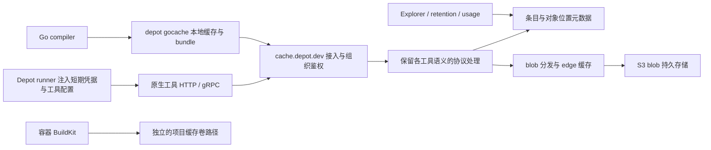

# Depot Cache：公开证据与架构推断

调研日期：2026-09-28。范围：Depot 多协议远程缓存、客户端接入、隔离、保留策略、管理与性能证据。本文没有使用 Depot 账号、读取客户数据或对服务发起负载测试。

标记含义：**公开事实**表示官方文档或工程文章明确描述；**产品宣告**表示性能、全球可用性等尚未独立验证的产品表述；**推断**表示从接口与公开实现反推的设计，不能当成内部代码事实。文档没有发布日期时，日期统一指本次读取日期。

## 1. 结论

Depot Cache 的可观察产品形态是：**统一组织身份和管理入口，保留各工具的原生协议，连接多种缓存数据路径**。公开信息支持 HTTP 与 gRPC 接入并存，支持 S3 保存构建缓存 blob，以及 Go 客户端主动合并小对象；不支持把整个产品概括为“一个 Ceph 集群”或“一个统一 REAPI 服务”。下文列出证据与推断边界。

最值得 expbuild 学习的三个点：工具接入成本低、通过客户端减少小对象网络请求、把缓存管理变成用户能看懂的产品。最需要额外设计的点：细粒度授权与可信写入边界、查询与管理负载隔离、精确的 GC 并发语义。后面三个是我们的设计要求，并非认定 Depot 没有实现。

## 2. 协议与接入矩阵

以下均为当前官方配置，不等于所有服务端 RPC 都经过认证测试。

| 工具 | 官方入口与方式 | 组织选择／限制 | 证据 |
| --- | --- | --- | --- |
| Bazel | `--remote_cache=https://cache.depot.dev`；`authorization` 请求头 | 用户属于多组织时加 `x-depot-org` | [Bazel 文档](https://depot.dev/docs/cache/integrations/bazel)，读取 2026-09-28 |
| Gradle | `HttpBuildCache`，`https://cache.depot.dev`，HTTP Basic 的 password 放 Depot token | 多组织时 username 放组织 ID；示例启用 push | [Gradle 文档](https://depot.dev/docs/cache/integrations/gradle)，读取 2026-09-28 |
| sccache | `SCCACHE_WEBDAV_ENDPOINT=https://cache.depot.dev`，token 或 username/password | 多组织时 username 为组织 ID | [sccache 文档](https://depot.dev/docs/cache/integrations/sccache)，读取 2026-09-28 |
| Turborepo | `TURBO_API=https://cache.depot.dev`、`TURBO_TOKEN` | `TURBO_TEAM` 为 Depot 组织 ID | [Turborepo 文档](https://depot.dev/docs/cache/integrations/turbo)，读取 2026-09-28 |
| Nx | 实现 Nx self-hosted remote cache protocol；server 为 `https://cache.depot.dev` | 不支持自定义 header 选组织，多组织用户必须改用组织 token | [Nx 文档](https://depot.dev/docs/cache/integrations/nx)，读取 2026-09-28 |
| Pants | `remote_store_address=grpcs://cache.depot.dev`；启用远程读写 | Authorization 与 `x-depot-org` header | [Pants 文档](https://depot.dev/docs/cache/integrations/pants)，读取 2026-09-28 |
| moonrepo | Depot 文档使用 `unstable_remote.host=grpcs://cache.depot.dev` | `DEPOT_TOKEN`，多组织时 `X-Depot-Org` | [Depot moonrepo 文档](https://depot.dev/docs/cache/integrations/moonrepo)，读取 2026-09-28 |
| Go | Go 1.24+；`GOCACHEPROG="depot gocache"` | CLI 授权；可通过 `--organization` 指定组织 | [Go 文档](https://depot.dev/docs/cache/integrations/gocache)，读取 2026-09-28 |
| Maven | Maven Build Cache extension；HTTP remote URL 为 `https://cache.depot.dev` | 仅组织 token；例子配置 SHA-256 与 Bearer header | [Maven 文档](https://depot.dev/docs/cache/integrations/maven)，读取 2026-09-28 |
| GitHub Actions | Depot runner 自动替换 GitHub Actions cache API 后端，适用于 `actions/cache` 及使用该 API 的 setup actions | 该集成仅支持 Depot GitHub Actions runners | [Actions Cache 文档](https://depot.dev/docs/cache/integrations/github-actions)，读取 2026-09-28 |

这里的 Maven 是**构建结果缓存扩展**，不能据此认为 Depot 是 Maven 依赖制品仓库。sccache 的 WebDAV 配置也不能证明服务端提供完整通用 WebDAV 文件系统。

### REAPI 与 FindMissing：能够确认到哪一步

- **强证据**：Pants 和 moonrepo 使用 TLS gRPC；moonrepo 自己的官方文档明确远程服务要求 REAPI v2 的 AC、CAS、SHA-256、gRPC，并提供 Depot 配置。因此，“Depot 支持 REAPI 缓存路径”有来自服务端接入文档和客户端协议文档的交叉支持。[moonrepo remote cache](https://moonrepo.dev/docs/guides/remote-cache)，读取 2026-09-28。
- **版本差异**：Depot 的 moonrepo 示例仍写 `unstable_remote`，moonrepo 当前 v2 文档用 `remote`。这是接入示例需要按客户端版本验证的实例；不应直接把网页代码复制为 expbuild 的兼容性验收标准。[两方文档](https://depot.dev/docs/cache/integrations/moonrepo)、[moonrepo v2](https://moonrepo.dev/docs/guides/remote-cache)，读取 2026-09-28。
- **边界**：Bazel 官方示例使用 HTTP，不是 gRPC。不能由这一个示例推出 Depot 不支持 REAPI，也不能从 Pants/moonrepo 支持推出所有 Bazel REAPI 扩展、压缩、ByteStream 恢复或 Execute 都受支持。
- **未证实**：本次资料没有公开 `FindMissingBlobs` 的批量大小、QPS、digest/s、P95/P99、索引结构、Bloom filter、数据一致性或 GC 续期方式。也没有证据证明每次 FindMissing 都访问主库或对每个 digest 执行 S3 HEAD。

## 3. 身份与共享范围不能混为一谈

**公开事实**：Depot Cache 接受用户 token、组织 token，以及 Depot runner 注入、仅单个 job 生命周期有效的 `DEPOT_CACHE_TOKEN`。Cache 明确不接受 project token，理由是此处的 project 属于容器构建产品。[Cache Authentication](https://depot.dev/docs/cache/authentication)，读取 2026-09-28。

**公开事实**：通用 CLI 权限表中，Cache 支持 user/org token，不支持 project/pull token；只读 pull token 专用于 Registry。不能把 Registry 的只读凭据能力外推给通用构建缓存。[CLI Authentication](https://depot.dev/docs/cli/authentication)，读取 2026-09-28。

**公开事实**：GitHub Actions cache 以 repository 为作用域；文档明确不实施 branch 隔离，分支共享命名空间，用户可通过 key 格式控制区分。[Actions Cache behavior](https://depot.dev/docs/cache/integrations/github-actions)，读取 2026-09-28。

**文档与源码差异，需验证**：公开 CLI 仓库的 `CreateEntryRequest` 有可选 `scope`，注释以 GHA 的 branch/platform/version 组合作例，前缀匹配下载也接受 scope。它证明缓存契约具备额外隔离字段，但仅凭 proto 注释不能证明生产 Actions 集成已启用 branch 隔离，或上述用户文档已经失效；两份证据应并列保留。[公开 cache.proto](https://github.com/depot/cli/blob/788a3d5373bc5f4bc19f40f8d6148899b763706c/proto/depot/cache/v1/cache.proto)，源码快照读取 2026-09-28。

**公开事实**：另一个产品形态 Depot CI durable cache disk 按组织内 name 共享，可跨 repository；公共 fork PR 不挂载缓存盘。并行挂载允许并发读写，但应用层重叠写不自动获得原子性。[Cache disks](https://depot.dev/docs/ci/how-to-guides/cache-disks)，读取 2026-09-28。

**推断，高置信度**：Depot 管理上统一，但缓存 namespace 必须保留产品维度。最低限度需要区分组织级工具缓存、仓库级 Actions archive、项目级容器卷、组织命名缓存盘。具体内部 key 是否包含这些字段、是否独立数据库或 bucket，未公开。

**对 expbuild 的含义**：不能照搬“组织 token + 全球 endpoint”就当作企业完整权限模型。expbuild 的项目/namespace、信任域、`blob.write` 与 `result.publish` 分权仍然有必要；尤其 untrusted PR 的 key 前缀不能替代服务端授权隔离。这是本项目选择，不是对 Depot 安全性的断言。

## 4. 存储与全球分发：哪些是事实

| 时间／范围 | 官方披露 | 可以推出／不能推出 |
| --- | --- | --- |
| 2023-07-17，Docker layer cache v2 | 从 EBS 转向 NVMe 上的 Ceph 集群，卷薄置备，builder 挂载缓存卷 | 证明历史 Docker 缓存采用块盘方式；不能当作 2025 年推出的多协议 Cache 产品后端。来源：[Cache storage v2](https://depot.dev/blog/cache-v2-faster-builds) |
| 2025-01-14，Depot Cache 发布 | 宣称通过离本地开发者／CI 最近的 cache edge 获取缓存 | 支持存在全球分发产品设计；没有公开 edge 列表、路由算法、复制模式或跨区一致性。来源：[Introducing Depot Cache](https://depot.dev/blog/introducing-depot-cache) |
| 2025-05-30，Go cache v2 | 初版每个操作产生独立 S3 请求；小对象与空对象开销显著，随后做 bundle | 明确 Go 数据路径用 S3，且瓶颈包含请求数而非只有带宽。来源：[Gocache v2](https://depot.dev/blog/now-available-gocache-v2-faster-improved-golang-build-performance) |
| 2026-07-07，Depot Metal 回顾既有系统 | 列出 S3 用于 CI jobs、Bazel、Gradle、Go 的 cache blobs，Ceph 用于 Docker build 块盘 | 证实多协议 blob 后端使用过 S3；不能证明所有协议当前共享同一个物理 CAS 或 bucket。来源：[Depot Metal / Storage](https://depot.dev/blog/announcing-depot-metal) |
| 当前 Security 文档 | GitHub Actions cache backed by S3 | 再次支持 Actions blob 后端；不能推出全部数据都受其 repository scope 规则支配。来源：[Security / caching and storage](https://depot.dev/docs/security)，读取 2026-09-28 |

**推断，中置信度**：较合理的服务分层是“协议与组织路由 → 元数据/对象定位 → blob 分发层 → S3 持久层”，边缘层吸收远端下载。替代实现可能是 regional proxy 加 CDN，也可能是客户端拿到下载位置后直连分发层；单凭统一 endpoint 和全球产品宣告无法选定一种。

**额外的契约事实**：公开 `CacheService` 的 `CreateEntry` 返回 multipart 上传 URL，`FinalizeEntry` 接受 part ETags，下载方法返回 URL，`GetBundle` 返回 segment 列表。这已经证明 Depot 至少为自有客户端设计了“元数据协调 + URL 传输”的接口；原生 Gradle/REAPI 客户端是否由服务端代理到同一路径，以及 URL 实际经过哪种 CDN，仍不能仅凭契约确认。[公开 cache.proto](https://github.com/depot/cli/blob/788a3d5373bc5f4bc19f40f8d6148899b763706c/proto/depot/cache/v1/cache.proto)，读取 2026-09-28。

**没有证据**证明：所有远程缓存用 Ceph、所有远程缓存已经转换成 Metal 块存储、单对象全区域同步复制、R2 是通用构建缓存主存储、跨协议 action 自动命中、跨租户物理去重。

## 5. Go cache v2 暴露了最具体的优化策略

2025-05-30 的工程文章描述：Go 缓存含大量小于 1 KB 的对象，甚至 0 字节值；其请求密度超过较重 Bazel 负载一个数量级。v2 将连续 PUT 写入内存 buffer 并记录 offset/length，达到目标尺寸后提交 bundle。GET 获取目标 segment、所属 bundle 及 segment index，使同组后续读取可以从本地盘满足。官方实验称 Tailscale 缓存构建接近 4 倍改善，两组都在 Depot runner；这是特定实验结果，不是普适承诺。[Gocache v2，2025-05-30](https://depot.dev/blog/now-available-gocache-v2-faster-improved-golang-build-performance)。

初版工程文章还披露：CLI 将缓存写入本地文件，同时后台上传远程缓存；close 阶段为剩余远程 PUT 等待最多十秒。这是**当时的初版行为**，不能把它当成 v2 当前实现的完整退出语义。[Go remote cache，2025 年文章，读取 2026-09-28](https://depot.dev/blog/go-remote-cache)。

**工程推断，高置信度**：Depot 不只在服务端添加 API，它会利用可控 CLI 改变请求形状，将“每个编译结果一轮网络请求”变成“读取一次，预取相关结果”。这解释了为什么仅增加服务器 QPS 可能无法获得相同构建加速。

**替代与代价**：本地缓存也能降低请求数，但无法单独解释跨 runner 冷启动的 bundle 预取。bundle 会引入读放大、重复 segment、部分失效与 GC 粒度问题；公开文章没有披露 compaction、引用计数、按 tenant 组织 bundle 或失败重试算法。

**对 expbuild 的含义**：FindMissing 的批量索引只是控制请求成本的一部分。压测还要测每次构建的总 RPC、对象尺寸分布、每 GB 对象数、读放大、客户端本地命中和对象存储请求费用。REAPI 原生客户端不能无条件套用 Go helper 的自定义 bundle 协议；可将打包放在内部存储层，但必须保持原生单 digest 可寻址及隔离语义。

## 6. Retention、GC 与成本

**公开事实**：当前远程 Cache 默认保留 14 天、容量无上限；组织设置提供 7/14/30 天与 25/50/100/150/250/500 GB 或不限容量。Docker layer cache 不使用这个策略，而在 project 单独设置。使用量按小时快照、月平均计费，页面列出超额存储 $0.20/GB/月。[Cache overview](https://depot.dev/docs/cache/overview)，读取 2026-09-28。

**公开事实**：2025-01-17 retention 发布文说明，可为 GitHub Actions cache 和 Depot Cache 分别设置策略；超时未使用条目被移除，容量超限时移除最老条目。[Retention policies，2025-01-17](https://depot.dev/blog/configuring-cache-retention-on-depot)。

**尚不清楚**：这里的“最老”是创建时间还是最后访问时间，访问时间如何采样，清理频率、删除传播延迟、活跃读取保护、AC 与 CAS 引用完整性、容量是否允许瞬时超限、失败上传如何计费，均未在上述文档展开。故不应写成“Depot 已公开严格 LRU + reference GC”。

**产品宣告的边界**：发布时称不收 Cache 出入站传输费；Registry 当前另有 Standard/Fast CDN 计费差异，不能把 Cache 宣告扩大为“Depot 所有传输永远免费”。[Cache 发布，2025-01-14](https://depot.dev/blog/introducing-depot-cache)、[Registry overview](https://depot.dev/docs/registry/overview)，读取 2026-09-28。

## 7. 管理、观测与真实规模暴露的问题

**公开事实**：Cache Explorer 在 2024-10-07 发布，整合原先 Docker/GitHub 缓存页面，支持按类型、架构、名称过滤、按条件或选中条目批量删除、展开 Docker layer 条目、查看过去 30 天平均存储量。这说明统一“可浏览的缓存条目”是产品能力，不能推出所有类型共用同一存储实现。[Cache Explorer，2024-10-07](https://depot.dev/changelog/2024-10-07-depot-cache-explorer)。

**公开事实**：当前组织使用量页面将 Container Layer Cache、Actions Cache、Ephemeral Registry、Remote Build Cache 分列，支持每日趋势；这是容量可观测性，不能据此声称提供每种协议的 RPC 延迟、digest 命中率或 FindMissing 诊断。[Observability overview](https://depot.dev/docs/observability)，读取 2026-09-28。

**公开事实**：容器构建另有 build/step 级缓存命中和耗时曲线。它观测的是 BuildKit 构建，不等同于所有外部 Bazel/Gradle 客户端的 invocation 追踪。[Container build metrics](https://depot.dev/docs/container-builds/observability/container-build-metrics)，读取 2026-09-28。

**公开事实**：2025-06-03 审计发布文披露 WorkOS 集成、版本化事件 schema、actor/target、默认 30 天 retention 和 LogStreams 导出；初始重点是组织、项目、凭据、配置变更，包括缓存 reset。该资料本身不足以证明每次 blob PUT 均有可导出的完整审计记录。[Audit logging，2025-06-03](https://depot.dev/blog/now-available-audit-logging-for-improved-security)。

### 2025-05-08 故障：比架构宣传更有价值的证据

官方 2025-05-12 复盘说明，Cache Explorer 的一个查询试图载入超过 1.4 亿缓存条目及元数据，导致已经负载较高的主库 CPU 满载；认证重试放大负载，编排和构建受影响。读副本当时仍可服务读取，但将认证迁至副本又暴露复制延迟问题。即时措施包括增加容量、限流退避和迁移可容忍延迟的查询；独立编排数据库和熔断当时属于后续计划。[May 8 outage](https://depot.dev/blog/may-8-outage)，事故 2025-05-08，文章 2025-05-12。

这支持两点历史判断：当时存在持久缓存条目目录；管理查询、身份和编排存在共享数据库资源的故障耦合。**它不证明当前拓扑未变，也不证明 blob 数据存数据库，更不证明 FindMissing 直接查该主库。**

对 expbuild 的直接要求：缓存浏览必须使用有界游标分页；全局容量/命中趋势应预聚合；批量删除异步化；限制管理查询并发、连接和执行时间。可容忍延迟的展示读取与需要立即生效的权限判断分别设计。数据面、管理面、GC 的负载测试应同时运行。

## 8. 可信的架构假设

以下是**逻辑架构推断，不是部署拓扑复原**。方框不代表独立进程、语言或数据库。

| 假设 | 置信度 | 理由 | 替代解释／未知 |
| --- | --- | --- | --- |
| 统一入口后存在多协议适配 | 高 | 同域 HTTP/WebDAV 配置及 TLS gRPC，工具语义不同 | 单体 handler 或多服务代理均可实现 |
| 授权解析先建立组织上下文 | 高 | token scope、组织 header、Basic username、Turbo team 的对应关系 | 可在边缘或源站完成；缓存/撤销时效未知 |
| 数据与可管理元数据存在逻辑分离 | 高 | S3 blob 证据与 Explorer 元数据查询证据 | 数据模型、索引、分片与物理部署不能从中得知 |
| 不同 cache family 保留不同 namespace 规则 | 高 | Actions repository、容器 project、命名 disk 的公开差异 | 可能统一表加类型字段，也可能独立服务 |
| 通过 edge 或 regional 层降低跨地域传输成本 | 中 | 官方最近 edge 宣告；公开契约返回传输 URL | CDN 拓扑未知；原生协议与自有客户端可能走不同代理路径 |
| Go bundle 是客户端降低小对象请求开销的核心优化 | 高 | 官方工程文章明确描述 buffer、index、本地预取 | 当前具体参数与后续演进需检查源码/实测 |
| 全协议统一物理 CAS 并跨协议去重 | 未证实 | 统一品牌、endpoint 和账单不构成物理去重证据 | 每协议独立 key/object namespace 同样合理 |
| FindMissing 有专用索引/Bloom/filter/缓存 | 未证实 | 未找到方法级公开说明 | 批 SQL、KV、内存索引或存储查询皆可能 |

## 9. 后续需向 Depot 验证的问题

1. REAPI 版本与 Capabilities、FindMissing 批量限制/吞吐/尾延迟、压缩及 ByteStream 恢复覆盖范围。
2. 原生工具缓存是否有 project/namespace 级授权、只读 token、可信 CI 发布策略及缓存来源追踪。
3. 写后读一致性与跨 region 可见性；最近 edge 冷启动、源站故障和失效传播方式。
4. 数据驻留选择是否覆盖所有 Cache blob、元数据、edge 副本和管理备份；BYOC 下各组件归属。
5. GC 是否保护活跃客户端，如何处理 AC 引用与 bundle 内 segment，删除何时算完成。
6. 完整缓存访问审计、协议维度 hit/miss 和 latency 是否对客户开放，哪些属于商业计划或定制能力。

以上是待验证清单，不应预先认定功能缺失。expbuild 可以借鉴公开路径，同时通过可复现兼容测试和性能数据形成自己的实现依据。
