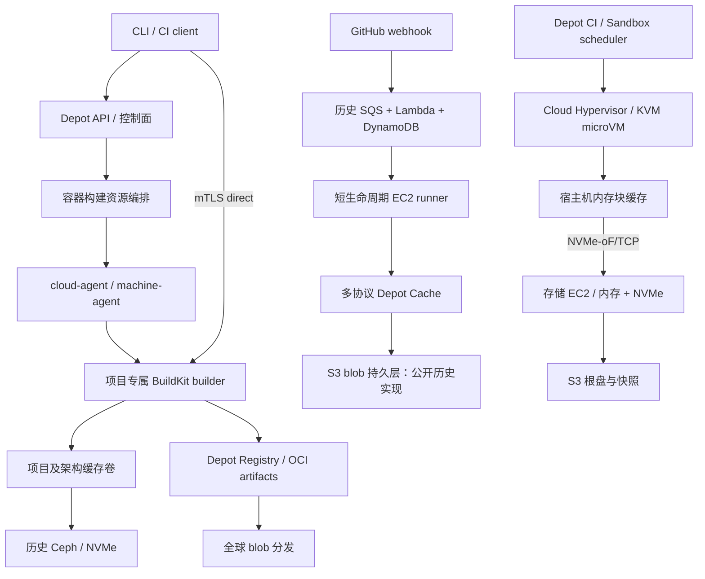

# Depot 计算、调度与存储架构证据

查阅日：2026-09-28。范围：官方技术博客、现行产品文档。标记 **事实** 表示官方公开陈述，不代表独立验证；**推断** 表示根据这些陈述重建的设计；**未知** 表示本次未找到足够公开证据。博客日期以下均取页面正文，搜索引擎显示的相对日期有错误，不采用。

## 1. 最重要的判断

Depot 的加速来自多条互补路径：把 BuildKit 缓存长期留在计算附近、提供短生命周期执行环境、优化小对象缓存访问、缩短镜像分发路径。不能把它理解为所有协议都经过同一个 Ceph 文件系统，也不能把 2023 年标题里的 “Depot Cache v2” 当成今天多协议远程缓存的第二版。

截至本次查阅，能确证的最新基础设施方向是 Depot Metal，但产品迁移状态必须保留时点：2026-07-07 公告确认 **Depot CI 和 Sandboxes** 已迁移，**GitHub Actions runners 和 container builds** 当时仍在迁移计划中；现行后两者文档仍描述 EC2 模式。本次没有找到可证实后两者全部完成迁移的公告。[Metal 公告，2026-07-07](https://depot.dev/blog/announcing-depot-metal)

## 2. 分层事实表

| 领域 | 官方事实及适用时点 | 架构含义 |
| --- | --- | --- |
| 容器构建控制面 | CLI 向 API 申请 builder；cloud-agent 轮询待执行基础设施变更；VM 内 machine-agent 启动 BuildKit；API 返回 mTLS 证书后 CLI 直连 builder。查阅 2026-09-28。[技术架构](https://depot.dev/docs/container-builds/overview) | API 负责授权与资源分配；构建流量不必经业务 API 中转。 |
| BuildKit 调度单位 | 默认每 project、每 CPU 架构一个 builder，同一 builder 可处理并发构建并去重工作。查阅 2026-09-28。[并发设计](https://depot.dev/docs/container-builds/build-parallelism) | 调度倾向保留缓存与计算的亲和性。 |
| 横向扩容 | 2025-07-02 autoscaling GA：超过配置并发上限时增加 builder；使用主缓存的克隆；克隆写入不合并回主缓存，builder 销毁时克隆也销毁。[扩容公告](https://depot.dev/blog/build-autoscaling-now-generally-available) | 这不是全局共享写缓存；吞吐与缓存收敛之间有明确取舍。 |
| 跨项目隔离 | Builder 和其 SSD 缓存绑定单一 project/organization；缓存盘静态加密。查阅 2026-09-28。[安全说明](https://depot.dev/docs/security) | 用户数据隔离由身份、调度与存储共同实施，不能只靠 digest。 |
| 不可信 PR | fork PR 构建使用临时 builder，不能读写项目缓存。查阅 2026-09-28。[容器构建说明](https://depot.dev/docs/container-builds/overview) | 可信构建缓存与不可信执行环境分开。 |
| GitHub Actions 生命周期 | webhook 触发，从 standby pool 分配新 EC2、注册 runner、执行 job、销毁实例；同一实例不重复使用。查阅 2026-09-28。[Runner 流程](https://depot.dev/docs/github-actions/overview) | 执行 VM 的一次性不意味着远程缓存也一次性。 |
| Runner 本地 I/O | Ultra Runners 用部分内存做磁盘加速；现行 runner 文档确认此机制。查阅 2026-09-28。[Ultra Runners](https://depot.dev/blog/introducing-github-actions-ultra-runners)、[Runner 文档](https://depot.dev/docs/github-actions/overview) | 远端 cache 命中之后的解压、编译、临时写入仍值得优化。 |

这里没有把 project 缓存隔离、GitHub Actions 的组织缓存规则和 Depot Cache 的作用域混为一谈：它们是不同产品入口的策略。

## 3. 架构演进，避免把旧文章拼成“当前架构”

### 3.1 早期虚拟化与启动路径

**事实，2023-10-19 历史复盘：** 最早使用 Fly Machines（Firecracker VM）；为了原生 Arm 转向 AWS EC2。EC2 方案从按需冷启动，演进为运行中的 warm pool，再加入已完成初始化但处于 stopped 状态的 standby pool。此文描述的 Firecracker 属于早期 Fly 阶段。[启动优化复盘](https://depot.dev/blog/infrastructure-provisioner-v3)

**推断：** 早期“几秒启动”主要依靠生命周期编排与库存管理；不能据此推断最新 microVM 也依赖 warm pool。

### 3.2 Docker 层缓存：EBS → Ceph

**事实，2023-07-17：** Docker 项目缓存最初存 EBS，后来迁至 NVMe 支撑的 Ceph 块卷，利用 thin provisioning 避免按所有项目的最大配额预付存储。官方给出更高吞吐与 IOPS 的自测结果；这里不将其视作对今日系统的性能保证。[历史 Cache v2 公告](https://depot.dev/blog/cache-v2-faster-builds)

**事实，2024-01-18：** 缓存存储位于 builder 实例外，项目绑定持久卷；卷与 builder 放在同一 Availability Zone。旧文“每项目最多两台 EC2”的限制已被 2025 autoscaling 公告更新。[Docker 加速架构](https://depot.dev/blog/depot-magic-explained)

**推断：** “persistent NVMe cache” 指持久缓存由 NVMe 存储系统承载，不等于每次调度都把完整缓存复制到 builder 本地，也不能从营销短句得出“零网络 I/O”。

### 3.3 新 microVM：Cloud Hypervisor，而非猜测 Firecracker

**事实，2026-05-06：** Depot CI 使用 JIT VM scheduler，无预热 VM 池。文章明确使用 Cloud Hypervisor v51.1.0/KVM、vsock guest-agent；通过精简内核、自有 initramfs 和 fw_cfg 减少启动工作。文中测试环境为 Intel i7i.metal-24xl/Debian 13，这不是 7 月 Metal 公告中的 AMD 全平台硬件清单。[microVM 启动优化](https://depot.dev/blog/optimizing-microvm-boot-times)

同文还披露 VM 根盘和快照作为 OCI 对象存于 Depot Registry，宿主机缓存 disk chunks，缺失部分按需拉取；文中 P50 约 0.6 秒、P90 可到 1.2 秒，仅描述其测试口径。不能将“亚秒启动”当所有区域、所有镜像的 SLA。[同一技术文](https://depot.dev/blog/optimizing-microvm-boot-times)

### 3.4 Depot Metal 的确定结构

**事实，2026-07-07：** 裸金属 EC2 承载 microVM；独立存储 EC2 提供 NVMe 存储，经 NVMe-oF/TCP 暴露磁盘；S3 持久保存 ext4/block snapshots；计算与存储主机均用内存缓存块。新存储层用于替代旧 Ceph/EBS 路径，并将加速器和观测组件移至 guest 外。[Metal 技术说明](https://depot.dev/blog/announcing-depot-metal)

**未知：** SPDK 是否用于这条路径、存储服务语言、复制因子、WAL、写入确认条件、快照原子性、块索引数据库、宿主机故障恢复细节。官方正文只写 NVMe-oF/TCP，不足以推导 SPDK。microVM 内部具体版本可能继续演进，不能拿 5 月版本号当 9 月生产锁定版本。

**推断：** 其核心是把 VM 文件系统的热数据、计算生命周期和 S3 持久层分离。对 BuildKit 全盘状态、任意 CI 工具与快照恢复而言，块接口比逐个工具迁移文件语义更通用。但这不证明多协议 Depot Cache 的每个 blob 也已改由此块服务提供。

## 4. GitHub Actions 调度的罕见公开细节

**事实，2025-10-29 事故复盘：** 当时 runner provisioning 使用 DynamoDB 保存 shadow runner 状态，SQS 排队，Lambda 消费消息并调用 EC2；container build 通过控制面调用 EC2，没有直接的 DynamoDB 依赖。Registry manifest 依赖 ECR，而 layer blobs 通过 Tigris/CDN 分发。区域故障暴露出“blob 全球分布，manifest 仍受单区域影响”的问题。[us-east-1 事故复盘](https://depot.dev/blog/october-20-us-east-1-outage)

复盘还说明，备用区域此前容量和配额不足；作者称截至 2025-10-28 已补齐 us-east-2 warm backup。跨境 failover 未默认自动进行，原因包括客户的数据驻留要求。当时计划降低 Registry 对 ECR 的依赖；没有后续证明时，应把 ECR 标为历史已证实依赖，而非永久事实。[同一事故复盘](https://depot.dev/blog/october-20-us-east-1-outage)

**推断：** 架构可靠性不能只看有几个 region。事件队列、配额、IAM、registry metadata、故障时请求重新归属和客户区域许可必须一起设计。

## 5. Depot Cache 与 Docker 缓存的边界

**事实，2025-05-30：** Go 缓存最初的每个操作对应 S3 请求，海量 sub-KB/空对象带来调用成本和延迟；Gocache v2 合并条目为 bundle，按 offset/length 定位，读取时把同 bundle 的其他条目预取到本地。官方报告特定样本最高约 4 倍收益，未经本次复测。[Gocache v2](https://depot.dev/blog/now-available-gocache-v2-faster-improved-golang-build-performance)

**事实，现行文档：** 多协议 Depot Cache 有组织级保留政策；Docker 类型的层缓存不受该策略控制，而采用项目缓存策略。查阅 2026-09-28。[Depot Cache 概览](https://depot.dev/docs/cache/overview)

**推断：** 统一产品和统一管理界面不等于统一物理存储路径。Cache 能力可以统一鉴权、归属、指标和计费，同时允许 BuildKit 块盘、REAPI CAS、Go bundle、OCI layer 各用适合的访问方式。没有证据表明其 FindMissing 通过 Ceph inode 查询，也没有证据可指名 Bloom filter、Redis、PostgreSQL 或特定 KV。

## 6. Registry 与网络路径

**事实，2025-03-04：** Registry 从早期 R2/Cloudflare Workers 演进；镜像先写 builder 所在区域 S3，再复制至 Tigris；同 AWS 区域读取 S3，外部客户端由 Tigris 就近提供内容。文中“13 个区域”只代表当时信息。[Registry 发布说明](https://depot.dev/blog/introducing-depot-registry)

**事实，现行文档：** Registry 支持组织子域、任意 OCI artifact、服务端 `depot push` 转移及 Standard/Fast CDN 模式；manifest 删除后，引用 layer 由后台回收。这里不把 2025 的全免费传输描述照搬成当前商业行为。查阅 2026-09-28。[Registry 概览](https://depot.dev/docs/registry/overview)

**事实，现行文档：** Pull-through cache 在组织级保存 upstream 连接，在 repository 级绑定上游路径；缺失内容回源，命中 layer 经 CDN 提供。它是依赖/镜像分发加速，和 Action Cache 命中属于不同维度。查阅 2026-09-28。[Pull-through 文档](https://depot.dev/docs/registry/pull-through-cache)

**事实，区域：** 项目显式选择 builder region；现行 SDK 文档列出 `us-east-1`、`eu-central-1`。这个清单不能外推为所有产品、所有备援区域的完整清单。查阅 2026-09-28。[SDK 项目 API](https://depot.dev/docs/api/sdk-reference)

**推断：** Depot 的吞吐优势很可能相当一部分来自数据放置：runner 靠近 builder，builder 靠近缓存与源 registry，镜像靠近消费者。单独部署一个 WAN cache endpoint 很难复刻完整收益。

## 7. 企业部署边界

**事实，现行文档：** Depot Managed 把数据面部署到客户独立 AWS 子账号，继续使用 Depot 托管 API/Web/CLI，由 Depot 运维；可用 PrivateLink/VPC peering，配置本地 KMS/S3。查阅 2026-09-28。[Managed 概览](https://depot.dev/docs/managed/overview)

部署文档要求 Depot 团队启用并实施部署，给出了 provisioner/ops 跨账号管理权限的 bootstrap；这不等于客户能完全离线自运维整个产品。[AWS 部署文档，查阅 2026-09-28](https://depot.dev/docs/managed/on-aws)

**对 expbuild 的启示：** 当前“企业自托管优先”意味着控制面、鉴权、元数据、更新、备份也要能独立运行。仅实现与 Depot Managed 相似的 customer data plane，仍未满足这一目标。

## 8. 可用于总体报告的架构重建

以下是分析图，实线仅表示公开来源支持的组件关系；历史组件按日期隔开，不能解读为它们全部同时属于现行生产系统。

**高置信推断：** Depot 以共同控制面组织多种产品数据面，按 workload 选择缓存粒度和执行方式；客户端/runner 集成承担了大量自动配置工作，低接入成本是产品优势的一部分。

**中置信推断：** Metal 的分块根盘、快照与 host cache 为后续跨产品统一存储调度创造了条件；长期可能把缓存预热、调度亲和性、快照复用统一优化。当前公开证据不足以确认这些优化已经完整实现。

**保持未知：** 统一 Cache 的索引和事务实现、FindMissing 的批处理与租约、GC fencing、跨租户去重边界、限流公平性、Metal HA/replication、完整灾备 RPO/RTO。不能从其端到端加速倍数倒推这些子系统已经达到某个吞吐数字。

## 9. 对 expbuild 的具体研究结论

1. 应学习的是“共同管理语义 + 按负载选数据路径”，而不是让所有协议硬套一种 key/value 数据结构。
2. 最值得近期验证的性能方向是元数据批量请求、小对象打包与客户端邻近缓存；将 GC、授权和数据可见性一并验证。
3. Docker 加速若进入产品范围，优先评估可保留 BuildKit 原生状态的专属 builder/缓存盘模式，明确横向扩容后的缓存写回策略。
4. Registry、依赖下载、解压写盘、启动排队都会影响总构建时间。基准应分阶段测量，避免只优化 FindMissing QPS。
5. Metal 是多年演进后的运维重资产方案。expbuild 第一阶段没有必要同时自建 hypervisor、块存储、CI scheduler；接口上保留独立 compute/storage provider 边界即可。

本文未运行 Depot 账户内实验、未验证其商业性能声明，也没有访问非公开内部系统。
