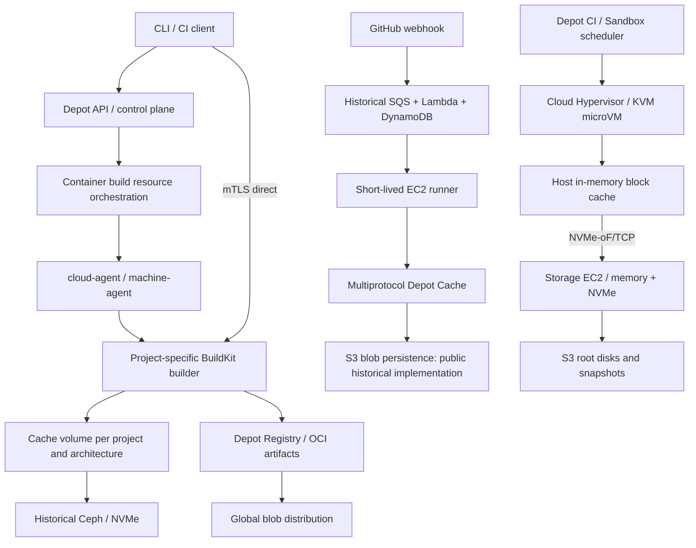

# Evidence for Depot's Compute, Scheduling, and Storage Architecture

Accessed: 2026-09-28. Scope: official technical blogs and current product documentation. **Fact** denotes an official public statement, not independent verification; **Inference** denotes a design reconstructed from those statements; **Unknown** means this review found insufficient public evidence. All blog dates below come from the page body; erroneous relative dates shown by search engines are not used.

## 1. Key Assessment

Depot accelerates builds through several complementary paths: keeping BuildKit caches close to compute over the long term, providing short-lived execution environments, optimizing small-object cache access, and shortening image distribution paths. This should not be understood as every protocol going through one Ceph filesystem, nor should “Depot Cache v2” in a 2023 title be treated as the second version of today's multiprotocol remote cache.

As of this review, Depot Metal is the latest infrastructure direction that can be confirmed, but migration status must retain its date: the 2026-07-07 announcement confirmed that **Depot CI and Sandboxes** had migrated, while **GitHub Actions runners and container builds** were still on the migration roadmap. Current documentation for the latter two still describes the EC2 model. This review found no announcement confirming that both had fully migrated. [Metal announcement, 2026-07-07](https://depot.dev/blog/announcing-depot-metal)

## 2. Facts by Layer

| Area | Official facts and applicable date | Architectural implications |
| --- | --- | --- |
| Container build control plane | The CLI requests a builder from the API; cloud-agent polls for pending infrastructure changes; machine-agent inside the VM starts BuildKit; after the API returns mTLS certificates, the CLI connects directly to the builder. Accessed 2026-09-28. [Technical architecture](https://depot.dev/docs/container-builds/overview) | The API handles authorization and resource allocation; build traffic need not pass through the business API. |
| BuildKit scheduling unit | By default, there is one builder per project per CPU architecture. A single builder can handle concurrent builds and deduplicate work. Accessed 2026-09-28. [Concurrency design](https://depot.dev/docs/container-builds/build-parallelism) | Scheduling favors affinity between cache and compute. |
| Horizontal scaling | Autoscaling GA, 2025-07-02: additional builders are created when the configured concurrency limit is exceeded; they use clones of the primary cache. Clone writes are not merged back into the primary cache, and the clone is destroyed with its builder. [Scaling announcement](https://depot.dev/blog/build-autoscaling-now-generally-available) | This is not a globally shared writable cache; it makes an explicit tradeoff between throughput and cache convergence. |
| Cross-project isolation | A builder and its SSD cache are bound to a single project/organization; cache disks are encrypted at rest. Accessed 2026-09-28. [Security documentation](https://depot.dev/docs/security) | Identity, scheduling, and storage jointly enforce user-data isolation; digests alone cannot do so. |
| Untrusted PRs | Fork PR builds use temporary builders that cannot read or write the project cache. Accessed 2026-09-28. [Container build documentation](https://depot.dev/docs/container-builds/overview) | Trusted build caches are separated from untrusted execution environments. |
| GitHub Actions lifecycle | A webhook triggers allocation of a fresh EC2 instance from a standby pool, runner registration, job execution, and instance destruction; the same instance is not reused. Accessed 2026-09-28. [Runner lifecycle](https://depot.dev/docs/github-actions/overview) | A disposable execution VM does not imply a disposable remote cache. |
| Runner local I/O | Ultra Runners use some memory to accelerate disk access; current runner documentation confirms this mechanism. Accessed 2026-09-28. [Ultra Runners](https://depot.dev/blog/introducing-github-actions-ultra-runners), [runner documentation](https://depot.dev/docs/github-actions/overview) | Decompression, compilation, and temporary writes after a remote cache hit still merit optimization. |

Project cache isolation, GitHub Actions organization cache rules, and Depot Cache scopes are not conflated here: they are policies for different product entry points.

## 3. Architectural Evolution: Avoid Assembling Old Articles into a “Current Architecture”

### 3.1 Early Virtualization and Startup Paths

**Fact, historical retrospective dated 2023-10-19:** Depot initially used Fly Machines (Firecracker VMs), then moved to AWS EC2 for native Arm. The EC2 approach evolved from on-demand cold starts to a running warm pool, then added a standby pool of initialized but stopped instances. The Firecracker implementation described in this article belongs to the early Fly phase. [Startup optimization retrospective](https://depot.dev/blog/infrastructure-provisioner-v3)

**Inference:** Early startup times of “a few seconds” primarily relied on lifecycle orchestration and inventory management; this does not imply that the latest microVMs also depend on a warm pool.

### 3.2 Docker Layer Cache: EBS → Ceph

**Fact, 2023-07-17:** Docker project caches initially lived on EBS, then moved to NVMe-backed Ceph block volumes. Thin provisioning avoided paying upfront for every project's maximum storage quota. Depot reported higher throughput and IOPS in its own tests; these are not treated here as performance guarantees for today's system. [Historical Cache v2 announcement](https://depot.dev/blog/cache-v2-faster-builds)

**Fact, 2024-01-18:** Cache storage resides outside the builder instance, with a persistent volume bound to each project; the volume and builder are in the same Availability Zone. The old article's limit of “at most two EC2 instances per project” was superseded by the 2025 autoscaling announcement. [Docker acceleration architecture](https://depot.dev/blog/depot-magic-explained)

**Inference:** “Persistent NVMe cache” means persistent cache is backed by an NVMe storage system. It does not mean the full cache is copied to the builder locally on every scheduling event, and a marketing phrase cannot establish “zero network I/O.”

### 3.3 New microVMs: Cloud Hypervisor, Rather Than an Assumption of Firecracker

**Fact, 2026-05-06:** Depot CI uses a JIT VM scheduler without a prewarmed VM pool. The article explicitly identifies Cloud Hypervisor v51.1.0/KVM and a vsock guest-agent; a stripped-down kernel, custom initramfs, and fw_cfg reduce startup work. Its test environment was Intel i7i.metal-24xl/Debian 13; this is not the platform-wide AMD hardware inventory in July's Metal announcement. [microVM boot optimization](https://depot.dev/blog/optimizing-microvm-boot-times)

The same article also discloses that VM root disks and snapshots are stored as OCI objects in Depot Registry, hosts cache disk chunks, and missing chunks are fetched on demand. Its approximately 0.6-second P50 and up-to-1.2-second P90 describe only its test methodology. “Subsecond startup” cannot be treated as an SLA for every region and image. [Same technical article](https://depot.dev/blog/optimizing-microvm-boot-times)

### 3.4 Confirmed Structure of Depot Metal

**Fact, 2026-07-07:** Bare-metal EC2 hosts microVMs; separate storage EC2 instances provide NVMe storage and expose disks over NVMe-oF/TCP; S3 durably stores ext4/block snapshots; both compute and storage hosts cache blocks in memory. The new storage layer replaces the old Ceph/EBS path and moves accelerators and observability components outside the guest. [Metal technical description](https://depot.dev/blog/announcing-depot-metal)

**Unknown:** Whether this path uses SPDK, the storage service's language, replication factor, WAL, write-acknowledgment conditions, snapshot atomicity, block-index database, and details of recovery from host failure. The official text only specifies NVMe-oF/TCP, which is insufficient to infer SPDK. Specific microVM component versions may continue evolving; May's version number cannot be treated as the pinned production version in September.

**Inference:** The core idea is to separate hot VM filesystem data, compute lifecycles, and the S3 persistence layer. For full BuildKit disk state, arbitrary CI tools, and snapshot recovery, a block interface is more general than migrating file semantics tool by tool. This does not prove that every blob in multiprotocol Depot Cache is now served by this block service.

## 4. Rare Public Details of GitHub Actions Scheduling

**Fact, incident retrospective dated 2025-10-29:** At that time, runner provisioning stored shadow runner state in DynamoDB, queued work in SQS, and used Lambda to consume messages and call EC2. Container builds called EC2 through the control plane without a direct DynamoDB dependency. Registry manifests depended on ECR, while layer blobs were distributed through Tigris/CDN. The regional outage exposed the problem of globally distributed blobs whose manifests were still affected by a single region. [us-east-1 incident retrospective](https://depot.dev/blog/october-20-us-east-1-outage)

The retrospective also explains that backup regions previously lacked capacity and quotas; the author states that a us-east-2 warm backup had been completed by 2025-10-28. Cross-border failover was not automatic by default, in part because of customers' data-residency requirements. Reducing Registry's dependence on ECR was planned at the time. Without subsequent confirmation, ECR should be labeled a confirmed historical dependency, not a permanent fact. [Same incident retrospective](https://depot.dev/blog/october-20-us-east-1-outage)

**Inference:** Architectural reliability cannot be judged by region count alone. Event queues, quotas, IAM, registry metadata, reassignment of requests during failures, and customer permission to use regions must be designed together.

## 5. Boundaries Between Depot Cache and Docker Caches

**Fact, 2025-05-30:** Each operation in the original Go cache generated an S3 request; enormous numbers of sub-KB/empty objects created request costs and latency. Gocache v2 combines entries into bundles, locates them by offset/length, and prefetches other entries in the same bundle to local storage during reads. Depot reported gains of up to approximately 4× on specific samples; this review did not reproduce those tests. [Gocache v2](https://depot.dev/blog/now-available-gocache-v2-faster-improved-golang-build-performance)

**Fact, current documentation:** Multiprotocol Depot Cache has organization-level retention policies. Docker layer caches are not controlled by that policy and instead use project cache policies. Accessed 2026-09-28. [Depot Cache overview](https://depot.dev/docs/cache/overview)

**Inference:** A unified product and management interface do not imply a unified physical storage path. Cache capabilities can unify authentication, ownership, metrics, and billing while allowing BuildKit block disks, REAPI CAS, Go bundles, and OCI layers to use appropriate access methods. There is no evidence that FindMissing queries Ceph inodes, nor evidence identifying Bloom filters, Redis, PostgreSQL, or a particular KV store.

## 6. Registry and Network Paths

**Fact, 2025-03-04:** Registry evolved from an early R2/Cloudflare Workers implementation. Images are first written to S3 in the builder's region and then replicated to Tigris; reads within the same AWS region use S3, while Tigris serves external clients from nearby locations. The article's “13 regions” describes only the information available at that time. [Registry release announcement](https://depot.dev/blog/introducing-depot-registry)

**Fact, current documentation:** Registry supports organization subdomains, arbitrary OCI artifacts, server-side `depot push` transfers, and Standard/Fast CDN modes. After a manifest is deleted, referenced layers are garbage-collected in the background. The 2025 description of entirely free transfer is not carried over here as current commercial behavior. Accessed 2026-09-28. [Registry overview](https://depot.dev/docs/registry/overview)

**Fact, current documentation:** Pull-through cache stores upstream connections at organization level and binds upstream paths at repository level. Missing content is fetched from the origin; cached layers are served through the CDN. This accelerates dependency/image distribution, a different dimension from Action Cache hits. Accessed 2026-09-28. [Pull-through documentation](https://depot.dev/docs/registry/pull-through-cache)

**Fact, regions:** Projects explicitly select a builder region; current SDK documentation lists `us-east-1` and `eu-central-1`. This list cannot be extrapolated into a complete list for every product or backup region. Accessed 2026-09-28. [SDK project API](https://depot.dev/docs/api/sdk-reference)

**Inference:** A substantial part of Depot's throughput advantage likely comes from data placement: runners near builders, builders near caches and source registries, and images near consumers. Deploying a WAN cache endpoint alone is unlikely to reproduce the full benefit.

## 7. Enterprise Deployment Boundaries

**Fact, current documentation:** Depot Managed deploys the data plane into a separate customer AWS subaccount, continues to use Depot-hosted API/Web/CLI, and is operated by Depot. PrivateLink/VPC peering and local KMS/S3 configuration are available. Accessed 2026-09-28. [Managed overview](https://depot.dev/docs/managed/overview)

The deployment documentation requires the Depot team to enable and carry out deployment and provides a bootstrap for cross-account provisioner/ops management permissions. This does not mean customers can operate the entire product independently and fully offline. [AWS deployment documentation, accessed 2026-09-28](https://depot.dev/docs/managed/on-aws)

**Implication for expbuild:** The current priority of enterprise self-hosting means the control plane, authentication, metadata, updates, and backups must also be able to operate independently. Implementing only a customer data plane similar to Depot Managed would not meet that goal.

## 8. Architectural Reconstruction for the Overall Report

The following is an analytical diagram. Solid lines indicate only component relationships supported by public sources; historical components are distinguished by date and must not be interpreted as all belonging to the current production system simultaneously.

**High-confidence inference:** Depot organizes multiple product data planes through a common control plane and chooses cache granularity and execution models by workload. Client/runner integrations handle substantial automatic configuration; low adoption costs are part of the product's advantage.

**Medium-confidence inference:** Metal's chunked root disks, snapshots, and host cache create conditions for future unified storage scheduling across products. Over time, cache warming, scheduling affinity, and snapshot reuse could be optimized together. Current public evidence is insufficient to confirm that these optimizations have been fully implemented.

**Still unknown:** The unified Cache's index and transaction implementation, FindMissing batching and leases, GC fencing, cross-tenant deduplication boundaries, rate-limit fairness, Metal HA/replication, and complete disaster-recovery RPO/RTO. Its end-to-end speedup ratios cannot establish that these subsystems achieve any particular throughput.

## 9. Specific Research Conclusions for expbuild

1. The lesson is “shared management semantics + workload-specific data paths,” rather than forcing every protocol into one key/value structure.
2. The most promising near-term performance directions to validate are metadata batching, small-object packing, and caches close to clients; validate GC, authorization, and data visibility alongside them.
3. If Docker acceleration enters the product scope, prioritize evaluating dedicated builders/cache disks that preserve native BuildKit state, and define the cache writeback policy after horizontal scaling.
4. Registry access, dependency downloads, decompression and disk writes, and startup queues all affect total build time. Benchmarks should measure each stage rather than optimizing only FindMissing QPS.
5. Metal is an operationally intensive infrastructure approach reached after years of evolution. expbuild's first phase need not build its own hypervisor, block storage, and CI scheduler simultaneously; preserving separate compute/storage provider boundaries in the interfaces is sufficient.

This document did not involve experiments within a Depot account, verification of commercial performance claims, or access to nonpublic internal systems.
