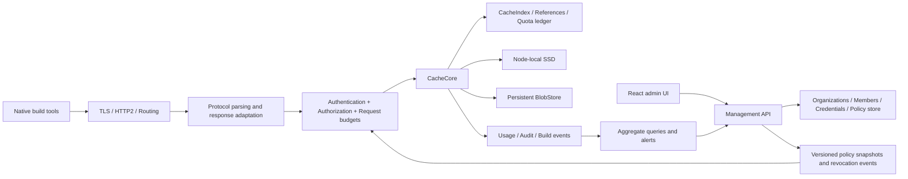

# Target Architecture and Extension Contracts

Date: 2026-09-28. The following is a proposed target design, not a description of the current implementation. The roadmap governs initial-release scope and deployment complexity.

## 1. Architectural Principles and Explicit Tradeoffs

| Decision | Recommendation | Rationale and cost |
|---|---|---|
| Domain first | Protocol adapters + shared cache core + independent control plane | Preserve each tool's semantics; adapters still require separate maintenance and validation |
| Data-plane language | Continue with Rust/Tokio/tonic; add an HTTP service layer | Reuse existing assets, with streaming IO and resource budgets in one system |
| Control-plane language | Retain TypeScript/React/Express or an equivalent framework for now | Do not rewrite business logic for language uniformity; prioritize permissions, contracts, and data reliability |
| Initial deployment | Two application processes + PostgreSQL + file/object storage | Operationally manageable; logical modules do not imply microservices |
| Storage | Start with FS; validate one S3-compatible backend in the initial release | Do not build object storage from scratch; “S3-compatible” still requires testing specific vendors and versions |
| Metadata | Separate PostgreSQL schemas/table partitions and interfaces | Transactions, conditional commits, quotas, and recovery are easier to validate; split at very large scale based on benchmarks |
| Plugins | Compile-time modules initially; a versioned out-of-process protocol later | Do not promise a stable Rust dynamic ABI; multiple processes add call and operational overhead |
| Deduplication | Limit P0 to within a namespace; defer cross-namespace/project sharing | Clear isolation, quota, and deletion boundaries; identical bytes may be stored repeatedly in different namespaces |
| Consistency | Atomic blob publication; conditional entry commits; metadata transactions | Prefer a miss followed by rebuilding over returning incorrect or incomplete artifacts |
| Execution | Independent optional module | Cache can launch first; execution must separately pass isolation and state-machine acceptance tests |

Apache OpenDAL can be evaluated as an internal storage-client adapter layer, using its backends and retry/timeout/rate-limiting capabilities. It cannot define expbuild's tenants, cache keys, reference consistency, GC, or server-side protocol semantics. [OpenDAL](https://opendal.apache.org/), [Layers](https://opendal.apache.org/docs/rust/opendal/layers/). Pin a release and backend capability matrix when adopting it, rather than relying on every claim in the main-branch documentation.

## 2. Data Plane, Control Plane, and Event Plane



Large object contents do not pass through the Node management API. Direct data-plane access to the cache-index database does not mean that every blob read/write synchronously calls the control plane. Initially, the management database and cache index may use separate schemas in the same PostgreSQL instance, with separate connection pools, permissions, tables, and query budgets. Split databases only when measured contention justifies it.

All protocol entry points use the same authorization mechanism, although credential decoding may differ: the adapter maps Bearer, Basic, gRPC metadata, registry tokens, and so on to a platform principal. Protocols return native error codes rather than forcing a generic JSON error format on clients.

After writing policies, the control plane publishes versioned snapshots/change events. The data plane verifies and caches their source, version, and validity period; requests record policy_version. The initial release permits short-lived local authorization caches: the target is revocation within 60 seconds under normal connectivity, while disconnected operation may continue existing authorizations for at most a 5-minute short lease. Reject after expiry; a management failure must not enable anonymous access. These numbers are initial design targets, to be finalized through fault tests and customer requirements.

Cache-read availability must not be confused with authorization availability: a brief control-plane failure should not immediately interrupt authorized reads, but service cannot continue indefinitely without trusted authorization. Resuming an incomplete upload must revalidate the current principal/scope; an expired token cannot use an old upload_id to continue committing.

Authorization limits also apply to active streams. P0 traffic passes through the data plane; long streams periodically check authorization/revocation, upload commits reauthorize, and streams terminate when their authorization lease expires. Limiting only new connections is insufficient. If future direct object-store transfers cannot interrupt downloads already in progress, they cannot promise the same 60-second revocation target: retain proxy transfers, or offer an explicitly selected mode with weaker revocation and disclose the validity windows of issued credentials and active streams. Expiry of a direct-transfer URL does not necessarily terminate a transfer already started by the backend.

## 3. Minimal Shared-Core Model

```text
RequestContext {
  principal_id, tenant_id, project_id, namespace_id, trust_domain,
  protocol_id, policy_version, request_id, deadline, resource_budget
}

BlobId { digest_algorithm, digest, logical_size }
StoredBlob { isolation_domain, blob_id, encoding, storage_locator, state }
BlobVisibility { namespace_id, blob_id, authorized_reference_or_upload, retain_until }

CacheKey { namespace_id, protocol_id, key_schema_version, opaque_tool_key }
CacheEntry {
  key, generation, protocol_payload, blob_refs,
  writer_principal, writer_token_id, invocation_id?, trust_domain,
  created_at, expires_at, state
}

UploadSession {
  id, owner_context, expected_blob_or_key, durable_offset,
  quota_reservation, staged_locator, expires_at, state
}
```

These are draft domain models, not a promise of stable field names or APIs. RequestContext is constructed by a trusted entry point; arbitrary tenant_id values supplied by plugins are not accepted. Each namespace is bound to exactly one trust_domain. The namespace in CacheKey already includes this trust boundary; clients cannot temporarily switch the trust level of the same namespace.

BlobVisibility is a logical visibility record; the physical existence of StoredBlob alone cannot grant access. FindMissing, BatchRead, ByteStream, and reference publication all check namespace visibility. P0 does not implement cross-namespace/project sharing. Any future sharing requires a separate design for explicit sharing policies, authorized references, and metering migration. CAS uploads not yet attached to a result root also have their own visibility and short retention lease; they cannot immediately be deleted as unreferenced garbage. Content writes and result publication are separate permissions. See [Cache Core Contract](../design/cache-core.md) for detailed initial-release constraints.

Five concepts must remain distinct:

1. **Tool key**: the key by which Gradle/Turbo/sccache and similar tools decide whether a task is the same; usually not a digest of the result file.
2. **BlobId**: a content digest of actual bytes, published after verifying size and digest.
3. **Protocol metadata**: REAPI ActionResult, Turbo signature headers, OCI manifests, and so on, preserving original semantics or using lossless encoding.
4. **Entry generation**: the platform version for replacement, CAS conditional commits, and cleanup race control; it does not alter the tool's cache key.
5. **Storage encoding**: backend compression/encryption is separate from client transfer representation; a digest of compressed bytes must not stand in for the uncompressed digest required by the protocol.

Identical hash strings in Bazel, Gradle, and Turbo do not identify the same entry. Similar HTTP path shapes do not imply that values can be shared. Share underlying blobs only when the protocol and encoding are explicitly identical, permissions allow it, and content verification agrees.

`CacheEntry` does not force every result to be parsed as ActionResult. Gradle/sccache may point to an opaque archive; REAPI stores ActionResult and its parseable output references; OCI retains a directed reference graph. Pass tool-native signatures through byte for byte; do not repackage archives and claim the signatures remain valid.

## 4. Write, Read, and Concurrency Semantics

### Write path

1. Validate protocol fields, paths, digest format, and allowed algorithms/sizes; resolve the principal and authorize the namespace and write trust domain.
2. Reserve quota and create an upload session. For unknown lengths, request additional quota as the stream grows and terminate at the limit. Stream large files to temporary files/objects with incremental verification, avoiding a whole-file Vec.
3. Handle timeouts, client cancellation, backpressure, offsets, and retries; record durable_offset and report only persisted portions.
4. Verify completed content, then atomically publish the immutable blob. Use unique temporary objects, idempotent commits, and safe concurrent writes of the same digest. Return success only after reaching the declared durability boundary.
5. Transactionally publish the entry generation, references, usage, and required outbox events. If the blob succeeds but the entry fails, retain it as an orphan awaiting cleanup; never expose an entry before its referenced content is complete.

Each protocol defines its own overwrite policy: REAPI UpdateActionResult may update mappings; Nx must enforce existing-key conflict rules for the selected OpenAPI version; Turbo/Gradle must match native behavior. A platform-wide “first writer wins for every key” policy is not a universal compatibility solution.

Distributed nodes must not protect global commits with local mutexes. Use unique constraints/conditional versions and transactions in the index, and backend atomic completion and idempotency for blobs. S3 multipart completion cannot be generalized to arbitrary conditional writes across all vendors; test the selected backend. FS uploads for the same key use unique staging names and complete verification and the selected fsync policy before a successful rename.

### Read path

Authorize before looking up the entry; validate its state, expiry, trust policy, and required references, then transfer as requested by the client. Fall back from L1 misses to L2; report an L2 miss or missing reference according to the protocol. Do not return empty bytes as a false success. Do not use known-corrupt cache data for builds; quarantine corrupt objects and record events.

Large reference trees cannot be fully traversed on every read. The target is to record references at entry commit, add protected roots and read leases, and make GC follow the same reference protocol. Invalidate incomplete results found during index recovery or sampling. Unattached REAPI content read only by digest also needs namespace visibility records/upload retention periods; do not assume every CAS blob always has an AC root.

Handle cache failures with bounded timeouts and protocol-correct errors. Whether a tool falls back to local execution or skips remote writes must be verified for each client. The platform provides only validated configuration recommendations; it cannot promise that every tool automatically keeps builds running through every failure.

## 5. GC, Reference Integrity, and Retention Policies

GC is a core capability, not an afterthought implemented with `rm`. Different protocols define retention sets through different roots: REAPI action results and active upload/execution leases; opaque archive entries; OCI tag/manifest graphs; Nix metadata/signature references; and so on. Lifecycle interfaces must let adapters declare roots and reference-extraction capabilities.

For the initial release, mark-and-sweep with a grace period is recommended rather than relying solely on reference counts vulnerable to exceptional conditions:

- Define a scan epoch; mark unexpired entries, pins, upload/read leases, and newly published objects.
- Write tombstones for candidates, recording generation/epoch without deleting immediately.
- Recheck after the protection window: only a cleaner holding a valid GC lease may delete, and only if there are no new references, sessions, or generations.
- Coordinate index deletion and background object deletion with idempotent tasks; retain retries, failure queues, reclaimed-byte metrics, and accidental-deletion detection metrics.
- Prioritize staged orphans, expired entries, and unreferenced objects. Restrict new writes under space pressure rather than bypassing protection for objects in use.

Rechecking alone does not solve TOCTOU. Publishing references, acquiring protection leases, and entering the deleting state must share a transaction/CAS state machine. Objects transition Live → Tombstoned → Deleting. Only Live objects can directly receive new references; Tombstoned objects require conditional-version restoration; Deleting objects reject new references. After atomically confirming the absence of protected references, the cleaner holds a fencing token. Object locators include a storage generation or backend version, and deletion targets the old generation so it cannot delete a later upload of the same digest. Entry commits encountering Deleting wait or establish a new generation rather than referencing the copy being deleted. This is a correctness requirement; validate transaction granularity, lock ordering, and reference batching in the PoC.

Update access times in batches/by sampling, not with a synchronous database write on every GET. Sampled LRU only orders candidates; safety comes from roots, leases, and rechecks. Object-store lifecycle rules may clean only explicit temporary prefixes or controlled expired data. Applying an independent TTL indiscriminately to shared CAS breaks reference consistency.

Backups focus on IAM, policies, indexes/references, metering ledgers, configuration, and audit data; blobs may be restored or rewarmed according to cost. Restoring only an index requires marking missing blobs and turning their entries into misses, not presenting false hits. Background reconcile checks indexes against object state. Multi-tenant migration must not directly copy old caches with no ownership into a shared domain.

Recovery initially keeps GC and writes disabled. Confirm policy/index backup versions and the object view, run reconcile, then enable readiness and writes. Never restore an old index and immediately sweep a bucket that still has newer references. P0 delivers a manually executable procedure and drill; P1 adds automated backups, PITR, and target RPO/RTO.

## 6. Extension System

| Extension surface | Responsibilities | Must not bypass |
|---|---|---|
| ProtocolAdapter | Route declarations, request parsing, key mapping, metadata/references, native responses, capability declarations | Principal/tenant validation, quotas, resource budgets, persistence entry points |
| StorageDriver | stat/read-range/write-stream/commit/abort/delete; capability declarations | Platform namespace and key policies; must not directly define cache-hit semantics |
| IdentityProvider | Authentication/attribute mapping, OIDC/enterprise directory integration | Core permission decisions, principal scope, and revocation policies |
| PolicyEvaluator | Decide reads/writes, retention, and budgets from restricted inputs | Default deny, timeouts, auditing, and resource limits |
| EventSink | External destinations for audit/build/usage data | Data redaction, isolation, and delivery credential scope |
| ExecutionBackend | Receive authorized execution tasks; return status/cancellation/artifacts | Worker identity, attempt numbers, isolation, task quotas |

Three maturity stages:

1. **P0/P1 built-in modules**: separate Rust crates and features; a shared conformance harness. Extensibility initially means adding an adapter without changing the core, not runtime loading/unloading.
2. **P2 plugin SDK**: versioned Protobuf/gRPC out-of-process contracts; manifests declare type, SDK version, capabilities, configuration schema, required network/storage permissions, health, and timeouts; an official example adapter.
3. **Open the ecosystem as demand warrants**: release signing, version compatibility, isolation, upgrade rollback, diagnostics, and third-party plugin status. Evaluate Wasm for small policy logic, without defaulting to it for all high-bandwidth transfers.

Protocol, policy, and event plugins must not receive unrestricted raw object-storage credentials. The core provides per-request authorized handles bounded by namespace/operation/validity. Data may flow through the core or use object-scoped transfer credentials, but the latter must preserve auditing, quotas, and native protocol availability. StorageDriver is a separate high-trust category: it genuinely requires backend IO credentials, is installed/configured only by platform administrators, uses credentials limited by bucket/prefix/operation, and audits installation, key access, and upgrades. Do not promote arbitrary third-party protocol plugins into storage drivers. IdentityProvider likewise forms a high-trust identity boundary. In particular, protocol integration cannot discard streams, offsets, signatures, and batch per-item status through a single key-value RPC.

The draft plugin API includes at least `DescribeCapabilities`, `ValidateConfig`, `Health`, request context, cancellation/deadline propagation, traffic budgets, error classification, reference enumeration, and migration versions. Unsupported features may be rejected. A declaration in a manifest alone must not automatically advertise support to clients.

Plugin acceptance covers real clients for the same protocol, cross-tenant negative tests, malformed inputs, concurrent writes, GC, cancellation, timeouts, upgrade rollback, and memory limits. First- and third-party plugins should use the same contract tests.

## 7. Enterprise Security Boundaries

The initial release focuses on the trust boundaries involved in actual workloads:

- TLS at every entry point, with correct gRPC HTTP/2 and proxy forwarding. A trusted ingress may initially terminate TLS, but backends must not expose anonymous ports; worker channels later use separate machine identities/mTLS.
- Ordinary build requests cannot arbitrarily replace administrator-configured backend URLs, preventing cache-origin fetches from becoming arbitrary network access. Origin-fetch and callback egress have explicit scopes.
- Use validated digest types; validate paths segment by segment and constrain them to a root. Download extraction must guard against absolute paths, parent traversal, symlink escapes, compression bombs, and unbounded directory trees.
- Trusted CI may write shared caches; developers read by default; external PRs use separate tokens/namespaces. Content hashes or overwrite prevention alone cannot stop a malicious first-write artifact.
- Artifacts, build logs, environments, and commands may contain sensitive information. Minimize collection, redact, and apply project-level authorization and retention. Audit logs do not record plaintext tokens.
- Do not provide anonymous global digest probing by default. Physical deduplication does not transfer read permissions; cross-tenant deduplication needs separate threat modeling and key policies.

## 8. Telemetry and Management Events

Events use an envelope: event_id, event_type, schema_version, tenant/project/namespace, producer_id, producer_sequence, occurred_at/received_at, trace/request/build ID, payload. Consumers are idempotent by producer + sequence/event_id, with explicit out-of-order and late-arrival windows.

Separate three categories of data:

1. Operational metrics: low-cardinality counters/histograms in Prometheus, and traces that may be sampled. Aggregate by protocol/operation/status/backend/node; do not put arbitrary digests, build_id, or user IDs in labels. High-cardinality queries belong in event storage. [Prometheus instrumentation practices](https://prometheus.io/docs/practices/instrumentation/).
2. Management audit: an outbox in the same transaction as permission/token/policy changes, with retryable eventual delivery. An exporter outage must not silently lose critical change records.
3. Usage ledger: durable transactions guarantee quota reservations and commits; send upload/download metering through deduplicatable sequences or a WAL and reconcile regularly. Dropping debug traces must not affect billing or permissions. Validate metering accuracy separately before SaaS billing.

Separate hard download-quota admission from asynchronous metering: acquire a cross-node shared byte-budget lease before sending, consume it based on actual transfer, and release unsent portions on failure. Charge Range requests/retries according to the agreed rules. Asynchronous usage events support settlement and analysis; late-arriving events cannot enforce real-time hard limits. If a deployment provides only a soft download budget, its UI and API must label it as a soft limit rather than claim a hard limit with zero overage.

PostgreSQL partitioned tables and aggregation jobs are enough to start. Add ClickHouse or a message queue only when retention, query, and write-volume benchmarks establish the need. Build details show only evidence from integrated clients; server-side request_id values must not fabricate a complete pipeline.

## 9. Optional Edge and Remote Execution

Edge belongs to P2: a protocol proxy + local SSD near runners/developers, with the central cache remaining the trusted authoritative write point. Start with read-through/write-through; acknowledge writes only after central durable confirmation, avoiding a false impression that data is cached when an edge is lost. Offline write-back needs explicit consistency and quota design and is not a default capability.

Edge inherits namespace authorization, policy versions, and revocation validity periods; TTL/deletion events synchronize with the primary store. Partition capacity by tenant so a hot tenant cannot consume the entire SSD. Deploy only after demonstrating that RTT/bandwidth is the bottleneck; multiple cache levels are not a benefit in themselves.

Long-term remote-execution structure: Execution Gateway → durable Action/Operation/Attempt → fair queue → WorkerPool → isolated executor → CAS/ActionResult. Required semantics:

- Follow ExecuteRequest.skip_cache_lookup when deciding whether to query AC; when lookup is allowed and hits, do not enqueue. Action.do_not_cache separately controls result caching; do not conflate the two. Read actual platform, timeout, and other constraints. [REAPI specification](https://github.com/bazelbuild/remote-apis/blob/main/build/bazel/remote/execution/v2/remote_execution.proto)
- Worker registration authentication, capability matching, resource admission, lease renewal, attempt fencing, and idempotent completion.
- Accept at-least-once attempts and prevent expired attempts from overwriting new results; do not promise exactly-once execution.
- Failures, timeouts, cancellation, worker loss, restarts, and output-upload failures all reach a definite terminal state; all background collections have lifecycles.
- A trusted host executor is only for controlled development/dedicated environments. Shared or untrusted tasks use validated isolated pools; containers alone do not prove strong multi-tenant isolation.
- Correctly handle zero-byte files, Tree and Directory, symlinks, executable bits, output directories, cache policies, and execution timing.

P2 can evaluate mature REAPI execution backends, integrating through standard protocols without requiring expbuild to implement the entire scheduler. Check the selected version's license, identity propagation, CAS topology, and operational visibility. Using an existing executor does not mean the management platform already controls its resources and tenant isolation.

## 10. Proposed Code Organization and Contracts

```text
expbuild/
  crates/core/                 # RequestContext, identifiers, errors, policy boundaries
  crates/cache/                # Blob, CacheEntry, references, uploads, and GC
  crates/storage/              # FS / S3 clients, cache tiers
  crates/protocol-reapi/       # REAPI cache services
  crates/protocol-http/        # Shared HTTP middleware; independent per-tool adapters
  crates/telemetry/            # Metrics, events, outbox/WAL sinks
  crates/server-bin/          # Assembly and runtime
  crates/client/ + cli/        # Management, diagnostics, compatibility validation; no forced replacement of native build commands
  crates/worker/               # Independent experiments/future execution capabilities
  api/                        # Versioned OpenAPI, internal proto, event schemas
  tests/conformance/          # Protocol and real-client matrix

expbuild-admin/
  pages/ components/          # Retain the React foundation; evolve by product module
  server/                     # IAM, projects, policies, queries, configuration distribution
  generated/                  # Client types generated from versioned contracts
```

This is not a task list for immediately moving directories. First establish the minimal model and two end-to-end paths, then migrate along actual module boundaries so directory splitting does not precede capability validation. The two repositories use explicit API/event versions and compatibility windows rather than relying on coincidentally compatible simultaneous deployments.
