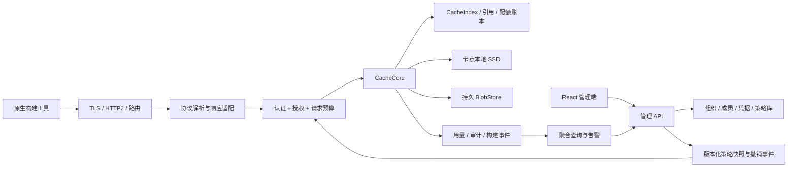

# 目标架构与扩展契约

日期：2026-09-28。以下是建议的目标设计，不是当前实现说明。首版范围与部署复杂度以路线图为准。

## 1. 架构原则与明确取舍

| 决策 | 建议 | 原因与代价 |
|---|---|---|
| 领域优先 | 协议适配器 + 共享缓存内核 + 独立控制面 | 保留各工具语义；适配器仍需单独维护和验证 |
| 数据面语言 | 延续 Rust/Tokio/tonic；增加 HTTP 服务层 | 复用现有资产，流式 IO 与资源预算在同一体系 |
| 控制面语言 | 暂保留 TypeScript/React/Express 或等价框架 | 不为统一语言重写业务；权限模型、契约和数据可靠性优先 |
| 初期部署 | 两个应用进程 + PostgreSQL + 文件/对象存储 | 可操作；逻辑模块并不等于微服务 |
| 存储 | FS 起步，首版验证一个 S3 兼容后端 | 不自研对象存储；“兼容 S3”仍需具体厂商与版本测试 |
| 元数据 | PostgreSQL 独立 schema/表分区与接口 | 事务、条件提交、配额与恢复容易验证；超大规模按基准拆分 |
| 插件 | 首版编译期模块，后续进程外版本化协议 | 不承诺稳定 Rust 动态 ABI；多进程增加调用和运维开销 |
| 去重 | P0 限定 namespace 内；跨 namespace/项目共享后置 | 隔离、配额与删除边界明确；相同字节在不同 namespace 可重复存储 |
| 一致性 | blob 原子发布；entry 条件提交；元数据事务 | 宁可未命中后重建，也不能返回错误或未完成产物 |
| 执行 | 独立可选模块 | 缓存可先上线；执行需单独通过隔离和状态机验收 |

可评估 Apache OpenDAL 作为内部存储客户端适配层，利用其后端和重试/超时/限流能力；它不能替 expbuild 定义租户、缓存 key、引用一致性、GC 或协议服务端语义。[OpenDAL](https://opendal.apache.org/)、[Layers](https://opendal.apache.org/docs/rust/opendal/layers/)。正式引入时锁定 release 与后端能力矩阵，而不是依赖 main 文档的全部声明。

## 2. 数据面、控制面和事件面



大对象内容不经 Node 管理 API。数据面可直接访问缓存索引数据库，不意味着每次 blob 读写都同步调用控制面。管理库和缓存索引初期可以在同一个 PostgreSQL 实例的不同 schema，连接池、权限、表和查询预算分离；只有实测争用再拆数据库。

所有协议入口使用同一授权机制，但凭据解码方式可不同：Bearer、Basic、gRPC metadata、registry token 等由适配层映射为平台 principal。协议返回原生错误码，不向客户端强塞通用 JSON 错误格式。

控制面写策略后发布带版本的快照/变更事件。数据面验证来源、版本、有效期并缓存；请求记录 policy_version。首版允许短时本地授权缓存，目标正常连通时撤销在 60 秒内生效，断连时已有授权最多按 5 分钟短租约继续使用；过期后拒绝，不因管理故障转为匿名访问。这些数值是初始设计目标，须用故障测试和客户要求定稿。

缓存读可用性与授权可用性不可混淆：短期控制面故障不应让已获授权的读取立即中断，但失去可信授权后不能无限服务。未完成上传续传必须重新校验当前主体/范围；失效令牌不能靠旧 upload_id 继续提交。

授权期限也覆盖活跃流：P0 的流量经过数据面，长流定期检查授权/撤销状态，上传 commit 再鉴权，授权租约过期即终止；不能只限制新连接。未来的对象存储直传若不能中断已开始的下载，就不能承诺同样的 60 秒撤销目标：应保持代理传输，或作为显式选择的较弱撤销模式，声明已签发凭据和活跃流的有效窗口。直传 URL 本身到期不必然终止后端已经开始的传输。

## 3. 统一内核的最小模型

```text
RequestContext {
  principal_id, tenant_id, project_id, namespace_id, trust_domain,
  protocol_id, policy_version, request_id, deadline, resource_budget
}

BlobId { digest_algorithm, digest, logical_size }
StoredBlob { isolation_domain, blob_id, encoding, storage_locator, state }
BlobVisibility { namespace_id, blob_id, authorized_reference_or_upload, retain_until }

CacheKey { namespace_id, protocol_id, key_schema_version, opaque_tool_key }
CacheEntry {
  key, generation, protocol_payload, blob_refs,
  writer_principal, writer_token_id, invocation_id?, trust_domain,
  created_at, expires_at, state
}

UploadSession {
  id, owner_context, expected_blob_or_key, durable_offset,
  quota_reservation, staged_locator, expires_at, state
}
```

这些是领域草案，不承诺字段名和 API 已稳定。RequestContext 由可信入口构造，不接受插件传入任意 tenant_id。每个 namespace 唯一绑定一个 trust_domain；CacheKey 中的 namespace 已包含该信任边界，不能由客户端为同一 namespace 临时切换信任级别。

BlobVisibility 是逻辑可见性记录，不能仅凭 StoredBlob 的物理存在授予权限。FindMissing、BatchRead、ByteStream、引用发布都按 namespace 的可见性判断。P0 不实现跨 namespace/项目共享；未来若开放，须另行设计显式共享策略、授权引用和计量迁移。未挂到结果根的 CAS 上传也有自己的可见性与短期保留租约，不能立即作为无引用垃圾删除。内容写入与结果发布为独立权限。首版详细约束见 [缓存内核契约](../design/cache-core.md)。

五个不可混淆的概念：

1. **工具 key**：Gradle/Turbo/sccache 等决定“这个任务是否相同”的键；通常不是结果文件的摘要。
2. **BlobId**：针对某段真实字节的内容摘要，验证大小和摘要后发布。
3. **协议元数据**：REAPI ActionResult、Turbo signature header、OCI manifest 等，保留原始语义或可无损编码。
4. **条目 generation**：平台做替换、CAS 条件提交和清理竞态控制的版本，不修改工具缓存 key。
5. **存储 encoding**：后端压缩/加密形式与客户端传输形式分开；不能用压缩后的字节摘要冒充协议要求的未压缩摘要。

Bazel、Gradle、Turbo 的相同 hash 字符串不是同一条目。HTTP 路径形状相近也不表示可共享值。只有明确协议与编码相同、权限允许、内容校验一致时才共享底层 blob。

`CacheEntry` 不把所有结果强制解析为 ActionResult。Gradle/sccache 可指向一个不透明归档；REAPI 保存 ActionResult 及它可解析的输出引用；OCI 保留有向引用图。工具原生签名按字节透传，不重新压包后声称签名仍有效。

## 4. 写入、读取与并发语义

### 写入链路

1. 验证协议字段、路径、digest 格式、允许的算法/大小；解析 principal，授权 namespace 和写入信任域。
2. 申请额度和上传 session；未知长度按流增长申请，达到上限终止。大文件流向临时文件/临时对象并增量校验，避免全文件 Vec。
3. 处理超时、客户端取消、背压、偏移和重试；记录 durable_offset，仅报告已持久化的部分。
4. 内容完成后校验，原子发布不可变 blob。唯一临时对象、幂等提交、并发同 digest 安全；在声明的耐久性边界完成后才能返回成功。
5. 事务发布 entry generation、引用关系、用量和必要 outbox 事件。blob 成功而 entry 失败时保留为待清理孤儿；禁止 entry 可见而引用内容尚未完成。

协议分别定义覆盖策略：REAPI 的 UpdateActionResult 可更新映射；Nx 需要按所选 OpenAPI 版本执行已有键冲突规则；Turbo/Gradle 按原生行为兼容。不能将平台“所有键一律 first-writer-wins”当作万能兼容策略。

分布式多节点不以本地互斥锁保护全局提交；索引采用唯一约束/条件版本与事务，blob 依赖后端原子完成与幂等性。S3 multipart completion 不能泛化到所有厂商的任意条件写，所选后端须实测。FS 同键上传使用唯一暂存名，成功 rename 前完成校验与所选 fsync 策略。

### 读取链路

先授权，再查 entry；校验其状态、有效期、信任策略和必要引用，再按客户端请求传输。L1 缺失回 L2，L2 缺失按协议报告 miss 或缺失引用；不返回空字节伪装成功。不把已知损坏缓存用于构建，隔离损坏对象并记录事件。

大型引用树不能每次读取都完整遍历。目标是 entry 提交时记录引用，加受保护根和读租约，GC 遵循同一引用协议；索引恢复或抽样检查发现不完整结果时使其失效。REAPI 中只按 digest 读取的未绑定内容也需要 namespace 可见性记录/上传保留期，不能假设所有 CAS blob 永远有 AC 根。

缓存故障采用有界超时和协议正确错误；工具是否回退本地执行、是否跳过远程写入，必须在各客户端验证。平台只提供经验证的配置建议，不能承诺所有工具在任何故障下自动不中断构建。

## 5. GC、引用完整性和保留策略

GC 是核心能力，不是事后 `rm` 目录。不同协议以不同根定义保留集合：REAPI action results 与活跃上传/执行租约；不透明归档条目；OCI tag/manifest 图；Nix metadata/signature 引用等。生命周期接口需让 adapter 声明根和引用提取能力。

首版推荐标记/清扫配合宽限期，不只依赖易受异常影响的引用计数：

- 定义扫描 epoch；标记尚未过期 entry、pin、upload/read lease 以及新发布对象。
- 候选对象写 tombstone，记录 generation/epoch，不立即删除。
- 等待保护窗口后复核：没有新引用、新 session 或新 generation，才由持有有效 GC lease 的清理器删除。
- 索引删除和后台对象删除用幂等任务协调；保留重试、失败队列、回收字节和误删检测指标。
- 按优先级先清暂存孤儿、过期条目、无引用对象；空间紧张时限制新写，不能越过正在使用对象的保护。

复核本身不能解决 TOCTOU：发布新引用、申请保护租约与进入删除状态必须共享事务/CAS 状态机。对象从 Live → Tombstoned → Deleting；只有 Live 可直接新增引用，Tombstoned 须通过条件版本恢复，Deleting 禁止新引用。清理器在原子确认无保护引用后持有 fencing token；对象 locator 含 storage generation 或后端 version，删除绑定旧 generation，不能删除后来同 digest 重新上传的新对象。条目提交遇到 Deleting 时等待或建立新 generation，不能引用正在删除的副本。这是正确性要求；具体事务粒度、锁顺序和引用批量处理在 PoC 中验证。

访问时间批量/采样更新，不能每次 GET 同步写数据库。采样 LRU 只用于候选排序，安全性来自根、租约和复核。对象存储 lifecycle 只能清理明确的临时前缀或受控过期数据；对共享 CAS 简单设置独立 TTL 会破坏引用一致性。

备份重点是 IAM、策略、索引/引用、计量账本、配置和审计；blob 可按成本恢复或重新预热。若只恢复索引，必须标记缺失 blob 并使条目 miss，不能呈现虚假命中。后台 reconcile 校对索引与对象状态；多租户迁移不直接复制无归属的旧缓存进入共享域。

恢复流程先保持 GC 与写入关闭，确认策略/索引备份版本和对象视图后执行 reconcile，再开放 readiness 和写入。禁止旧索引恢复后直接清扫仍有新引用的存储桶。P0 交付人工可执行流程与演练；P1 再自动化备份、PITR 与目标 RPO/RTO。

## 6. 扩展体系

| 扩展面 | 负责 | 不允许绕过 |
|---|---|---|
| ProtocolAdapter | 路由声明、请求解析、key 映射、元数据/引用、原生响应、能力宣告 | principal/tenant 校验、配额、资源预算、持久化入口 |
| StorageDriver | stat/read-range/write-stream/commit/abort/delete；能力声明 | 平台命名空间与密钥政策；不能直接定义缓存命中语义 |
| IdentityProvider | 身份验证/属性映射，OIDC/企业目录接入 | 核心权限决策、主体范围与撤销策略 |
| PolicyEvaluator | 在受限输入上决定读写、保留、预算 | 默认拒绝、超时、审计与资源限制 |
| EventSink | 审计/构建/用量的外部出口 | 数据脱敏、隔离和投递凭据范围 |
| ExecutionBackend | 接收已授权的执行任务、状态/取消/产物返回 | worker 身份、尝试编号、隔离、任务额度 |

三个成熟阶段：

1. **P0/P1 内置模块**：独立 Rust crate 与 feature；统一 conformance harness。可扩展先表现为“新增 adapter 不改核心”，不要求运行时装卸。
2. **P2 插件 SDK**：版本化 Protobuf/gRPC 进程外契约；manifest 申明类型、SDK version、capabilities、配置 schema、所需网络/存储权限、健康与超时；官方 example adapter。
3. **按需求开放生态**：发布签名、版本兼容、隔离、升级回滚、诊断和第三方插件状态。Wasm 可评估小型策略逻辑，不默认承载所有高带宽传输。

协议、策略与事件插件不能获得无限权限的原始对象存储凭据。核心向它们提供按请求授权、限定 namespace/操作/有效期的 handle；数据流可经过核心或使用限定对象的传输凭据，但后者必须保持审计、配额和原生协议可用性。StorageDriver 是另一个高信任类别：确需持有后端 IO 凭据，仅由平台管理员安装和配置，使用限定 bucket/prefix/操作的凭据，并对其安装、密钥访问和升级审计；不把任意第三方协议插件提升为存储驱动。IdentityProvider 同样属于高信任身份边界。对协议接入尤其不能用单一 key-value RPC 丢弃流、偏移、签名和 batch per-item status。

插件 API 草案至少包括 `DescribeCapabilities`、`ValidateConfig`、`Health`、请求上下文、取消/期限传播、流量预算、错误分类、引用枚举与迁移版本。允许拒绝不支持的功能；禁止仅在 manifest 宣告即自动向客户端广告支持。

插件验收：同一协议真实客户端测试、跨租户负例、坏输入、并发写、GC、取消、超时、升级回滚、内存上限。第一方与第三方插件应使用同一套契约测试。

## 7. 企业安全边界

首版重点是实际任务涉及的信任边界：

- 所有入口 TLS，gRPC HTTP/2 与代理正确透传；可先由可信 ingress 终止 TLS，但后端不可暴露匿名端口；worker 通道后续用独立机器身份/mTLS。
- 管理员配置的后端 URL 不能被普通构建请求任意替换，避免把缓存回源变成任意网络访问；回源与回调出口有明确范围。
- digest 采用校验后的类型；路径逐段校验、根目录约束；下载解包防绝对路径、父目录、符号链接逃逸、压缩炸弹和无界目录树。
- 可信 CI 可写共享缓存；开发者默认读；外部 PR 独立 token/namespace。单纯内容 hash 或禁止覆盖都不能阻止第一次写入的恶意产物。
- 产物、构建日志、环境与命令可能含敏感信息；最小采集、脱敏、按项目授权和保留。审计不记录 token 明文。
- 默认不提供匿名全局 digest 探测。物理去重不转移读取权限；跨租户去重需单独威胁建模和密钥策略。

## 8. 遥测与管理事件

事件采用 envelope：event_id、event_type、schema_version、tenant/project/namespace、producer_id、producer_sequence、occurred_at/received_at、trace/request/build ID、payload。消费者按 producer + sequence/event_id 幂等，明确乱序和迟到窗口。

将三类数据分开：

1. 运行指标：低基数 counters/histograms，Prometheus；允许采样的 trace。按 protocol/operation/status/backend/node 汇总，不把任意 digest、build_id、用户 ID 放标签。高基数查询进入事件存储。[Prometheus 指标实践](https://prometheus.io/docs/practices/instrumentation/)。
2. 管理审计：和权限/令牌/策略变更同事务 outbox，最终投递可重试；不能因 exporter 掉线悄悄丢失关键变更记录。
3. 用量账本：配额预留与提交在持久事务中保障，上传/下载计量通过可去重序列或 WAL 发送并定期对账；丢弃 debug trace 不影响账单和权限。SaaS 计费前另行验证计量准确性。

下载硬额度的准入与异步计量分开：发送前申请跨节点共享的字节预算租约，按实际传输消耗，失败释放未发送部分；Range/重试也按约定计费。异步 usage 事件用于结算和分析，不能靠晚到事件执行实时硬限。若某部署只提供软下载预算，UI 和 API 明确标为软限，不能宣称零超发硬限。

首版 PostgreSQL 分区表和聚合任务足够开始；当保留、查询、写入量的基准证明必要时再加 ClickHouse 或消息队列。构建详情只显示已接入的客户端证据，不用服务端 request_id 伪造完整 pipeline。

## 9. 可选 Edge 与远程执行

Edge 属 P2：靠近 runner/开发者的协议代理 + 本地 SSD，主缓存仍是可信权威写入点。先做 read-through/write-through；写成功只在中心持久确认后回复，避免边缘丢失后存在“已缓存”的错觉。离线 write-back 需要显式一致性和额度设计，不是默认能力。

Edge 继承命名空间授权、策略版本和撤销有效期；TTL/删除事件与主库同步。按 tenant 分区容量，防热点租户吃尽 SSD。证明 RTT/带宽是瓶颈后才部署，不把多级缓存本身作为收益。

远程执行长期结构：Execution Gateway → 持久 Action/Operation/Attempt → 公平队列 → WorkerPool → 隔离执行器 → CAS/ActionResult。必要语义如下：

- 遵循 ExecuteRequest.skip_cache_lookup 决定是否查询 AC；允许查询且命中时不入队。Action.do_not_cache 单独控制结果缓存，不能将两者混同；读取真实平台与 timeout 等约束。[REAPI 规范](https://github.com/bazelbuild/remote-apis/blob/main/build/bazel/remote/execution/v2/remote_execution.proto)
- worker 注册认证、能力匹配、资源准入、租约续期、attempt fencing、完成幂等。
- 接受 at-least-once 尝试，防止过期 attempt 覆盖新结果；不承诺“恰好执行一次”。
- 失败、超时、取消、worker 丢失、重启、输出上传失败都到确定终态；所有后台集合有生命周期。
- trusted host executor 仅用于受控开发/专用环境；共享或不可信任务使用经过验证的隔离池，容器不等同强多租户隔离证明。
- 正确处理零字节文件、Tree 与 Directory、符号链接、可执行位、输出目录、缓存策略和执行计时。

可在 P2 评估成熟 REAPI 执行后端，通过标准协议接入而不要求 expbuild 自己实现全部 scheduler；必须核查选定版本的许可、身份透传、CAS 拓扑和运营可见性。使用现成执行器不等于管理平台已经掌握其资源和租户隔离。

## 10. 建议代码组织与契约

```text
expbuild/
  crates/core/                 # RequestContext、标识、错误、策略边界
  crates/cache/                # Blob、CacheEntry、引用、上传与GC
  crates/storage/              # FS / S3客户端、缓存分层
  crates/protocol-reapi/       # REAPI cache services
  crates/protocol-http/        # 公共HTTP中间件；各工具独立适配模块
  crates/telemetry/            # 指标、事件、outbox/WAL出口
  crates/server-bin/          # 组装与运行
  crates/client/ + cli/        # 管理、诊断、兼容验证；不强制替换原生构建命令
  crates/worker/               # 独立实验/后续执行能力
  api/                        # 版本化OpenAPI、内部proto、event schemas
  tests/conformance/          # 协议与真实客户端矩阵

expbuild-admin/
  pages/ components/          # 保留React基础，按产品模块演进
  server/                     # IAM、项目、策略、查询、配置下发
  generated/                  # 从版本化契约生成客户端类型
```

这不是立即搬目录的任务清单。先建立最小模型与两条端到端路径，再按实际模块边界迁移，避免目录拆分先于能力验证。两个仓库使用明确的 API/event version 和兼容窗口，不依靠同时部署碰巧兼容。
