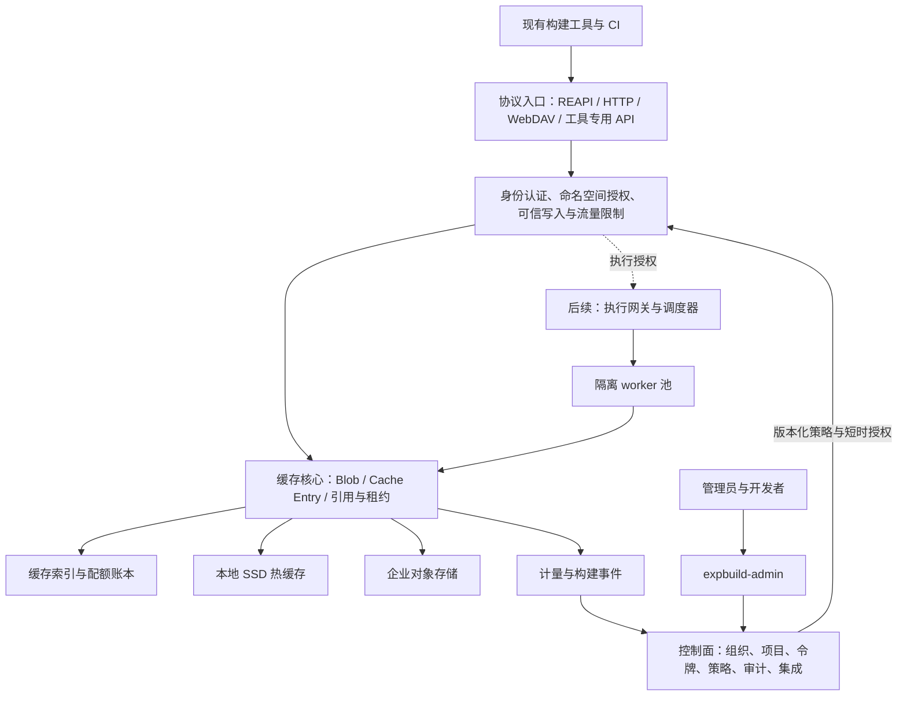

# ExpBuild 平台重新规划：研究结论与决策稿

研究日期：2026-09-28。状态：供产品与架构评审的建议方案，不代表已经实现或通过性能验证。

**建议定位：面向企业自托管的多协议构建缓存与加速平台，以统一治理、可信缓存和可解释的收益为核心，逐步扩展到边缘缓存、远程执行及 SaaS。**

用户已确认“企业自托管优先，预留 SaaS”。团队规模、首批客户技术栈、现网规模、现有兼容性承诺尚未给出；本文默认按新目标重新设计关键边界、择优复用现有代码。阶段估算以 4–6 人专职团队为情景假设，不能直接视为交付承诺。

后续深化已形成 [P0 开发技术方案](../design/README.md)，包含缓存内核、控制面接口、元数据事务与 DDL、协议验证档案和首批开发拆分。首版进一步确定为 namespace 内物理隔离与去重，跨 namespace 共享后置；具体实现以该目录的 P0 契约为准。

## 阅读入口

| 文档 | 回答的问题 |
|---|---|
| [01 产品与管理能力](01-product-and-management.md) | 为谁解决什么问题；“大而全”的边界；控制台、权限、配额与收益指标 |
| [02 架构与扩展设计](02-architecture-and-extension.md) | 多协议如何共享底座；租户、存储、GC、插件、安全、部署与远程执行 |
| [03 协议研究](03-protocol-research.md) | 各工具真实接入方式、限制、一手来源、兼容验证办法 |
| [04 生态与竞品研究](04-landscape-research.md) | 应当借鉴什么、集成什么、如何形成差异化 |
| [Depot 深度调研](../research/depot/README.md) | 公开事实、源码契约、架构推断，以及对FindMissing和expbuild的启示 |
| [05 仓库现状审计](05-current-state-audit.md) | 当前两仓库到底实现了什么；哪些部分复用或重构 |
| [06 路线图与验证计划](06-roadmap-and-validation.md) | 首版范围、里程碑、验收、风险、迁移和首批任务 |

## 1. 关键判断

1. **先交付可靠的缓存平台，再扩展执行平台。** 现有 REAPI/worker 实现能提供起点，但远程执行涉及调度状态机、可信隔离、工具链与运维，不能把它和多个协议、完整企业管理同时塞入首版。
2. **用两种差异明显的协议验证底座。** 首版建议 REAPI 缓存与 Gradle HTTP cache；前者是 CAS + Action Cache，后者是按工具提供的 key 存取不透明归档。若首批试点以 Rust/C++ 为主，以 sccache WebDAV 替换 Gradle，而不是在首版继续加协议。
3. **统一身份、权限、存储和计量，不统一构建语义。** 不同工具的缓存 key、产物格式、签名与有效性由适配器保留；相同底层字节可以在允许的隔离域内去重，不承诺跨 Bazel、Gradle、Nx 的语义命中。
4. **企业管理从第一版进入请求链路。** 项目、命名空间、服务账号、只读/读写令牌、审计、硬配额、容量管理和恢复能力必须在数据面生效，不能仅做控制台表单。
5. **架构允许“大而全”，版本范围保持可验收。** 协议、存储、身份、事件出口、执行后端各有独立扩展面；首版以内置模块为主，稳定后发布版本化插件 SDK。
6. **远程命中率和真实收益分开。** 服务端请求命中、工具任务命中、避免的 CPU 时间、CI 墙钟时间是不同指标；没有基线或客户端事件时展示“未知”，不生成收益数字。
7. **企业与项目确定归属，namespace 固定协议和信任级别。** 可信 CI 写入、开发者读为主；外部 PR 使用隔离命名空间。首版不跨 namespace 共享对象。散列校验保证字节完整性，不能证明产物来自可信构建。

## 2. 研究对原思路的修正

现有后端是 Rust 远程执行原型，管理端是 React/Express/Prisma 控制台雏形。README 中的“完整 REAPI”“多存储”等描述不能作为生产就绪的依据。静态审计发现租户上下文缺失、ByteStream 与执行生命周期不完整，管理端还有权限过滤和演示数据混入问题，见 [代码证据](05-current-state-audit.md)。

“支持很多工具”也不足以成为独特卖点。Depot 已有多工具缓存接入；BuildBuddy 在 Bazel 缓存、执行和诊断方面提供较完整体验。expbuild 更值得验证的机会是：**企业能在自己的基础设施上，用同一套治理规则管理异构构建缓存，并获得真实、可追溯的效果与成本数据。** 这是研究后的产品假设，仍需客户验证。[Depot Cache](https://depot.dev/docs/cache/overview)、[BuildBuddy](https://www.buildbuddy.io/docs/introduction/)。

## 3. 推荐能力顺序

此表是整个规划的最终排序。协议调研中的 P0/P1 是协议自身的候选优先级，应以这里和路线图的阶段范围为准。

| 阶段 | 协议/生态 | 同步交付的平台能力 |
|---|---|---|
| P0 / 试点首版 | REAPI cache-only；Gradle HTTP cache | FS + 一个 S3 兼容后端；租户/项目/命名空间；令牌与 RBAC；配额、GC、审计、真实指标；策略同步、私有部署、基础备份恢复 |
| P1 / 企业正式版 | 允许仍保持首版两生态；不以新增协议数作为发布门槛 | HA、OIDC、自动化备份与升级恢复、完善接入与诊断流程 |
| P1.x / 生态覆盖 | sccache WebDAV、Turborepo、Bazel HTTP；随后按需求加入 Nx、ccache helper | 逐协议兼容认证；Bazel BES/BEP 基础接入；不阻断企业正式版 |
| P2 / 规模与扩展 | BuildKit 通过 OCI registry 集成；按需求增加 Maven build cache | Edge cache、分层缓存、插件 SDK、企业配额策略、更完整缓存诊断 |
| P3 / 执行与更广生态 | REAPI 远程执行；按需求验证 Nix、Go GOCACHEPROG 等接入 | 持久调度、租约与 fencing、隔离 worker 池、执行计量、跨站点策略 |

P3 远程执行的设计验证可以提前并行，但不得阻断缓存正式版。npm/Maven/PyPI 包代理、通用制品仓库、完整 CI 编排与发布系统作为后续独立产品决策；先集成企业已有系统。Maven build cache 和 Maven 依赖代理是两件不同的事。

## 4. 目标架构

物理部署起步为一个 Rust 数据面服务、一个管理 API/前端服务、PostgreSQL 和文件/对象存储。逻辑模块先清楚，按量拆分；首版不要求 Kubernetes、Kafka、ClickHouse、Redis 或自研分布式数据库。

## 5. 版本成功标准

首版的成功是：企业管理员可以部署并创建项目，让两个不同构建生态接入；可信 CI 预热后开发者能够复用缓存；权限与配额真实生效；能看到准确的流量、容量、命中与错误数据；故障和清理不产生错误构建结果。

具体验收由 [路线图](06-roadmap-and-validation.md) 定义，包括真实客户端互操作、跨租户负向测试、并发写入/清理竞态、断点与大文件、备份恢复、标准化性能样本。当前研究没有运行这些测试，因此不宣称已经达到性能、稳定性或安全目标。

## 6. 开工前应确定的决策

| 决策 | 当前建议 | 需要补充的证据 |
|---|---|---|
| 第一批支持的两种生态 | REAPI + Gradle；Rust/C++ 用户多时替换 Gradle | 3–5 个试点项目的工具、版本、CI 时长、产物大小分布 |
| 与旧版本兼容 | 保留公开协议，重构内部模型；旧匿名缓存默认冷启动 | 是否有活跃用户、持久缓存、不可中断的 worker |
| 控制面技术栈 | 先保留 TypeScript；重做模型/授权；Rust 保留数据面 | 团队人员组成与运维要求 |
| 开源与商业边界 | 核心协议、存储抽象、基本安全与自托管闭环开放；高级治理/支持可商业化 | 商业目标、依赖许可清单、维护成本 |
| 容量与 SLO | 先建立基准，按试点分级承诺 | 并发、对象数、网络、数据保留期、预算 |

企业自托管与 SaaS 共用领域模型、数据面协议和授权机制；SaaS 的订阅、结算、注册审核、区域路由是后续控制面模块。提前保留 tenant_id，不等于提前建设收费系统。
