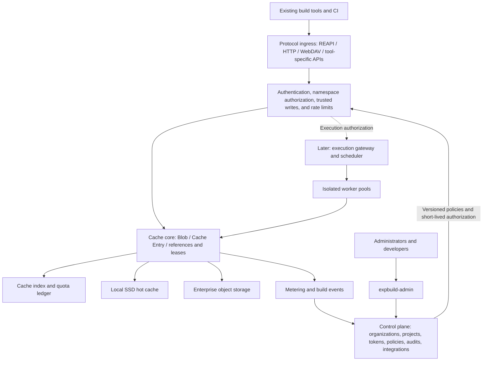

# ExpBuild Platform Replanning: Research Findings and Decision Draft

Research date: 2026-09-28. Status: a proposed plan for product and architecture review; this does not mean it has been implemented or performance-validated.

**Recommended positioning: an enterprise self-hosted, multi-protocol build cache and acceleration platform centered on unified governance, trusted caching, and explainable benefits, gradually expanding to edge caching, remote execution, and SaaS.**

The user has confirmed “enterprise self-hosting first, with room for SaaS.” Team size, the initial customers' technology stacks, production scale, and existing compatibility commitments have not yet been provided. This document assumes that key boundaries will be redesigned around the new goals, reusing existing code where appropriate. Phase estimates assume a dedicated team of 4–6 and must not be treated as delivery commitments.

Subsequent detailed work has produced the [P0 Technical Development Plan](../design/README.md), covering the cache kernel, control-plane interfaces, metadata transactions and DDL, protocol validation records, and the first development work breakdown. The first release now explicitly uses physical isolation and deduplication within each namespace; cross-namespace sharing is deferred. Implementation is governed by the P0 contracts in that directory.

## Reading Guide

| Document | Questions answered |
|---|---|
| [01 Product and Management Capabilities](01-product-and-management.md) | Whose problems are being solved; the limits of a comprehensive platform; console, permissions, quotas, and benefit metrics |
| [02 Architecture and Extension Design](02-architecture-and-extension.md) | How protocols share a foundation; tenants, storage, GC, plugins, security, deployment, and remote execution |
| [03 Protocol Research](03-protocol-research.md) | Actual integration methods, limitations, primary sources, and compatibility validation for each tool |
| [04 Ecosystem and Competitive Research](04-landscape-research.md) | What to learn from, what to integrate, and how to differentiate |
| [Depot Deep Dive](../research/depot/README.md) | Public facts, source-code contracts, architectural inferences, and implications for FindMissing and expbuild |
| [05 Current Repository Audit](05-current-state-audit.md) | What the two repositories actually implement; what to reuse or refactor |
| [06 Roadmap and Validation Plan](06-roadmap-and-validation.md) | First-release scope, milestones, acceptance, risks, migration, and initial tasks |

## 1. Key Judgments

1. **Deliver a reliable cache platform before expanding into execution.** The existing REAPI/worker implementation provides a starting point, but remote execution involves scheduling state machines, trusted isolation, toolchains, and operations. It cannot be packed into the first release alongside multiple protocols and complete enterprise management.
2. **Validate the foundation with two substantially different protocols.** REAPI caching and Gradle HTTP cache are recommended for the first release: the former uses CAS + Action Cache, while the latter stores opaque archives under tool-provided keys. If the initial pilots mainly use Rust/C++, replace Gradle with sccache WebDAV instead of adding another protocol to the first release.
3. **Unify identity, permissions, storage, and metering, without unifying build semantics.** Adapters preserve each tool's cache keys, artifact formats, signatures, and validity rules. Identical underlying bytes may be deduplicated within permitted isolation domains; semantic cache hits across Bazel, Gradle, and Nx are not promised.
4. **Enterprise management must enter the request path from the first release.** Projects, namespaces, service accounts, read-only/read-write tokens, auditing, hard quotas, capacity management, and recovery must take effect in the data plane, rather than merely appearing as console forms.
5. **Allow comprehensive architecture while keeping release scope verifiable.** Protocols, storage, identity, event sinks, and execution backends each have independent extension surfaces. Start with built-in modules and publish a versioned plugin SDK once they stabilize.
6. **Separate remote hit rates from actual benefits.** Server request hits, tool task hits, avoided CPU time, and CI wall time are different metrics. Display “unknown” when no baseline or client events exist; do not invent benefit figures.
7. **Enterprises and projects establish ownership; namespaces fix protocol and trust level.** Trusted CI writes, while developers primarily read; external PRs use isolated namespaces. The first release does not share objects across namespaces. Hash verification ensures byte integrity, but cannot prove that an artifact came from a trusted build.

## 2. How the Research Revises the Original Approach

The existing backend is a Rust remote-execution prototype, and the management application is an early React/Express/Prisma console. README claims such as “complete REAPI” and “multiple storage backends” are not evidence of production readiness. Static auditing found missing tenant context, incomplete ByteStream and execution lifecycles, and permission-filtering and mixed-in demo-data issues in the management application. See the [code evidence](05-current-state-audit.md).

“Supporting many tools” is also insufficient as a unique selling point. Depot already integrates caches for multiple tools; BuildBuddy offers a relatively complete experience for Bazel caching, execution, and diagnostics. The opportunity more worth validating for expbuild is: **enterprises can manage heterogeneous build caches on their own infrastructure under one set of governance rules, with real, traceable effectiveness and cost data.** This is a product hypothesis derived from research and still requires customer validation. [Depot Cache](https://depot.dev/docs/cache/overview), [BuildBuddy](https://www.buildbuddy.io/docs/introduction/).

## 3. Recommended Capability Order

This table is the final prioritization for the overall plan. P0/P1 labels in the protocol research indicate candidate priorities for individual protocols; the phase scopes here and in the roadmap take precedence.

| Phase | Protocols/ecosystems | Platform capabilities delivered alongside them |
|---|---|---|
| P0 / Initial pilot release | REAPI cache-only; Gradle HTTP cache | FS + one S3-compatible backend; tenants/projects/namespaces; tokens and RBAC; quotas, GC, auditing, real metrics; policy synchronization, private deployment, basic backup and recovery |
| P1 / Enterprise general release | May retain the two initial ecosystems; additional protocol count is not a release gate | HA, OIDC, automated backup and upgrade recovery, complete onboarding and diagnostic workflows |
| P1.x / Ecosystem coverage | sccache WebDAV, Turborepo, Bazel HTTP; then Nx and ccache helper as needed | Per-protocol compatibility certification; basic Bazel BES/BEP integration; does not block the enterprise general release |
| P2 / Scale and extensibility | BuildKit through OCI registry integration; Maven build cache as needed | Edge cache, tiered caching, plugin SDK, enterprise quota policies, fuller cache diagnostics |
| P3 / Execution and broader ecosystems | REAPI remote execution; validate Nix, Go GOCACHEPROG, and other integrations as needed | Persistent scheduling, leases and fencing, isolated worker pools, execution metering, cross-site policies |

Design validation for P3 remote execution may start earlier in parallel, but must not block the cache general release. npm/Maven/PyPI package proxies, general artifact repositories, and full CI orchestration and release systems remain separate future product decisions; integrate enterprises' existing systems first. Maven build cache and Maven dependency proxying are distinct capabilities.

## 4. Target Architecture

Physical deployment starts with one Rust data-plane service, one management API/frontend service, PostgreSQL, and file/object storage. Establish clear logical modules first, then split them as scale requires. The first release does not require Kubernetes, Kafka, ClickHouse, Redis, or a custom distributed database.

## 5. Release Success Criteria

First-release success means an enterprise administrator can deploy the system and create projects, connect two different build ecosystems, and let developers reuse caches warmed by trusted CI. Permissions and quotas must genuinely take effect; traffic, capacity, hit, and error data must be accurate; failures and cleanup must not produce incorrect build results.

The [roadmap](06-roadmap-and-validation.md) defines concrete acceptance criteria, including real-client interoperability, negative cross-tenant tests, concurrent-write/cleanup races, resumability and large files, backup and recovery, and standardized performance samples. These tests were not run during this research, so no performance, stability, or security targets are claimed as achieved.

## 6. Decisions to Resolve Before Development

| Decision | Current recommendation | Additional evidence needed |
|---|---|---|
| First two supported ecosystems | REAPI + Gradle; replace Gradle if Rust/C++ users predominate | Tools, versions, CI durations, and artifact-size distributions from 3–5 pilot projects |
| Compatibility with old versions | Preserve public protocols and refactor internal models; cold-start old anonymous caches by default | Whether active users, persistent caches, or workers that cannot be interrupted exist |
| Control-plane stack | Retain TypeScript initially; rebuild models/authorization; keep Rust for the data plane | Team composition and operational requirements |
| Open-source/commercial boundary | Open core protocols, storage abstractions, basic security, and an end-to-end self-hosted workflow; advanced governance/support may be commercial | Business goals, dependency license inventory, maintenance costs |
| Capacity and SLOs | Establish benchmarks first, then make tiered commitments based on pilots | Concurrency, object counts, network, retention periods, budget |

Enterprise self-hosting and SaaS share the domain model, data-plane protocols, and authorization mechanisms. SaaS subscriptions, billing, signup review, and regional routing are later control-plane modules. Reserving tenant_id early does not mean building a billing system early.
